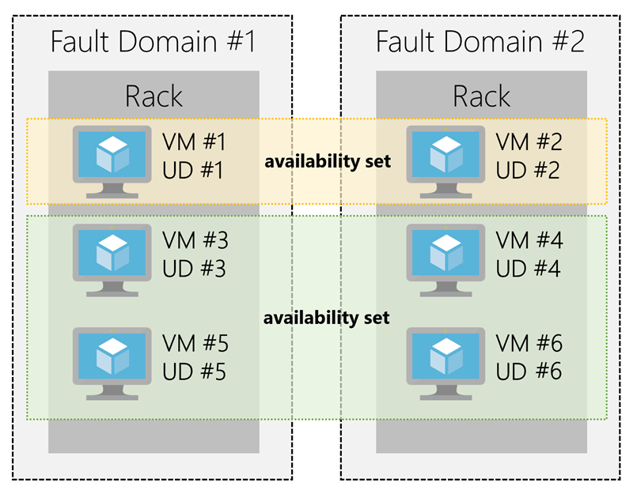

:::row:::
  :::column:::
    
  :::column-end:::
  :::column span="3":::
Azure VMs lets you create and use virtual machines in the cloud. They provide infrastructure as a service (IaaS) in the form of a virtualized server and can be used in a variety of different ways. Just like a physical computer, you're able to customize all of the software running on the VM. This makes them an ideal choice when you need total control over the OS or when you need to run custom software or use custom hosting configurations.
  :::column-end:::
:::row-end:::

Typically, new virtual machines can be created and provisioned in minutes by selecting a pre-configured virtual machine image. Selecting an image is one of the most important decisions you'll make when creating a VM. An image is a template used to create a virtual machine. These templates already include an operating system (OS) and often other software, such as development tools or web hosting environments.

## Moving to the cloud with VMs

VMs are also an excellent choice when moving from a physical server to the cloud ("lift and shift"). You can create an image of the physical server and host it within a virtual machine with little or no changes. Just like a physical on-premise server, you'll be required to maintain the virtual machine. This means updating the operating system and the software it runs. 

## Scaling VMs in Azure

You can run single VMs for testing, development, or minor tasks, or group VMs together to provide high availability, scalability, and redundancy. Azure has several features devoted to these critical features to ensure that no matter what your uptime requirements are, Azure can meet them.

- Availability sets
- Virtual machine scale sets
- Azure Batch

### What are availability sets?

An **availability set** is a logical grouping of two or more VMs that ensure your application remains available during planned or unplanned maintenance.

A _planned maintenance event_ is when the underlying Azure fabric that hosts virtual machines is updated by Microsoft. This is done to patch security vulnerabilities, improve performance, and add or update features. Most of the time these updates can be performed without any impact to the guest VMs - however, sometimes it requires a reboot to complete an update. When the VM is part of an availability set, the Azure fabric will ensure updates are sequenced so not all of the associated VMs are rebooted at the same time. This grouping is referred to as an _update domain_. Update domains are a logical part of each datacenter and are implemented with software and logic.

> [!IMPORTANT]
> Azure does not provide any notification about planned maintenance.

_Unplanned maintenance events_ are those which involve a hardware failure in the datacenter, such as a power outage or disk failure. VMs that are part of an availability set will automatically switch to a working physical server to the VM continues to run. This group is referred to as a _fault domain_. A fault domain is essentially a rack of servers. It provides the physical separation of your workload across different hardware in the datacenter. This includes power, cooling, and network hardware that supports the physical servers located in server racks. In the event the hardware that supports a server rack becomes unavailable, only that rack of servers would be affected by the outage.

Azure creates two fault domains (two racks each having dedicated power and network resources), and five logical update domains. Your VMs are then sequentially placed across the created domains as shown here.

There is no cost for an availability set; you only pay for the VMs within the set. It's highly recommended to place each workload in an availability set to ensure you don't have a single point of failure in your VM architecture.

### What are virtual machine scale sets?

Azure virtual machine scale sets let you create and manage a group of identical, load balanced VMs. Imagine you're running a website that enables scientists to upload astronomy images that need to be processed. If you duplicated the VM, you'd normally need to configure an additional service to route requests between multiple instances of the website. This is exactly what VM scale sets do for you.

Scale sets allow you to centrally manage, configure, and update a large number of VMs in minutes to provide highly available applications. The number of VM instances can automatically increase or decrease in response to demand or a defined schedule. With virtual machine scale sets, you can build large-scale services for areas such as compute, big data, and container workloads.

### What is Azure Batch?

Azure Batch enables large-scale job scheduling and compute management with the ability to scale to tens, hundreds, or thousands of VMs. 

When you're ready to run a job, Batch starts a pool of compute virtual machines for you, installing applications and staging data, running jobs with as many tasks as you have, identifying failures and re-queuing work, and scaling down the pool as work completes. 

There may be situations in which you need raw computing power or supercomputer level compute power; Azure provides these capabilities.
