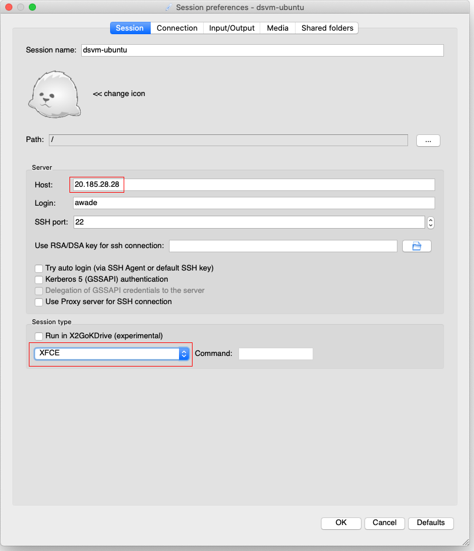

Now that you've created a Data Science Virtual Machine, you need to connect to it. The Data Science Virtual Machine is preconfigured for SSH access on both Ubuntu and Windows Server 2019. With SSH, you can connect to the command line of the Data Science Virtual Machine. You can also use a full graphical desktop, using Remote Desktop for Windows and X2Go client for Linux. 

## If necessary, start the Data Science Virtual Machine

The Data Science Virtual Machine you just created will already be running. In general, you'll manually start and stop the virtual machine from the Azure portal:

1. Navigate to your resource group (<rgn>[sandbox resource group name]</rgn>) in the Azure portal
1. From your resource list, choose your Data Science Virtual Machine, which is of type "Virtual machine"
1. From the Data Science Virtual Machine's resource page, choose "Start" if necessary
1. Wait until the Data Science Virtual Machine's Status is "Running"
1. Record the IP address

## Connect to the command line using SSH

To access the command line of your Data Science Virtual Machine, you'll use:

- An SSH client running in a terminal on your local machine
- The username and password you specified during creation
- The public IP address of the running Data Science Virtual Machine

### Install an SSH client on Windows, if necessary

If you're running Linux or macOS, an ssh client is part of the OS standard utilities. If you're running Windows, you may not have an SSH client already installed on your machine. Open a PowerShell console with Administrative rights and see if you have the client installed:

```powershell
Get-WindowsCapability -Online | ? Name -like 'OpenSSH*'

# You should see output similar to:
 
Name  : OpenSSH.Client~~~~0.0.1.0
State : NotPresent
Name  : OpenSSH.Server~~~~0.0.1.0
State : NotPresent
```

If the `State` of the `OpenSSH.Client` isn't `Installed`, run:

```powershell
Add-WindowsCapability -Online -Name OpenSSH.Client~~~~0.0.1.0
```

## Connect using an ssh client from the command line

From a terminal or PowerShell console, run the following, replacing your username and the IP address for `1.1.1.1`:

```bash
ssh UserName@1.1.1.1
```

The first time you connect via SSH, you'll receive a warning. Accept the fingerprint and you'll be presented with a password prompt. Enter the password you specified while creating the Data Science Virtual Machine. You should see a greeting screen and a command prompt.

## Connect using a graphical user interface

If you wish to use a graphical user interface, you can use:

* Microsoft Remote Desktop for the Windows Server 2019 Data Science Virtual Machine
* An XFCE client such as X2Go Client for the Ubuntu 18.04 Data Science Virtual Machine.

## Connect to your Ubuntu Data Science Virtual Machine using X2Go

The Linux VM is already provisioned with X2Go Server and ready to accept client connections. To connect to the Linux VM graphical desktop, complete the following procedure on your client:

1. Download and install the X2Go client for your client platform from [X2Go](https://wiki.x2go.org/doku.php/doc:installation:x2goclient).

1. Run the X2Go client. If the "New Session" window doesn't pop up automatically, go to Session -> New Session.

1. On the resulting configuration window, enter the following configuration parameters:
   - **Session tab**:
     - **Host**: Enter the IP address of your VM, which you made note of earlier.
     - **Login**: Enter the username on the Linux VM.
     - **SSH Port**: Leave it at 22, the default value.
     - **Session Type**: Change the value to **XFCE**. Currently, the Linux VM supports only the XFCE desktop.
   - **Media tab**: You can turn off sound support and client printing if you don't need to use them.
   - **Shared folders**: You can mount client machine directories to the virtual machine. Add the client machine directories that you want to share with the VM on this tab. Shared folders are convenient, but for transferring large amounts of data to blob storage, [Azure Data Explorer](https://azure.microsoft.com/services/data-explorer/) is a faster and more robust choice.

   

1. Select **OK**.
1. Click on the box in the right pane of the X2Go window to bring up the sign-in screen for your VM.
1. Enter the password for your VM.
1. Select **OK**.
1. You may have to give X2Go permission to bypass your firewall to finish connecting.
1. You should now see the graphical interface for your Ubuntu Data Science Virtual Machine.

