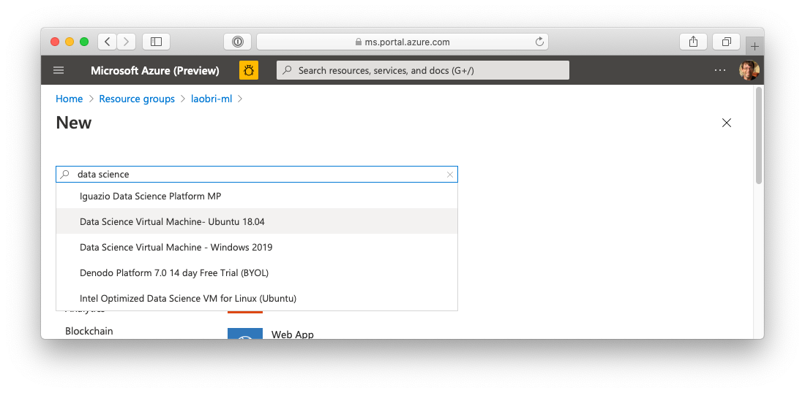
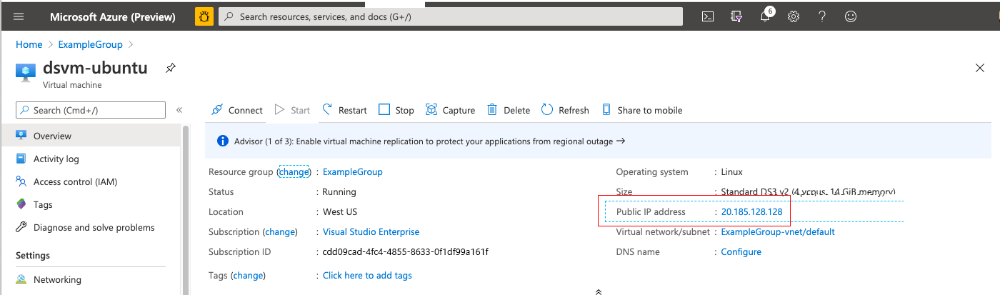

Referring to our scenario, let's say that you've decided to work on an Ubuntu Data Science Virtual Machine. To do so, you'll specify its configuration and create a resource in your resource group.

## Create a Data Science Virtual Machine using the Azure portal

1. Sign in to the [Azure portal](https://portal.azure.com/learn.docs.microsoft.com?azure-portal=true) by using the same account that you activated the sandbox with.

1. Select the **Create a resource** option in the upper-left corner of the portal page. The Azure Marketplace pane opens.

    

    As you can see, there are many selectable options. We want to create a Data Science Virtual Machine running on Ubuntu.

1. Use the **Search the Marketplace** search bar to find "Data Science." In the list, select the **Data Science Virtual Machine - Ubuntu 18.04** option.

    

1. Select **Create**. The **Create a virtual machine** page appears. Notice the wizard-based approach that we can use to configure the VM.

### Configure the VM

1. To configure the basic parameters of our Ubuntu virtual machine, in the **Basics** tab, fill in the following fields.

    | Setting | Value |
    | --- | --- |
    | **Project details**| |
    | Subscription | *Concierge Subscription* |
    | Resource group | <rgn>[sandbox resource group name]</rgn>. (This is the sandbox resource group.) |
    | **Instance details**| |
    | Virtual machine name | test-ubuntu-dsvm |
    | Region | Select a region near you. It should be the same as that of the resource group. |
    | Availability options | No infrastructure redundancy required |
    | Image | Data Science Virtual Machine - Ubuntu 18.04 - Gen1 |
    | Size | Standard_DS1_v2. If that's not the selected value: Select **See all sizes** link; Enter **DS1\_** in the search box; Select the **DS1\_v2** row; Select **Select** to choose that size and return to the configuration screen. |
    | **Administrator account**| |
    | Authentication type | Password |
    | Username | Enter a string from 1 to 64 characters long. |
    | Password | Enter a strong password. |

    

1. You can explore several other tabs to see the settings that you can influence during the VM creation. On the **Disks** tab, for example, you can specify your data disks. After you're finished exploring, select **Review + create** to review and validate the settings.

1. On the review screen, verify that all the settings are the way you want them. Select **Create**.

1. You can monitor the deployment through the **Notifications** panel. Select the icon on the top toolbar to show or hide the panel.

1. The VM deployment process takes a few minutes to finish. A notification will inform you that the deployment succeeded. Select **Go to resource** to go to the VM overview page.

1. You can see all the information and configuration options for your newly created Data Science Virtual Machine. One of the pieces of information is the **Public IP address** value. Make note of this IP address, because you'll need it to connect.

    

Congratulations! By performing a few steps, you deployed a Data Science Virtual Machine running on Linux. Now let's connect to it.
