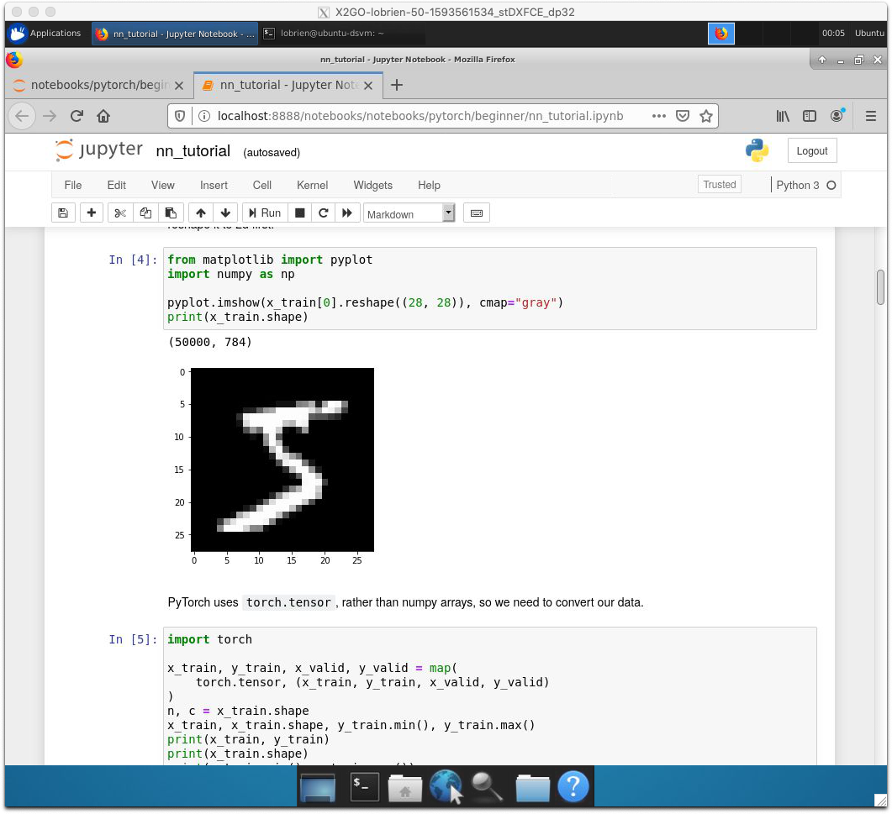

The Data Science Virtual Machine (DSVM) is a customized VM image built specifically for doing data science. The Data Science Virtual Machine runs on the Azure cloud platform. The virtual machine image has many popular data science tools preinstalled and preconfigured to jumpstart building intelligent applications for advanced analytics. 

If you work with data, you know: Wrangling data is time-consuming. Wrangling data requires different tools for different tasks. Wrangling data can require large amounts of storage and RAM, challenge the CPU/GPU, and be difficult to replicate. Sharing data and tools can be difficult and involve fragile data transmissions or "sneakernet" sharing of drives.

You want to work:

* In the operating system you prefer
* With the tools you know
* On a powerful machine
* Easily share your work with your colleagues

You may, of course, buy or build your own machine and configure it just as you choose. This may be the right choice for you if you're willing to bear the upfront costs and know that you'll stress the machine frequently. Even so, safe remote access to the machine either for yourself or your colleagues may be a challenge and will, at the least, be an ongoing administrative task.

With a Data Science Virtual Machine, you only pay for when the machine is running. If you're worried about forgetting to shut down the machine, you can schedule a daily shutdown at the time of your choosing. You can connect to the machine's command-line interface or use its graphical desktop.

The Data Science Virtual Machine has dozens of applications and programming tools and libraries preinstalled and preconfigured. These tools are configured to take advantage of the GPU(s) if you choose to run the Data Science Virtual Machine on hardware with GPU compute resources. For Python, R, Julia, Node, and .NET developers, not only are the base languages installed, but popular packages, development environments, and Jupyter kernels.

## Learning objectives

In this module, you'll:

* Match operating systems and hardware resources available for the Data Science Virtual Machine
* Specify and create a Data Science Virtual Machine running Ubuntu Server 18.04 LTS
* Connect to the command line of the Data Science Virtual Machine with SSH 
* Connect to the graphical Desktop of the Data Science Virtual Machine with X2Go Client 
* Demonstrate the use of RStudio running inside the Data Science Virtual Machine
* List custom Python environments, activate one, and run Jupyter notebook server