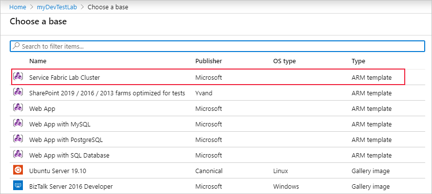
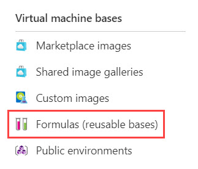

Azure DevTest Labs uses various objects to configure each lab to your requirements. 

In the e-commerce scenario, you want to know how to use object such as artifacts and policies to manage environments and govern their usage. 

Here, you'll learn what these objects are and how they govern the behavior of your lab to provide a flexible and secure environment for training, testing, development, and other purposes. 

## Objects in DevTest Labs

When you create test environments or development machines, you can use the following kinds of object to ensure that users can perform the necessary tasks. These objects also enable you to prevent unauthorized actions:

- Environments
- Artifacts
- Formulas/images
- Policies
- Virtual machines


Let's examine these objects in more detail.

## Environments

Azure DevTest Labs has a public repository of Azure Resource Manager templates you can use to create environments. This setup is similar to the artifacts repository that's available in the Azure portal for each lab. The environment repository gets you started quickly in a preconfigured environment that has few input parameters. For example, you could use PaaS resources like Service Fabric or Web Apps.

When you create environments or templates, you could store them in the environment repository to share with others, or set up your own Git repository.

Environments are created in the Azure portal by following these steps:

1. Sign into the [Azure portal](https://portal.azure.com/learn.docs.microsoft.com?azure-portal=true).
1. Select **All Services**, and then select **DevTest Labs** from the list.
1. From the list of labs, select your lab.
1. On the lab page, click **Add**.
1. The **Choose a base** pane displays the base images available. Select the Azure Resource Manager template you require.

    

1. On the **Add** pane, enter an environment name value to display to environment users.
1. Click **Add**.

## Artifacts

Use artifacts to deploy and configure an application after you provision a virtual machine. An artifact consists of a JavaScript Object Notation (JSON) definition file and other script files that are stored in a folder within a specified Git repository. These files contain expressions that can be used to specify what's required on the virtual machine. For example, you might define a command to run, and parameters that are available when that command is run. 

This code is an example JSON artifact:

```JSON
{
  "$schema": "https://raw.githubusercontent.com/Azure/azure-devtestlab/master/schemas/2016-11-28/dtlArtifacts.json",
  "title": "",
  "description": "",
  "iconUri": "",
  "targetOsType": "",
  "parameters": {
    "<parameterName>": {
      "type": "",
      "displayName": "",
      "description": ""
    }
  },
  "runCommand": {
    "commandToExecute": ""
  }
}
```

Suppose that, for the e-commerce developer onboarding labs, the Windows package manager **Chocolatey** is required on all development machines. An artifact could be set up to install the required package through a Powershell script.

```JSON
runCommand": {
    "commandToExecute": "[concat('powershell.exe -ExecutionPolicy bypass \"& ./installChocolatey.ps1'
, ' -RawPackagesList ', parameters('packages')
, ' -Username ', parameters('installUsername')
, ' -Password ', parameters('installPassword'))]"
}
```

The following table details each section of the JSON artifact schema and how it's used:

| Element name | Required? | Description |
| ------------ | --------- | ----------- |
| $schema	| No | Location of the JSON schema file. This value ensures validation checking of your custom artifact. |
| title | Yes |	Name. |
| description | Yes | Description. |
| iconUri | No | URI of the icon displayed in the lab. |
| targetOsType | Yes | Operating system of the virtual machine - Windows or Linux. |
| parameters | No | Values provided when the artifact install command is run on a machine. |
| runCommand | Yes | Command that's executed on the virtual machine. |
| | |

## Formulas and custom images

Both custom images and formulas can be used as a base for creating new virtual machines, although they're different. A custom image is based on a virtual hard drive (a .VHD file). A formula is an image based on a virtual hard drive with preconfigured settings, such as virtual machine size, virtual network, subnet, and artifacts. These preconfigured settings are set up with default values that can be overridden when the virtual machine is created.

Formulas are managed within the following Azure submenu:



Start by selecting a base for your formula:


Then use **basic settings** to configure:

- A name for your formula
- A username and password for the default user account
- A virtual machine size
- Artifacts to install

## Policies

In Azure DevTest Labs, use policies to manage costs and minimize waste in each lab environment. You can set things like the number of virtual machines or sizes that each person can use. Also, you can set auto-shutdown rules as costs are only incurred when a virtual machine is running. Policies cover the following areas. 

- Allowed virtual machine sizes
- The maximum number of virtual machines per user
- The total number of virtual machines allowed
- The auto-shutdown policy

## Create a DevTest Lab development virtual machine

In your e-commerce organization, you want to create a DevTest lab to speed up developer onboarding. The following steps describe how to create a DevTest lab and provision a virtual machine from a base image:

1. Sign in to the [Azure portal](https://portal.azure.com/learn.docs.microsoft.com?azure-portal=true).
1. From the left menu, select **Create a resource**, point to **Developer tools**, and then click **DevTest Labs**.
1. In the **Create a DevTest Lab** window, specify these values:

    | Property | Value |
    | --- | --- |
    | **Lab name** | Enter a meaningful name for the lab. |
    | **Subscription** | Select the subscription in which you want to create the lab. |
    | **Resource group** | Create a new resource group, or select an existing one. |
    | **Location** | Select the Azure region in which you want the lab to run. |
    | | |

    

1. Click **Create**.

## Add a virtual machine to the lab

Many labs include virtual machines where users can complete tests, development, or other tasks. To add a virtual machine to your lab, take these steps: 

1. On the **DevTest Lab** page, select **+ Add** on the toolbar.

    

1. On the **Choose a base** page, search with a keyword. For example, **Windows** or **Ubuntu**. Select one of the base images in the list.
1. On the **Virtual machine** page, specify these values: 

    | Property | Value |
    | --- | --- |
    | **Virtual machine name** | Enter a name for the virtual machine. |
    | **User name** | Enter a name for the default user account on the virtual machine. |
    | **Password** | Enter the password for the default user account. |
    | | |

    

1. Click **Submit**.

## Add a user to the Lab User role

Now that you've created a virtual machine for the new developer, you can assign the user to the claimable resource.

1. Select **Configuration and Policies** in the left menu.

    

1. Select **Access control (IAM)** from the menu, and then select **+ Add role assignment** on the toolbar.

    

1. On the **Add permissions page**, in the **Role** drop-down list, select **DevTest Labs User**.
1. In the **User** drop-down list, select the user you want to add, and then click **Save**.

    
