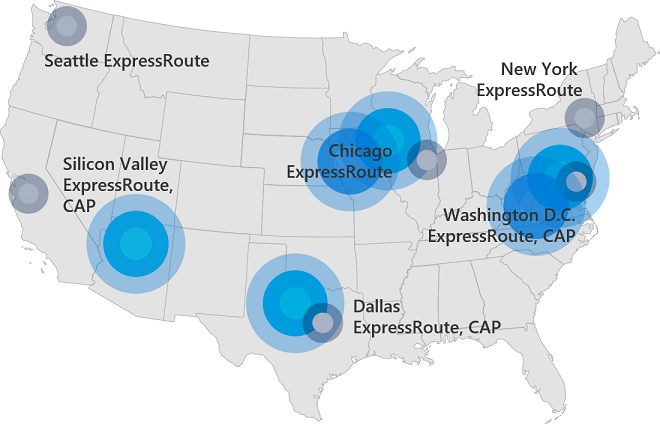
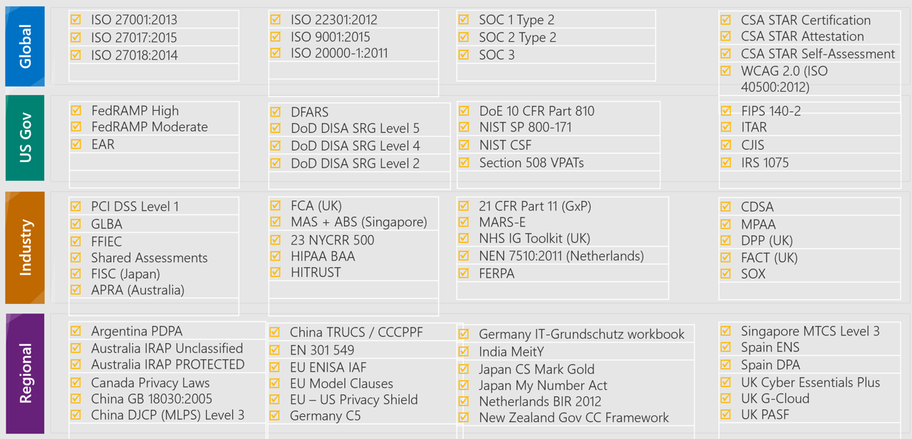

Azure Government is a cloud environment specifically built to meet compliance and security requirements for US government. This mission-critical cloud delivers  breakthrough innovation to U.S. government customers and their partners. Azure Government applies to government at any level — from state and local governments to federal agencies including Department of Defense agencies. 

While there are multiple cloud providers in the public sector, not many can offer the unique capabilities required by state and local and federal government agencies. Azure Government provides hybrid flexibility, deep security, and broad compliance coverage across regulatory standards.

The key difference between Microsoft Azure and Microsoft Azure Government is that Azure Government is a sovereign cloud. It's a physically separated instance of Azure, dedicated to U.S. government workloads only. It's built exclusively for government agencies and their solution providers.

Azure Government is designed for highly sensitive data, enabling government customers to safely transfer mission-critical workloads to the cloud.

#### An overview of Azure Government

> [!VIDEO https://www.microsoft.com/videoplayer/embed/RE2FIcr]

Before we go further, let's highlight the key benefits of using Azure Government.

:::row:::
   :::column:::
     
   :::column-end:::
   :::column span="3":::
     A **Physically separated** instance of Microsoft Azure.

     Microsoft Azure Government is a separate, physical instance of Azure. It has an advanced infrastructure with robust networking in eight announced regions across the United States. Those regions include two regions at DoD Impact Level 5. Azure Government also offers data replication across regions for business continuity. All are connected via private dark fiber.

     ExpressRoute provides choice and convenience when connecting between on-premises and virtual resources in the cloud and enables reliable connection for scenarios like data migration, disaster recovery, or other high-availability needs. ExpressRoute locations are in Chicago, Dallas, New York, Phoenix, San Antonio, Seattle, Silicon Valley, and Washington DC.

     Azure Government also features key networking services such as VNet service endpoints for storage and SQL and Network Watcher for more secure building of applications and monitoring. 

     
   :::column-end:::
:::row-end:::

:::row:::
   :::column:::
     
   :::column-end:::
   :::column span="3":::
     The only hyper-scale cloud built **specifically for U.S. government**.

     Azure Government serves thousands of government customers within Federal, state and local agencies. Many Federal cabinet level agencies are represented, as well as the Army, Navy, Air Force, and Marine Corps.
   :::column-end:::
:::row-end:::

:::row:::
   :::column:::
     
   :::column-end:::
   :::column span="3":::
     Meets the most complex **compliance standards**.

     Azure has the deepest and most comprehensive compliance coverage in the industry.

     
   :::column-end:::
:::row-end:::

:::row:::
   :::column:::
     
   :::column-end:::
   :::column span="3":::
     Designed to **exceed U.S. government requirements**.

     With Azure Government, agencies can:
     - **Modernize their services with the trusted cloud**. Leverage state-of-the-art security to protect citizen data, applications, and  hardware in an environment built to exceed the highest compliance requirements.
     - **Embrace the new era of agile government**. With flexible hybrid solutions, effectively engage with citizens through consistent interactions and scalable solutions, in the cloud or on-premises. Environments can be tailored through options across platforms, tools, and services, allowing agencies to architect their cloud at their own pace.
     - **Advance their mission**. Harness the power of Internet of Things (IoT) devices, analytics and deep learning, to enable actionable insights. Rapidly innovate government processes with tailored solutions that deliver enhanced citizen experiences.
     - **Expand the possibilities**. Advanced computing capabilities powered by an intelligent government cloud empower agencies as never before. Leverage advanced analysis and storage tools in an intelligent and powerful government cloud to uncover new insights in data.
   :::column-end:::
:::row-end:::

:::row:::
   :::column:::
     
   :::column-end:::
   :::column span="3":::
     Supports the **broadest selection of services**, tools, and languages.

     Azure Government is the only offering to span Infrastructure-as-a-Service (IaaS), Platform-as-a-Service (PaaS), and Software-as-a-Service (SaaS). Services are offered in compute, networking, storage, web + mobile, databases, data + analytics, Azure AI services, Internet of Things (IoT), enterprise integration, security + identity, monitoring + management, and developer tools.

     Over 38 services are included in the Azure Government FedRAMP High compliance program.
     While not all Microsoft Azure services are available in Azure Government, the list is continually growing. For the most current list of services, see the [Products available by region tool](https://azure.microsoft.com/global-infrastructure/services/) (select Azure Government in the **Regions** dropdown). The services available in Azure Government are listed by category, as well as whether they are Generally Available or available through preview. 
   :::column-end:::
:::row-end:::
