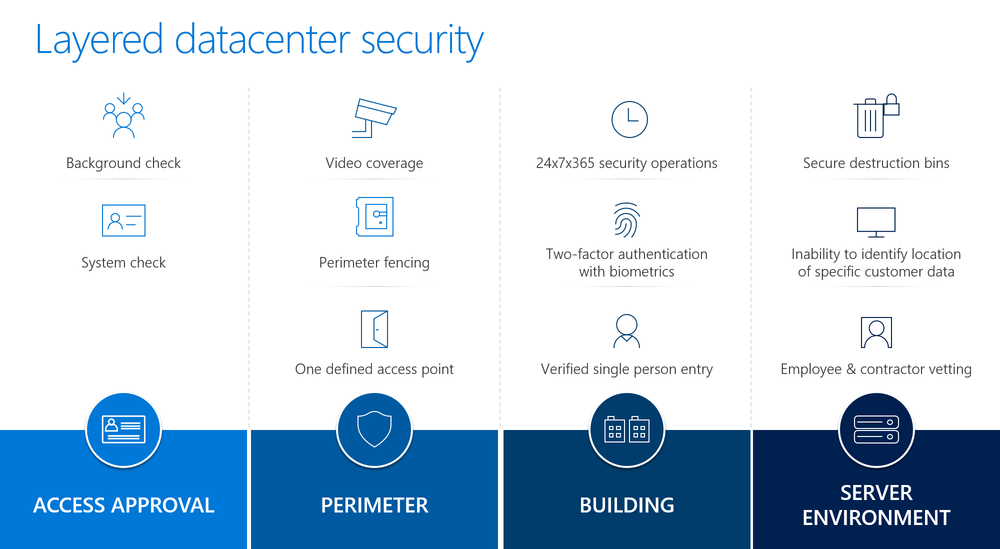

Azure Government was created from the ground up to serve the strict needs of the US government. It meets critical compliance standards, exceeds US government regulatory requirements, and has the ability to protect government data, applications and hardware.

Customers are assured of high levels of security because Azure Government:

- Provides a separate instance of Microsoft Azure that offers geo-replication
- Requires a US entity, US Government affiliation, or government-controlled data requirement to qualify
- Supports disaster recovery scenarios with geographically distributed data centers
- Exceeds the highest compliance standards 

Azure Government covers over 72 compliance regimes – the broadest and most comprehensive compliance in the industry. 

## Azure Government: Layered Datacenter Security

Azure Government's defense-in-depth approach to physical security provides multiple levels of protection, as shown in the following diagram. 

- **Access approval** is comprehensive, ensuring that only individuals on a preauthorized list can enter Azure Government datacenters. Personnel are granted access to discrete areas only as needed, following a “least privileged access” principle. We also have clear separation of duties between datacenter management and security personnel, which provides additional operational assurance.
- **Perimeter** security starts with fencing, front entrance gates, and camera monitoring. Every datacenter has only one defined access point and on-going roaming patrols. 
- **Building** security features 24x7x365 security operations, two-factor authentication with biometrics, and verified single person entry. Buildings aren't Microsoft-branded and have extensive camera coverage and camera monitoring 24x7x365, in addition to on-going roaming patrols. The comprehensive access approval process ensures that only individuals on a pre-authorized list can enter our datacenters. Personnel are granted access to discrete areas only as needed, following a “least privileged access” principle. There's also a clear separation of duties between datacenter management and security personnel, which provides additional operational assurance. 
- **Server environment** access is restricted according to internal personnel access needs. Operational procedures prevent bringing or removing unapproved data-bearing devices. Additional security screening, including metal detectors, biometric two-factor authentication, video monitoring, and on-going roaming patrols further secure server rooms. 

## Data Security

Azure Government offers various services to help secure data.

**Microsoft Defender for Cloud** and **Microsoft Intelligent Graph** leverage advanced analytics so you can learn from and mitigate evolving attacks.

**Key Vault** encrypts keys and secrets in FIPS 140-2 validated hardware security modules, provisions and centrally manages keys in seconds, and audits for further analysis and threat detection.

**Azure Active Directory (Azure AD)** controls permissions and access efficiently. This comprehensive identity and access management cloud solution provides a robust set of capabilities to manage users and groups. It helps secure access to on-premises and cloud applications. It manages user identities and creates intelligence-driven access policies to secure resources. It provides one consistent sign-on experience across Windows, Mac, Android, and iOS devices. Azure AD Multi-Factor Authentication prevents unauthorized access to both on-premises and cloud applications by providing an additional level of authentication. You can protect your business and mitigate potential threats with security monitoring and alerts and machine learning-based reports that identify inconsistent access patterns.

**Azure Site Recovery**, **Azure Backup**, geographically distributed datacenters, and built-in replication services support disaster recovery scenarios and ensure business continuity.
