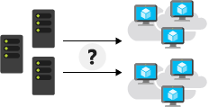
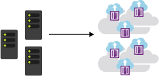
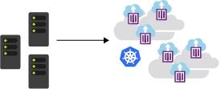
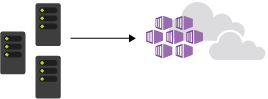

Let's start with a few definitions and a quick tour through the Azure Kubernetes Service (AKS). This overview provides information to help you decide if AKS is a good platform for your containerization management strategy.

## What is a container?

A *container* is an atomic unit of software that packages up code, dependencies, and configuration for a specific application. Containers allow you to split up monolithic applications into individual services that make up the solution. This rearchitecting of our application enables us to deploy these separate services via containers.

## Why use a container?

Suppose your asset tracking solution included three major applications:

- A tracking website that includes maps and information about the assets being tracked.

- A data processing service that collects and processes information sent from tracked assets.

- An MSSQL database for storing customer information captured from the website.

You realize that to meet customer demand you have to scale out your solution.

### Virtual Machines (VM)

One option is to deploy a new virtual machine for every application, hosted across multiple regions. Then, copy the applications to your new VMs. However, doing so makes you responsible for the management of each VM that you use. 

The maintenance overhead increases as you scale. VM operating system (OS) versions and dependencies for each application need to be provisioned and configured to match. When you apply upgrades for your applications that affect the OS and major changes, there are precautions. If any errors appear during the upgrade, the rollback of the installation is required and causes disruption, such as downtime or delays.

The deployment in the previous diagram is cumbersome, sometimes error-prone, and doesn't easily scale single services. For example, you can't easily scale only the caching service used in the web application. Containers help solve these types of problems.

The container concept gives us three major benefits:

1. **Immutability** - The unchanging nature of a container allows it to be deployed and run reliably with the same behavior from one compute environment to another. A container image tested in a QA environment is the same container image deployed to production.

1. **Smaller Size** - A container is similar to a VM, but without the kernel for each machine. Instead, they share a host kernel. VMs use a large image file to store both the OS and the application you want to run. In contrast, a container doesn't need an OS, only the application.

1. **Lightweight** - The container always relies on the host installed OS for kernel-specific services. The lightweight property makes containers less resource-intensive, so installing multiple containers is possible within the same compute environment.

1. **Startup is fast** - Containers start up in few seconds, unlike VMs, which can take minutes to start.

These benefits make containers a popular choice for developers and IT operations alike, and why many are switching from VMs.

## What is container management?

Even though functionally, containers are similar to VMs, their purposes vary. A container has a distinct life cycle that exists as a temporary machine. Its state passes through the stages of pending, running, and terminated. This life cycle makes containers more disposable and impacts how developers and IT operations think about the management of large interconnected applications. Container management involves deploying, upgrading, monitoring, and removing containers.

For example, suppose that you discover that at noon there's more site traffic, so you need more instances of the site's caching service to manage performance. You plan to solve this problem by adding more caching service containers.

Now it's time to roll out a new version of your caching service. How do you update all the containers? How do you remove all the older versions?

These types of load balancing questions require a system to manage your container deployment.

## What is Kubernetes?

Kubernetes is a portable, extensible open-source platform for automating deployment, scaling, and the management of containerized workloads. Kubernetes abstracts away complex container management and provides us with a declarative configuration to orchestrate containers in different compute environments. This orchestration platform gives us the same ease of use and flexibility as with Platform as a Service (PaaS) and Infrastructure as a Service (IaaS) offerings.

Kubernetes allows you to view your data center as one large computer. We don't worry about how and where we deploy our containers, only about deploying and scaling our applications as needed.

Here are some more aspects to keep in mind about Kubernetes:

- Kubernetes isn't a full PaaS offering. It operates at the container level and offers only a common set of PaaS features.

- Kubernetes isn't monolithic. It's not a single application that is installed. Aspects such as deployment, scaling, load balancing, logging, and monitoring are all optional.

- Kubernetes doesn't limit the types of applications to run. If your application can run in a container, it runs on Kubernetes.

- Your developers need to understand concepts such as microservices architecture to make optimal use of container solutions.

- Kubernetes doesn't provide middleware, data-processing frameworks, databases, caches, or cluster storage systems. All these items are run as containers or as part of another service offering.

- A Kubernetes deployment is configured as a cluster. A cluster consists of at least one primary machine or control plane and one or more worker machines. For production deployments, the preferred configuration is a high availability deployment with three to five replicated control plane machines that are referred to as nodes or agent nodes.

With all the benefits you receive with Kubernetes, you're responsible for finding the best solution that fits your needs to address these aspects. Keep in mind that you're responsible for maintaining your Kubernetes cluster. For example, you need to manage OS upgrades and the Kubernetes installation and upgrades. You also manage the hardware configuration of the host machines, such as networking, memory, and storage.

> [!NOTE]
> Kubernetes is sometimes abbreviated to **K8s**. The 8 represents the eight characters between the K and the s of the word K[*ubernete*]s.

## What is the Azure Kubernetes Service (AKS)?

AKS manages your hosted Kubernetes environment and makes it simple to deploy and manage containerized applications in Azure. Your AKS environment is enabled with features such as automated updates, self-healing, and easy scaling. Azure manages the control plane of your Kubernetes cluster for free. You manage the agent nodes in the cluster and only pay for the VMs on which your nodes run.

You can create and manage your cluster in the Azure portal or with the Azure CLI. When you create the cluster, there are Resource Manager templates to automate cluster creation. With these templates, you have access to features such as advanced networking options, Microsoft Entra Identity, and resource monitoring. Then, you can set up triggers and events to automate the cluster deployment for multiple scenarios.

With AKS, you get the benefits of open-source Kubernetes without the added complexity or operational overhead that using only Kubernetes can entail.
