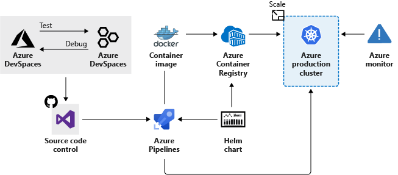

Now that you are familiar with the basics of Azure Kubernetes Service (AKS), let's see what information you need to set up a simple AKS cluster. This information should help you to understand how AKS integrates with existing development and deployment processes.

## Creating an AKS cluster

At its core, an AKS cluster is a cloud-hosted Kubernetes cluster. Unlike a custom Kubernetes installation, AKS streamlines the installation process and takes care of most of the underlying cluster management tasks.

You have two options when you create an AKS cluster: you can either use the Azure portal or Azure CLI. Both options require you to configure basic information about the cluster. For example, you will configure:

- The Kubernetes cluster name.
- The version of Kubernetes to install.
- A DNS prefix to make the control plane node publicly accessible.
- The initial node pool size.

The initial node pool size defaults to two nodes, but it's recommended that at least three nodes are used for a production environment.

> [!NOTE]
> The control plane node in your cluster is free. You only pay for node VMs, storage and networking resources consumed in your cluster.

Unless you specify otherwise, the Azure service creation workflow creates a Kubernetes cluster using the default configuration for scaling, authentication, networking, and monitoring. Creating an AKS cluster typically takes a few minutes. After the AKS cluster is created, you can change any of its default properties. You can manage your cluster with the Azure portal or from the command line.

## How workloads are developed and deployed to AKS

AKS supports the Docker image format. With a Docker image, you can use any development environment to create a workload, package the workload as a container, and deploy the container as a Kubernetes pod.

Here you use the standard Kubernetes command-line tools or the Azure CLI to manage your deployments. The support for the standard Kubernetes tools ensures that you don't need to change your current workflow to support an existing Kubernetes migration to AKS.

AKS also supports popular development and management tools such as Helm, Draft, the Kubernetes extension for Visual Studio Code, and Visual Studio Kubernetes Tools.

## Bridge to Kubernetes

Bridge to Kubernetes allows you to run and debug code on your development computer, while still being connected to your Kubernetes cluster and the rest of your application or services.

With Bridge to Kubernetes, you can:

- Avoid having to build and deploy code to your cluster. Instead, you create a direct connection from your development computer to your cluster. That connection allows you to quickly test and develop your service in the context of the full application without creating a Docker or Kubernetes configuration for that purpose.
- Redirect traffic between your connected Kubernetes cluster and your development computer. The bridge allows code on your development computer and services running in your Kubernetes cluster to communicate as if they are in the same Kubernetes cluster.
- Replicate environment variables and mounted volumes available to pods in your Kubernetes cluster to your development computer. With Bridge to Kubernetes, you can modify your code without having to replicate those dependencies manually.

## Azure Service Integration

AKS allows us to integrate any Azure service offering and use it as part of an AKS cluster solution.

For example, remember that Kubernetes doesn't provide middleware and storage systems. Suppose you need to add a processing queue to the fleet management data processing service. You can easily integrate Azure Storage queues to extend the capacity of the data processing service.
