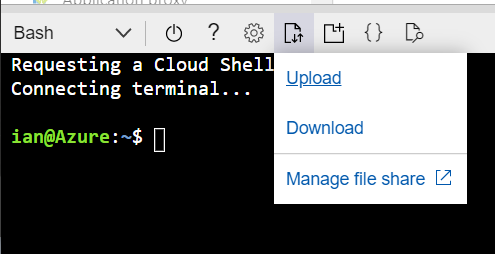

With the groundwork and foundations prepared, Contoso is almost ready to begin onboarding Lamna Healthcare. Before you start, you want a better understanding of how the process works and how Contoso will use Azure delegated resource management after Lamna Healthcare has been onboarded. 

In this unit, you'll take a more in-depth look at Azure delegated resource management and how it applies in this scenario. Finally, you'll cover the configuration of an Azure Resource Manager template, how to deploy it, and see that the customer has been successfully onboarded.

## Azure delegated resource management

Azure delegated resource management lets Contoso's authorized users work in Lamna Healthcare's subscription without needing an account on their tenant.

Azure delegated resource management provides two ways to onboard new customers. You can publish your managed service offers to the Azure Marketplace using the new **Managed Service** offer type. You can onboard Lamna Healthcare by deploying Azure Resource Manager templates.

### How does Azure delegated resource management work?

Here's a high-level overview of how Azure delegated resource management works for your scenario:

1. As the service provider, Contoso needs to specify the roles and access your users, service principals, and groups will need to manage your onboarded Lamna Healthcare customer. The managed service offer definition contains your tenant ID and a list of the access authorizations required for the offer. The authorization access is specified through the principal IDs associated with the roles you've defined. For Lamna Healthcare, using the permissions structure previously defined, you'd want authorization for the following Azure AD user groups:
   - Lamna_Subscription_Management
   - Lamna_Database_Management
   - Lamna_Managed_Service_Registration
   - Lamna_Policy_Automation_Account
   - Manage_Lighthouse_Customers

1. To complete the onboarding process, Lamna Healthcare has to deploy an Azure Resource Manager template on their subscription. When they complete the onboarding process, you're ready to begin managing. All Contoso staff assigned to the authorized roles can start managing Lamna Healthcare's Azure AD tenant.

1. While Contoso will use an Azure Resource Manager template to onboard Lamna Healthcare, you could also have provided the service offer through the Azure Marketplace. An Azure Marketplace offer can be one of two types: private or public.
   - Public offers are available to any customer searching the Azure Marketplace
   - Private offers are only available to named customers

## Azure Resource Manager templates

You can onboard Lamna Healthcare's Azure subscription through Azure Resource Manager templates. These templates are free to use and are available online via GitHub. Each template is just a code block that contains the instructions that allow you to meet a specific scenario or need, and a parameter file.

When you visit the GitHub repository (https://github.com/Azure/Azure-Lighthouse-samples/), you'll find a number of templates, four of which you can use to onboard your customers.

| **Onboarding scenario**                                      | **Template to use**                                          |
| ------------------------------------------------------------ | ------------------------------------------------------------ |
| Subscription                                                 | [delegated-resource-management](https://github.com/Azure/Azure-Lighthouse-samples/tree/master/templates/delegated-resource-management) |
| Resource group                                               | [rg-delegated-resource-management](https://github.com/Azure/Azure-Lighthouse-samples/tree/master/templates/rg-delegated-resource-management) |
| Multiple resource groups within a subscription               | [multipleRgDelegatedResourceManagement](https://github.com/Azure/Azure-Lighthouse-samples/tree/master/templates/rg-delegated-resource-management) |
| Subscription when using an offer published to Azure Marketplace | [marketplace-delegated-resource-management](https://github.com/Azure/Azure-Lighthouse-samples/tree/master/templates/marketplace-delegated-resource-management) |

As Contoso expands its Azure-managed service offerings, you'll pick the corresponding template to meet the service offering you want to manage. For Lamna Healthcare, it's straightforward. One of the requirements they've asked us to manage is their subscription. Looking at the list, the template that best meets our need is the **delegated-resource-management** template, which enables Lamna Healthcare to project an entire subscription into Contoso's tenant.

Templates can be used to automate and streamline the onboarding process, however:

- If you have multiple subscriptions in a tenant, each one will need a separate onboarding deployment
- If you want to onboard multiple resource groups, each with different subscriptions will also need separate onboarding deployments

## Configuring an Azure Resource Manager template

Now you've selected the **delegated-resource-management** template for Lamna Healthcare, it's time to configure it, ready for deployment.

All service offerings require the same core information: offer name, offer description, Contoso's tenant ID, and a list of Contoso's requested authorizations. This information will appear on the Lamna Healthcare **Service Providers** page after they've been onboarded.

A template is divided into two parts: a code (template) file and a parameter file. Unless you're modifying or creating a new template, there's no need to go near the code file. For Lamna Healthcare, and most of your future Azure customers, you only need to modify the parameter file.

All template files are based on JSON. So, when editing templates, you'll need a text editor like Notepad, or you could use a more robust JSON editor such as Visual Studio Code, with the Resource Manager Tools extension.

### Configuring the parameter file

If you haven't done so already, you'll need to download the **delegated-resource-management** template from the GitHub repository. To get to this template, you'll need to:

1. Open the GitHub repository.
1. Select the Azure **Delegated-Resource-Management** folder.
1. Select the **Templates**  folder.
1. Select the **delegated-resource-management** folder.
1. You'll see the folder contains two files:
   - delegatedResourceManagement.json – the template file
   - delegatedResourceManagement.parameters.json – the parameter file
1. Save both files locally.
1. Open the parameter file in your editor of choice. Below is an example of what the file will look like:

```JSON
{
    "$schema": "https://schema.management.azure.com/schemas/2018-05-01/subscriptionDeploymentParameters.json#",
    "contentVersion": "1.0.0.0",
    "parameters": {
        "mspOfferName": {
            "value": "Fabrikam Managed Services - Interstellar"
        },
        "mspOfferDescription": {
            "value": "Fabrikam Managed Services - Interstellar"
        },
        "managedByTenantId": {
            "value": "<insert the managing tenant id>"
        },
        "authorizations": {
            "value": [
            {
                "principalId": "0019bcfb-6d35-48c1-a491-a701cf73b419",
                "principalIdDisplayName": "Tier 1 Support",
                "roleDefinitionId": "b24988ac-6180-42a0-ab88-20f7382dd24c"
            },
            {
                "principalId": "0019bcfb-6d35-48c1-a491-a701cf73b419",
                "principalIdDisplayName": "Tier 1 Support",
                "roleDefinitionId": "36243c78-bf99-498c-9df9-86d9f8d28608"
            },
            {
                "principalId": "0afd8497-7bff-4873-a7ff-b19a6b7b332c",
                "principalIdDisplayName": "Tier 2 Support",
                "roleDefinitionId": "acdd72a7-3385-48ef-bd42-f606fba81ae7"
            },
            {
                "principalId": "9fe47fff-5655-4779-b726-2cf02b07c7c7",
                "principalIdDisplayName": "Service Automation Account",
                "roleDefinitionId": "b24988ac-6180-42a0-ab88-20f7382dd24c"
            },
            {
                "principalId": "3kl47fff-5655-4779-b726-2cf02b05c7c4",
                "principalIdDisplayName": "Policy Automation Account",
                "roleDefinitionId": "18d7d88d-d35e-4fb5-a5c3-7773c20a72d9",
                "delegatedRoleDefinitionIds": [
                    "b24988ac-6180-42a0-ab88-20f7382dd24c",
                    "92aaf0da-9dab-42b6-94a3-d43ce8d16293"
                ]
            }
            ]
        }
    }
}
```

This template will allow Lamna Healthcare's Azure subscription to be managed by Contoso. First, you'll need to modify the parameter file. This table shows the values you'll need to add or change.

| **Field**           | **Value**                                           | **Notes**                                                    |
| ------------------- | --------------------------------------------------- | ------------------------------------------------------------ |
| mspOfferName        | Contoso managed subscription offer                  | The offer name that will be displayed to  Lamna Healthcare and Contoso's users. |
| mspOfferDescription | Contoso managed services for a single subscription | A short description of the managed service offer. |
| managedByTenantId   | df4602a3-920c-435f-98c4-49ff031b9ef6                | The Contoso tenant ID.                     |

> [!Note]
> The tenant ID shown above is an example. Each tenant ID is unique, so you'll need to obtain the correct one from the Contoso Azure Active Directory. To do that, search in your Azure portal for **Azure Active Directory**. In the **Overview** page, you'll see the **Tenant ID** shown. Select the **Copy** option and store it because you'll need it later.

Next, you'll describe the authorizations needed to manage Lamna Healthcare's subscription. You'll need to add, modify, or remove some of the existing authorizations.

> [!Note]
> The principalIds shown below are examples. When updating the parameters file, you'll need to obtain the principalId's for each user or user groups you've set up in your tenant.

From your permission structure, you know you need:

- Lamna Subscription Management

| **Field**              | **Value**                            |
| ---------------------- | ------------------------------------ |
| principalId            | 0137bcfb-4125-43d2-a422-b731ca73b411 |
| principalIdDisplayName | Lamna Subscription Management        |
| roleDefinitionId       | b24988ac-6180-42a0-ab88-20f7382dd24c |

- Lamna Database Management

| **Field**              | **Value**                            |
| ---------------------- | ------------------------------------ |
| principalId            | 0251bcab-a12a-f2d3-aa22-b731cc74a463 |
| principalIdDisplayName | Lamna Database Management           |
| roleDefinitionId       | 9b7fa17d-e63e-47b0-bb0a-15c516ac86ec |

- Lamna Managed Service Registration

| **Field**              | **Value**                            |
| ---------------------- | ------------------------------------ |
| principalId            | 0035cefb-2d14-18d3-b316-c1701cf3b317 |
| principalIdDisplayName | Lamna Managed Service Registration   |
| roleDefinitionId       | 91c1777a-f3dc-4fae-b103-61d183457e46 |

- Lamna Policy Automation Account

| **Field**              | **Value**                                                    |
| ---------------------- | ------------------------------------------------------------ |
| principalId            | 1a26aefe-a645-2759-e7e6-1ff04b05c24a                         |
| principalIdDisplayName | Lamna Policy Automation Account                              |
| roleDefinitionId       | b24988ac-6180-42a0-ab88-20f7382dd24c   92aaf0da-9dab-42b6-94a3-d43ce8d16293 |

- Manage Lighthouse Customer

| **Field**              | **Value**                            |
| ---------------------- | ------------------------------------ |
| principalId            | 0420acae-b21a-2ed4-7a21-a256ca71a174 |
| principalIdDisplayName | Manage Lighthouse Customer           |
| roleDefinitionId       | 056cd41c-7e88-42e1-933e-88ba6a50c9c3 |

When you've finished changing the parameter file, it should look like this:

```JSON
{
    "$schema": "https://schema.management.azure.com/schemas/2018-05-01/subscriptionDeploymentParameters.json#",
    "contentVersion": "1.0.0.0",
    "parameters": {
        "mspOfferName": {
            "value": "Contoso Managed Subscription offer"
        },
        "mspOfferDescription": {
            "value": "Contoso Managed Services for a single subscription"
        },
        "managedByTenantId": {
            "value": "df4602a3-920c-435f-98c4-49ff031b9ef6"
    },
    "authorizations": {
        "value": [
        {
            "principalId": "0137bcfb-4125-43d2-a422-b731ca73b411",
            "principalIdDisplayName": "Lamna Subscription Management",
            "roleDefinitionId": "b24988ac-6180-42a0-ab88-20f7382dd24c"
        },
        {
            "principalId": "0251bcab-a12a-f2d3-aa22-b731cc74a463",
            "principalIdDisplayName": "Lamna Database Management",
            "roleDefinitionId": "9b7fa17d-e63e-47b0-bb0a-15c516ac86ec"
        },
        {
            "principalId": "0035cefb-2d14-18d3-b316-c1701cf3b317",
            "principalIdDisplayName": "Lamna Managed Service Registration",
            "roleDefinitionId": "91c1777a-f3dc-4fae-b103-61d183457e46"
        },
        {
            "principalId": "0420acae-b21a-2ed4-7a21-a256ca71a174",
            "principalIdDisplayName": "Manage Lighthouse Customer",
            "roleDefinitionId": "056cd41c-7e88-42e1-933e-88ba6a50c9c3"
        },
        {
            "principalId": "1a26aefe-a645-2759-e7e6-1ff04b05c24a",
            "principalIdDisplayName": "Lamna Policy Automation Account",
            "roleDefinitionId": "18d7d88d-d35e-4fb5-a5c3-7773c20a72d9",
            "delegatedRoleDefinitionIds": [
                "b24988ac-6180-42a0-ab88-20f7382dd24c",
                "92aaf0da-9dab-42b6-94a3-d43ce8d16293"
            ]
            }
        ]
        }
    }

}
```

Save the parameter file.

## Deploying your Azure Resource Manager template

Because Contoso already has a relationship with Lamna Healthcare, you can distribute the template to the customer. A Lamna Healthcare user who has the Owner role can then deploy the template on their Azure subscription.

The onboarding template files always require a subscription-level deployment, even if you're onboarding only one or more resource groups within a subscription. Because of this, Lamna Healthcare can't use the Azure portal, as it doesn't support subscription-level deployments. Instead, the deployment would be run using either Azure CLI or a PowerShell command. These steps show how Lamna Healthcare will do the deployment using Azure CLI:

1. From the Lamna Healthcare Azure portal, open a CLI session.
1. Upload the template and parameter files into your CLI session, using the **Upload** option.



1. You'll be prompted to locate the template files on your local computer. Select the template files: **delegatedResourceManagement.json**, and **delegatedResourceManagement.parameters.json**.
1. Both files are now uploaded to your Azure CLI session. The LamnaHealthcare user will need to run this command to deploy the package to their Azure session:

```CLI
az deployment create --name delegated-resource-management \
                     --location westUS \
                     --template-file delegatedResourceManagement.json \
                     --parameters delegatedResourceManagement.parameters.json \
                     --verbose
```

> [!Note]
> Because this is a subscription-level deployment, the Lamna Healthcare user who's doing it can't have a guest account. Also, they must have the **Owner** role in the Azure AD for the subscription or subscriptions they want to onboard.

## Confirming successful onboarding using an Azure Resource Manager template

When Lamna Healthcare has deployed the **delegated-resource-management** template files to their subscription, it will be available to the designated users on the Contoso managed service team to manage. Lamna Healthcare users will see and manage the service offer in the Azure portal.

Contoso's authorized managed service staff will find Lamna Healthcare in their **My Customers** page. They can reach it from your Azure portal as follows:

1. Navigate to the [My Customers page](https://docs.microsoft.com/azure/lighthouse/how-to/view-manage-customers).
1. Select **Customers**.
1. Confirm that you can see Lamna Healthcare's subscription with the offer name you provided in the Resource Manager template.

Lamna Healthcare can now see all their managed service provider details from the Service Providers page, and remove Contoso's access if needed. The Lamna Healthcare users can reach the page from their Azure portal by:

1. Go to the [Service Providers page](https://docs.microsoft.com/azure/lighthouse/how-to/view-manage-service-providers).
1. Select **Service provider offers**.
1. Confirm that you can see the service provider's name and the offer name that was given in the Resource Manager template.