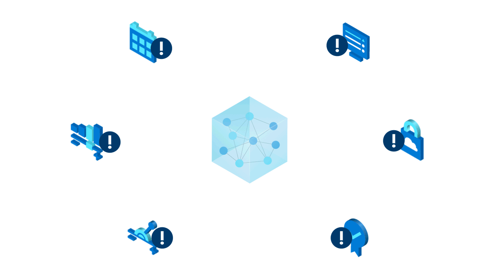

Azure ML is a platform for creating and managing the end-to-end life cycle of machine learning systems. Azure Machine Learning is framework agnostic, giving you the flexibility to work with the technologies you prefer, such as TensorFlow, PyTorch, ONNX, MLFlow, and Scikit-learn.

Azure ML enables people who may not fully grasp coding to have a powerful and intuitive tool—while users with a robust understanding can quickly train and deploy models. All your training scripts, models, logs, and computes are centralized in a shared Workspace in Azure ML, which assists you in every step of building and deploying machine learning systems—meaning you can focus on models while Azure ML does the rest.

Azure ML has a comprehensive suite of features to support logging, monitoring, and governance of datasets and models—ensuring your models are performing as intended—and effectively communicated to stakeholders.

## What is Azure Machine Learning Studio?

Azure Machine Learning Studio is a browser-based service that provides no-code and code-first solutions to visually create, train, and manage models through a web UI. Azure ML Studio allows _Python_ and _R_ SDK to seamlessly integrate with the natively supported _Jupyter Notebooks_ for collaborative notes and coding. Data within Azure Machine Learning Studio is simple to manage with intuitive data visualization and AI-assisted image or text labeling features.

IMAGE

## Creating a model

Models can be created in Azure ML in several ways. Training can take place on a local machine or the Azure cloud, such as a virtual machine or compute cluster.

### Code with R and Python

With the _Azure Machine Learning SDK for Python and R_, you can interact with the service from multiple environments—including Jupyter Notebooks. Notebooks provide a collaborative environment for runnable code, visualizations, and comments. Azure Machine Learning notebook widgets allow you to view a history of all your training, with run logs and a model repository that versions models created for easy tracking. The Notebooks also include code completion aids and code snippet insertions to speed up your work, as seen in the example below.

IMAGE

### AutoML

Automated Machine Learning (AutoML) automates creating the best machine learning models, helping users find the best model for their data—no matter their data science expertise. Specializing in classification, regression, and time-series forecasting, AutoML experiments with different features, algorithms, and parameters depending on the task—then provides scores on models it thinks are the best fit. These models can then be exported to an ONNX format that can run on a variety of platforms and devices. AutoML’s versatility and speed mean it’s often used as a starting point by both experienced and novice data scientists. 

In the image below, we can see an overview of the AutoML pipeline building and recommending a model.

IMAGE

### Designer

If you prefer a no-code option, Azure ML Designer within the Azure ML Studio gives you a visual canvas with drag and drop controls to manipulate datasets and modules. Modules within Azure ML Designer are algorithms that can have a range of purposes, from data ingress functions to training, scoring, and validation processes. These linked modules create effective ML pipelines to build, test, and deploy ML models, as seen in the example below.

IMAGE

## Managing data

With Azure ML, the time-intensive process of data preparation and ingestion can be streamlined and collaboratively worked on. The platform smoothly integrates with Azure Synapse, Azure Databricks, and a suite of other Azure services to assist data engineering pipelines to extract, transform, and load (ETL) raw data into datastores.

### Datastores and labeling

Azure ML securely stores your raw data in the datastore, so you don’t have to rely on external sources for your scripts, and your training sets can be experimented upon without risking the integrity of the original raw data. Once stored, you can clean, transform, and label data to create training sets from the datastore. Azure ML offers tools to help label tabular, image, and text data—with built-in machine learning systems that can suggest labels or fully automate data labeling. The example below shows a human lead multi-label classification project underway in the Azure ML Studio.

IMAGE 

## MLOps

All models—including those that work perfectly when deployed—require monitoring and retraining over time to maintain high performance. Azure ML provides MLOps capabilities to create repeatable steps for data preparation, training, scoring, and reusable software environments for easy deployment. These reproducible pipelines and environments deliver a **continuous integration/continuous delivery (CI/CD)** experience to your machine learning workflow.

In addition to these features, Azure ML also provides MLOps monitoring tools to notify you of events within the ML lifecycle—and even react to them. With this control, you can quickly identify and respond to diminishing model performance or issues within datasets. Governance information is also provided within Azure ML, so you can view a full run history and track team members’ actions within the model life cycle.