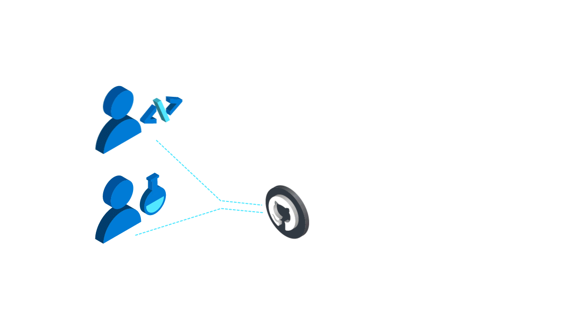

Using Azure Machine Learning requires an Azure account and Azure subscription. The subscription has standard and free pricing tiers and provides an endpoint and subscription key to access the service.

You can access Azure Machine Learning on the cloud or on your local machine through the Python software development kit (SDK), REST API, and Command Line Interface (CLI) extension. If you prefer low or no-code options, then Azure Machine Learning studio can be used to quickly train and deploy machine learning models.

Azure Machine Learning manages all the resources you need for the ML lifecycle inside a workspace. Workspaces can be shared by multiple people and include things like the computing resources available for your notebooks, training clusters, and pipelines. Workspaces are also the logical containers for your data stores and a repository for models and anything else within the model life cycle.

## How to create machine learning models

Models can be created using the SDK, imported from ML frameworks, or without code using the Azure Machine Learning studio. When you connect to a workspace, you can select various development environments with preloaded packages that contain curated environments for popular frameworks, such as TensorFlow and PyTorch. Compute targets can then be chosen to run a training script locally or on a virtual machine to create a model. Compute targets within Azure Machine Learning can automatically scale up and manage jobs to use GPU and CPU resources efficiently.

The status of runs can be logged and monitored natively via the SDK, Azure Monitor, and Azure Machine Learning studio—or by installing packages to run MLFlow and TensorBoard. Visualization of training runs can then be viewed within the Azure studio or workspace to drill down on results and metrics.

In the following example, we can see how Azure Machine Learning studio’s visualization can be customized to add charts, compare data, and apply filters to better analyze your results and metrics.

:::image type="content" source="../media/3-studio-chart.gif" alt-text="Screenshot of visualizing a model in Azure Machine Learning studio." lightbox="../media/3-studio-chart.gif":::

### Experiments

To train a model in Azure Machine Learning, you run an **experiment**—which is when a training script is run that can generate metrics and outputs that are tracked. You can run the same experiment multiple times with different hyperparameters, data, code, or settings. The workspace keeps a history of all training runs, including logs, metrics, outputs, and a snapshot of your scripts within the environment. In a collaborative project, experiment logs are a great way to review and track progress. They can show who is publishing or changing models, why changes were made, and when models were deployed or used in production.

### Pipelines

A pipeline is a workflow of a complete machine learning task that can include data preparation, training, testing, and deployment. Pipelines have many uses. You can make a pipeline that trains models, makes predictions in real-time, or one that only cleans data. Because each step in a pipeline is independent, multiple people can work on different steps within the same pipeline at once. _Azure Machine Learning Pipelines_ can save you time by only rerunning steps whose inputs have changed—drastically reducing runtimes if you're simply tweaking hyperparameters or other steps. Both _Azure Data Factory_ and Azure Pipelines provide out-of-the-box pipelines for Azure Machine Learning, so you can focus on machine learning instead of infrastructure.

### Data assets

You can create data assets from datastores, public URLs, and Azure Open Datasets. By creating a data asset, you reference the data source location—so data from training sets and pipelines will be stored without altering the original data. Data assets can then be registered, versioned, tracked, and traced to permit reuse and sharing across teams, roles, and experiments quickly. The versioning of reproducible experiments is also possible, allowing better analysis of data viability and model performance.

Azure Machine Learning can periodically check for newly stored data with an **incremental refresh,** enabling data assets to be updated automatically when new data is added to the datastore. T

### Labeling

_Data labeling_ is a centralized place to create, manage, and monitor labeling tasks. All data labeling projects can be administered via the Azure Machine Learning studio or workspace dashboard, where team members can view progress and assist in collaborative labeling projects. Human-in-the-loop labeling can take place here, allowing team members to manually add tags to train the ML-labeling models. After enough labels are submitted, a classification model is used to predict tags. Team members can then accept or reject instances of ML-tagged data to help train the labeling model’s accuracy. Eventually, the model will be capable of labeling the data without assistance.

Below we can see an example of a labeling task underway in Azure Machine Learning studio.

:::image type="content" source="../media/3-labeling.gif" alt-text="Screenshot of Azure Machine Learning studio data labeling." lightbox="../media/3-labeling.gif":::

## Deploying machine learning models

Azure Machine Learning can package and run models in Docker containers for deployment. These containers are separate from the run script, so you can quickly swap or update your models with improved ones while leaving the script unmodified.

You can also download the model into the _Open Neural Network Exchange (ONNX)_ format, which imparts broad flexibility in potential deployment platforms and devices—such as iOS, Android, and Linux.

Azure Machine Learning provides pre-packaged container images that include stable environments, with preloaded Python packages and settings. These container images help you deploy to popular machine learning frameworks such as TensorFlow and PyTorch with minimal setup.
