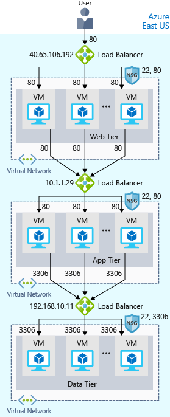
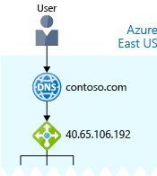

You now have your site up and running on Azure. But how can you help ensure your site is running 24/7?

For instance, what happens when you need to do weekly maintenance? Your service will still be unavailable during your maintenance window. And because your site reaches users all over the world, there's no good time to take down your systems for maintenance. You may also run into performance issues if too many users connect at the same time.

## What are availability and high availability?

:::row:::
  :::column:::
    
  :::column-end:::
	:::column span="3":::
_Availability_ refers to how long your service is up and running without interruption. _High availability_, or _highly available_, refers to a service that's up and running for a long period of time.

You know how frustrating it is when you can't access the information you need. Think of a social media or news site that you visit daily. Can you always access the site, or do you often see error messages like "503 Service Unavailable"?
  :::column-end:::
 :::row-end:::

You may have heard terms like "five nines availability." Five nines availability means that the service is guaranteed to be running 99.999 percent of the time. Although it's difficult to achieve 100 percent availability, many teams strive for at least five nines.

## What is resiliency?

:::row:::
  :::column:::
    
  :::column-end:::
	:::column span="3":::
_Resiliency_ refers to a system's ability to stay operational during abnormal conditions.

These conditions include:

- Natural disasters
- System maintenance, both planned and unplanned, including software updates and security patches.
- Spikes in traffic to your site
- Threats made by malicious parties, such as distributed denial of service (DDoS) attacks
  :::column-end:::
:::row-end:::

Imagine your marketing team wants to have a flash sale to promote a new line of vitamin supplements. You might expect a huge spike in traffic during this time. This spike could overwhelm your processing system, causing it to slow down or halt, disappointing your users. You may have experienced this disappointment for yourself. Have you ever tried to access an online sale only to find the website wasn't responding?

## What is a load balancer?

:::row:::
  :::column:::
    
  :::column-end:::
	:::column span="3":::
A _load balancer_ distributes traffic evenly among each system in a pool. A load balancer can help you achieve both high availability and resiliency.

Say you start by adding additional VMs, each configured identically, to each tier. The idea is to have additional systems ready, in case one goes down, or is serving too many users at the same time.
  :::column-end:::
:::row-end:::

The problem here is that each VM would have its own IP address. Plus, you don't have a way to distribute traffic in case one system goes down or is busy. How do you connect your VMs so that they appear to the user as one system?

The answer is to use a _load balancer_ to distribute traffic. The load balancer becomes the entry point to the user. The user doesn't know (or need to know) which system the load balancer chooses to receive the request.

The following illustration shows the role of a load balancer.

The load balancer receives the user's request and directs the request to one of the VMs in the web tier. If a VM is unavailable or stops responding, the load balancer stops sending traffic to it. The load balancer then directs traffic to one of the responsive servers.

Load balancing enables you to run maintenance tasks without interrupting service. For example, you can stagger the maintenance window for each VM. During the maintenance window, the load balancer detects that the VM is unresponsive, and directs traffic to other VMs in the pool.

For your e-commerce site, the app and data tiers can also have a load balancer. It all depends on what your service requires.

## What is Azure Load Balancer?

Azure Load Balancer is a load balancer service that Microsoft provides that helps take care of the maintenance for you. Load Balancer supports inbound and outbound scenarios, provides low latency and high throughput, and scales up to millions of flows for all Transmission Control Protocol (TCP) and User Datagram Protocol (UDP) applications. You can use Load Balancer with incoming internet traffic, internal traffic across Azure services, port forwarding for specific traffic, or outbound connectivity for VMs in your virtual network.

When you manually configure typical load balancer software on a virtual machine, there's a downside: you now have an additional system that you need to maintain. If your load balancer goes down or needs routine maintenance, you're back to your original problem.

If instead, however, you use Azure Load Balancer, there's no infrastructure or software for you to maintain. You define the forwarding rules based on the source IP and port to a set of destination IP/ports.

The following illustration shows  the role of Azure load balancers in a multi-tier architecture.

## Azure Application Gateway

If all your traffic is HTTP, a potentially better option is to use Azure Application Gateway. Application Gateway is a load balancer designed for web applications. It uses Azure Load Balancer at the transport level (TCP) and applies sophisticated URL-based routing rules to support several advanced scenarios.

This type of routing is known as application layer (OSI layer 7) load balancing since it understands the structure of the HTTP message. 

Here are some of the benefits of using Azure Application Gateway over a simple load balancer:

- **Cookie affinity**. Useful when you want to keep a user session on the same backend server.
- **SSL termination**. Application Gateway can manage your SSL certificates and pass unencrypted traffic to the backend servers to avoid encryption/decryption overhead. It also supports full end-to-end encryption for applications that require that.
- **Web application firewall**. Application gateway supports a sophisticated firewall (WAF) with detailed monitoring and logging to detect malicious attacks against your network infrastructure.
- **URL rule-based routes**. Application Gateway allows you to route traffic based on URL patterns, source IP address and port to destination IP address and port. This is helpful when setting up a _content delivery network_.
- **Rewrite HTTP headers**. You can add or remove information from the inbound and outbound HTTP headers of each request to enable important security scenarios, or scrub sensitive information such as server names.

### What is a Content Delivery Network?

A content delivery network (CDN) is a distributed network of servers that can efficiently deliver web content to users. It is a way to get content to users in their local region to minimize latency. CDN can be hosted in Azure or any other location. You can cache content at strategically placed physical nodes across the world and provide better performance to end users. Typical usage scenarios include web applications containing multimedia content, a product launch event in a particular region, or any event where you expect a high-bandwidth requirement in a region.

## What about DNS?

:::row:::
  :::column:::
    
  :::column-end:::
	:::column span="3":::
DNS, or Domain Name System, is a way to map user-friendly names to their IP addresses. You can think of DNS as the phonebook of the internet.

For example, your domain name, contoso.com, might map to the IP address of the load balancer at the web tier, 40.65.106.192.

You can bring your own DNS server or use Azure DNS, a hosting service for DNS domains that runs on Azure infrastructure.
  :::column-end:::
:::row-end:::

The following illustration shows Azure DNS. When the user navigates to **contoso.com**, Azure DNS routes traffic to the load balancer.

## Summary

With load balancing in place, your e-commerce site is now more highly available and resilient. When you perform maintenance or receive an uptick in traffic, your load balancer can distribute traffic to another available system.

Although you can configure your own load balancer on a VM, Azure Load Balancer reduces upkeep because there's no infrastructure or software to maintain.

DNS maps user-friendly names to their IP addresses, much like how a phonebook maps names of people or businesses to phone numbers. You can bring your own DNS server, or use Azure DNS.
