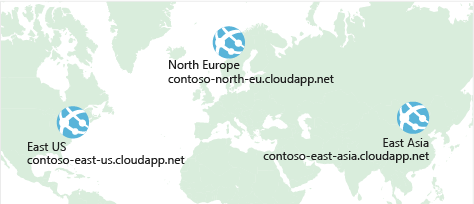
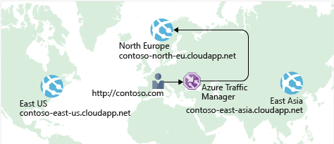

Previously, you saw how **Azure Load Balancer** helps you achieve high availability and minimize downtime.

Although your e-commerce site is more highly available, it doesn't solve the issue of latency or create resiliency across geographic regions.

How can you make your site, which is located in the United States, load faster for users located in Europe or Asia?

## What is network latency?

:::row:::
  :::column:::
    
  :::column-end:::
	:::column span="3":::  
_Latency_ refers to the time it takes for data to travel over the network. Latency is typically measured in milliseconds.

Compare latency to bandwidth. Bandwidth refers to the amount of data that can fit on the connection. Latency refers to the time it takes for that data to reach its destination.
  :::column-end:::
:::row-end:::

Factors such as the type of connection you use and how your application is designed can affect latency. But perhaps the biggest factor is distance.

Think about your e-commerce site on Azure, which is in the East US region. It would typically take less time to transfer data to Atlanta (a distance of around 400 miles) than to transfer data to London (a distance of around 4,000 miles).

Your e-commerce site delivers standard HTML, CSS, JavaScript, and images. The network latency for many files can add up. How can you reduce latency for users located far away geographically?

## Scale out to different regions

Recall that Azure provides data centers in regions across the globe.

:::row:::
  :::column:::
     
  :::column-end:::
  :::column span="3":::
Think about the cost of building a data center. Equipment costs aren't the only factor. You need to provide the power, cooling, and personnel to keep your systems running at each location. It might be prohibitively expensive to replicate your entire data center. But doing so with Azure can cost much less, because Azure already has the equipment and personnel in place.
  :::column-end:::
:::row-end:::

One way to reduce latency is to provide exact copies of your service in more than one region. The following illustration shows an example of global deployment.

The diagram shows your e-commerce site running in three Azure regions: East US, North Europe, and East Asia. Notice the DNS name for each. How can you connect users to the service that's closest geographically, but under the contoso.com domain?

## Use Traffic Manager to route users to the closest endpoint

:::row:::
  :::column:::
     
  :::column-end:::
  :::column span="3":::

One answer is **Azure Traffic Manager**. Traffic Manager can route traffic in a few different ways, such as to the endpoint with the lowest latency or by geography.
With geographic traffic routing, Traffic Manager directs users to specific endpoints based on which geographic location their DNS query originates from.
  :::column-end:::
:::row-end:::

The following illustration shows the role of the Traffic Manager.

Traffic Manager doesn't see the traffic that's passed between the client and server. Rather, it directs the client web browser to a preferred endpoint. 
Although not shown here, this setup could also include your on-premises deployment running in California. You can connect Traffic Manager to your own on-premises networks, enabling you to maintain your existing data center investments. Or you can move your application entirely to the cloud. The choice is yours.

## Compare Load Balancer to Traffic Manager

:::row:::
  :::column:::
     
  :::column-end:::
  :::column span="3":::
Azure Load Balancer distributes traffic within the same region to make your services more highly available and resilient. Traffic Manager works at the DNS level, and directs the client to a preferred endpoint. This endpoint can be to the region that's closest to your user.

Load Balancer and Traffic Manager both help make your services more resilient, but in slightly different ways. When Load Balancer detects an unresponsive VM, it directs traffic to other VMs in the pool. Traffic Manager monitors the health of your endpoints. When Traffic Manager finds an unresponsive endpoint, it directs traffic to the next closest endpoint that is responsive.
  :::column-end:::
:::row-end:::

## Summary

Geographic distance is one of the biggest factors that contributes to latency. With Traffic Manager in place, you can host exact copies of your service in multiple geographic regions. That way, users in the United States, Europe, and Asia will all have a good experience using your e-commerce site.
