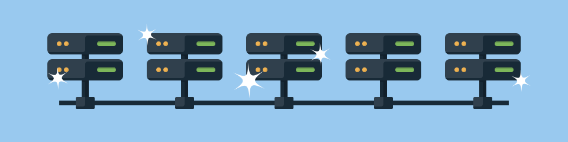

You learned just a few ways Azure networking can help reduce latency and make your apps and services more highly available. 

With load balancing and global distribution in place, your e-commerce site is ready for the world. Users reach the domain that's closest geographically. Each domain has failover built in, helping every user have a great experience. The numbers are already showing increased traffic, and business is booming.
