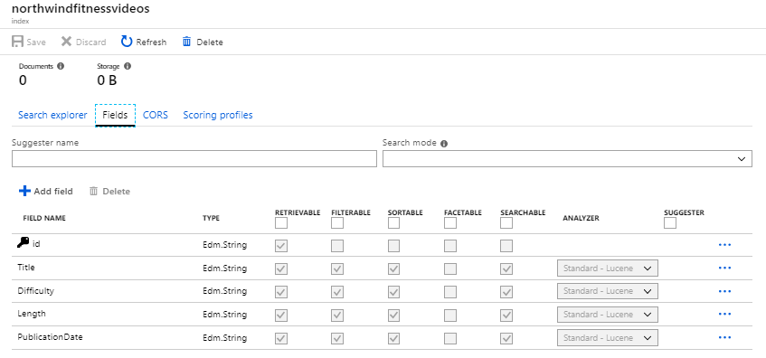

By integrating Azure Cognitive Search into the organizations apps and websites, companies can add fully featured search experiences for their customers. 

Your company wants to maximize the availability of its exercise video content to its customers. As part of establishing a greater online presence there's a need for an indexed and searchable video catalog. Your manager has asked you to look at implementing Azure Cognitive Search to provide a better search experience for your customers.

In this unit, you'll explore all the features of Azure Cognitive Search, its concepts and how to create a search index.

## A brief introduction to Azure Cognitive Search

:::image type="icon" source="../media/2-what-is-azure-search.png":::

Azure Cognitive Search is a service that enables a rich search experience over different kinds of content that can be consolidated into a single unified index. Imported data can originate from a variety of sources, with AI-powered indexing that can infer and extract searchable content from non-text sources. You decide what data is imported into the index, and set up indexers to pull that data into it, or push JSON formatted documents manually. Wherever your content is stored, once imported, Azure Cognitive Search becomes a powerful tool that can add intuitive search experiences for your customers.

Azure Cognitive Search lets you create, manage, and query search indexes. The results contain only your data, which can include text inferred or extracted from images, or new entities and key phrases detection through text analytics. It's a Platform as a Service (PaaS) so Microsoft manages the infrastructure and availability, allowing your organization to benefit without the need to purchase or manage additional hardware resources.

### What can Azure Cognitive Search do?

Search is part of everyday life, especially considering the vast amounts of data generated in the modern interconnected world. Azure Cognitive Search exists to compliment existing technologies and provides a programmable search engine built on Apache Lucene. Azure Cognitive Search is a highly available platform offering a 99.9% uptime SLA available for cloud and on-premises assets.

Azure Cognitive Search comes with the following features:

- **Data from any source**: Azure Cognitive Search accepts data from any source provided in JSON format, with auto crawling support for selected data sources in Azure.
- **Full text search and analysis**: Azure Cognitive Search offers full text search capabilities supporting both simple query and full Lucene query syntax.
- **AI powered search**: Azure Cognitive Search has Cognitive AI capabilities built in for image and text analysis from raw content.
- **Multi-lingual**: Azure Cognitive Search offers linguistic analysis for 56 languages to intelligently handle phonetic matching or language-specific linguistics. Natural language processors available to you in Azure Cognitive Search are the same as those used by Bing and Office.
- **Geo-enabled**: Azure Cognitive Search supports geo-search filtering based on proximity to a physical location.
- **Configurable user experience**: Azure Cognitive Search has several features to improve the user experience including autocomplete, autosuggest, pagination, and hit highlighting.

### What is cognitive search?

Cognitive search is a feature in Azure Cognitive Search that uses Cognitive Services AI in the indexing pipeline. Examples include extracting text from images, either through image analysis or recognition, or adding structure to unstructured data sources, such as detecting key phrases, language, sentiments, or entities.


Natural language and image-processing skills include:

- Entity recognition
- Language detection
- Key phrase extraction
- Text manipulation
- Text translation
- Sentiment detection
- Optical Character Recognition (OCR)
- Facial detection
- Image interpretation
- Image recognition

Enrichment is extensible. You can create custom skills, and custom processing, to add classification models to the pipeline (for example, document or shape recognition).

Your company is interested in using these features in the future, but want you to focus on creating a simple search experience, supported by the existing video catalog your development team has created.

## Azure Cognitive Search indexes

In Azure Cognitive Search, an index is a persistent collection of JSON documents and other content used to enable search functionality. The documents within an index can be thought of as rows in a table, each document is a single unit of searchable data in the index. In your company, the index will contain a document for each video in your catalog. The index includes a definition the structure of the data in these documents, in its schema. For each field in the document, the index stores its name, the data type, and it also stores what behaviors are supported for the field. Is the field searchable? Can the field be sorted?

A quick way to create an index schema is to use the Azure portal to import data from a supported data source, currently:

- Azure SQL Database
- SQL Server on an Azure VM
- Cosmos DB
- Azure Blob storage
- Azure Table storage

When you import data from one of these sources, the Azure Cognitive Search service automatically parses the data and populates a target index schema. A step in the import process allows you correctly set the data types, and specify the behaviors you'd like for each field. Using this approach to create your index schema also results in an indexer being automatically created. This indexer can then be run to initially load your search documents. Then, when new videos are created, or the data changes for existing videos, the indexer can be run again to update your index.

If you don't use this approach, you'll need to manually create your index, and create the indexer to load your JSON documents into the Search index.

### Index Design



Index design is important, if you forget to set a required behavior on a field, the only way to get that feature is to rebuild the index. When designing an index, it's key to remember the most effective indexes use only the behaviors that are needed. The smaller an index is, the faster it can return results.

During the design process, keep in mind the data your users will be searching, and how they may want to filter, or sort the results. Indexes consist of the following components:

- **Fields**: all the largest component in an index. Fields need to have a name, type, and have the behaviors defined for each of them

- **Scoring profiles**: lets you customize results to have certain documents return higher in the query results

- **Cross-Origin Resource Sharing**: browsers prevent cross-origin requests for security reasons. Enable this option if you need your index to be queried via JavaScript from different URLs. You can choose to lock down access to the index by using an allow list of origins, or you can allow all origins access.

#### Field Behaviors

All indexes require a unique text field to be defined as the primary key.

When creating your index, you need to choose the behaviors each field supports. The available options depend on what type of data is stored in the field:

- **Retrievable**: can this field be returned in the search results
- **Filterable**: can this field be used in filter expressions
- **Sortable**: can this field be sorted on in order by queries
- **Facetable**: can this field be used to group results to enable faceted navigation of the results
- **Searchable**: only available on text fields. Can this field be searched against
- **Analyzer to use**: only available on text fields. You choose the language analyzer for the field that processes text in a query.
- **Suggester**: used to incorporate autocomplete or type-ahead queries in index searches. With this selected, a webpage can use asynchronous JavaScript to offer both suggestions or offer autocomplete functionality.

Storage considerations are always important, and in Azure Cognitive Search it's no different. Remember that the behaviors you enable will have an impact on the size of storage required to store the index. Indexes supporting a full range of attributes will be substantially larger than just a searchable text index on a single field. Over time, as more documents are added to the index its size will grow.

### Index Workflows

A good practice for index design is to use an iterative workflow. Combine tools to complete the index design as quickly as possible:

1. Use the Import data wizard to prototype and load data to an index if your data is stored in one of the supported data sources.
1. If your data source is not supported by the Import data wizard, create an index manually in the portal. The portal has an interface to add fields, data types and assign behaviors.
1. The index schema can now be downloaded in JSON format. If you need to iterate on the index, you must now do that with a code-based approach.
1. The next step is to load data into the index, remember Azure Cognitive Search only supports JSON documents.
1. Finally you can query the index, analyze the results, and if necessary iterate on the index schema until it's correct.
1. Use the Search explorer on the Azure portal to test searches in real time.

Remember you have to drop and recreate indexes if you need to make changes to field definitions. Adding new fields is supported, with all existing documents having null values. You'll find it faster using a code-based approach to iterate your designs, as working in the portal requires the index to be deleted, recreated, and the schema details to be manually filled out.

## How to create an index

Azure Cognitive Search indexes can be created in several ways:

- Using the portal, Azure Cognitive Search includes a built-in index designer
- Programmatically using the Azure Cognitive Search REST APIs
- Programmatically using the .NET SDK, which has full parity to the REST APIs

#### Using the Azure portal

Azure Cognitive Search indexes can be created in the Azure portal using the index designer. Index creation in the portal is straight forward and consists of a few steps to provision the schema:

- Add an index through the designer, giving it a name
- Add fields to the index, specifying the key field and field attributes

The Import data wizard can be used in the portal to create indexes if you're using a data source that's supported.

#### Using C#

Azure Cognitive Search indexes can be created programmatically in C#. This is achieved using the .NET SDK. Index creation using this method is a case of following through a few simple tasks:

- Create a `SearchServiceClient` object class for connecting to the search service
- Create an `Index` object
- Call the `Indexes.Create` method to send the `Index` object to the search service

Creating an index in Azure Cognitive Search using C# requires you to obtain the URL endpoint and API key of the search service. These are then used to authenticate to the service when sending the create index requests.

#### Azure Cognitive Search REST API

You can use any programming language, including interpreted languages like Python or PowerShell, to call the Azure Cognitive Search Service REST API to create objects and manage your search service. The index definition and searchable content are provided in the request body as well-formed JSON content.

To use the Azure CLI, you'll first need to have created the search service. In the portal, make a note of the search service endpoint URL and the primary admin key.

The steps are then:

- Create an object to store the header for the REST API call.

    ```powershell
    $headers = @{
       'api-key' = '<your-admin-api-key>'
       'Content-Type' = 'application/json'
       'Accept' = 'application/json' }
    ```

- Test the details are correct by trying to connect to the API with `Invoke-RestMethod`.

    ```powershell
    Invoke-RestMethod -Uri <your-search-url> -Headers $headers | ConvertTo-Json
    ```

- Create an object to store the index schema definition of your index.

    ```powershell
    $body = @"
    {
        "name": "video-catalog",  
        "fields": [
            {"name": "id", "type": "Edm.String", "key": true, "searchable": false, "sortable": false, "facetable": false},
            {"name": "title", "type": "Edm.String", "filterable": false, "sortable": false, "facetable": false, "analyzer": "en.microsoft"},
            {"name": "difficulty", "type": "Edm.Int32"},
            {"name": "length", "type": "Edm.DateTimeOffset", "facetable": false},
            {"name": "publication", "type": "Edm.DateTimeOffset", "facetable": false},
            {"name": "size", "type": "Edm.Int32"}
        ],
        "suggesters": [  
        {  
           "name": "northwindsuggester",  
           "searchMode": "analyzingInfixMatching",  
           "sourceFields": ["title"]  
        }  
        ]
    }
    "
    ```

- Create a URL for the REST API endpoint, add the index name to the end of the Search service URL.

    ```powershell
    $url = "https://<your search service name>.search.windows.net/indexes/video-catalog?api-version=2019-05-01"
    ```

- Create the index using `Invoke-RestMethod`.

    ```powershell
    Invoke-RestMethod -Uri $url -Headers $headers -Method Put -Body $body | ConvertTo-Json
    ```

You have created an index using the REST API. You can load your search documents using the same approach, calling the appropriate REST endpoints.
