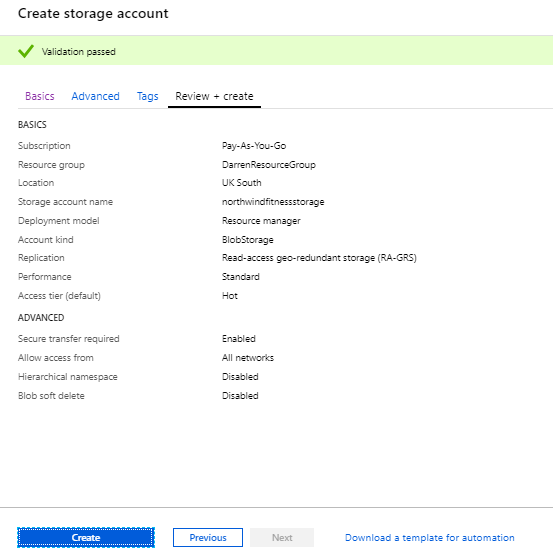
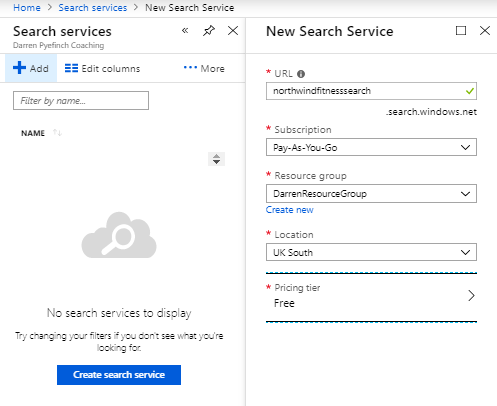

Azure Cognitive Search can be used in a code-free way via the portal. The wizards and editors aren't as feature rich as the SDK and REST APIs, but they will enable you to explore the best features quickly.

Your organization has a website where exercise videos are published. Your organization now needs to add a catalog index capability to enable users to search across the entire catalog using different properties. Azure Cognitive Search has been chosen as the tool to provide the search functionality.

In the unit, you'll create the Azure Cognitive Search service.

## Create an Azure Cognitive Search service in the Azure portal

1. Sign into the [Azure portal](https://portal.azure.com/learn.docs.microsoft.com?azure-portal=true) using the same account you activated the sandbox with.

1. On the Azure portal menu or from the **Home** page, select **Create a resource**.

1. Select **Web**, then select **Azure Cognitive Search**.

    

1. On the **New Search Service** page, complete the following fields.

    | Setting | Value |
    | --- | --- |
    | On the **Basics** tab > **Project Details** |
    | **Subscription** | Concierge Subscription  |
    | **Resource Group** |  Select the existing group <rgn>[sandbox resource group name]</rgn> |
    | **Instance Details** |
    | **URL** | Choose a unique name. In this exercise, enter *northwindfitness*  |
    | **Location** | Select your nearest datacenter |
    | **Pricing tier** | Standard |

1. Select **Review + create**, and after you see the response **Validation Success**, select **Create**.

    Your Azure Cognitive Search service will be up and running soon. There are many options to further configure your new search instance.

    If you were to continue to interact with the search service programmatically, you would need to obtain the URL and API key.

1. After deployment completes, select **Go to resource**.

1. Select the Azure Cognitive Search resource you created to navigate to its overview page. Note the ability to add indexes, import data, and search created indexes.

    
