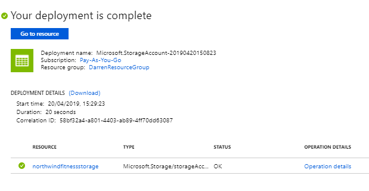
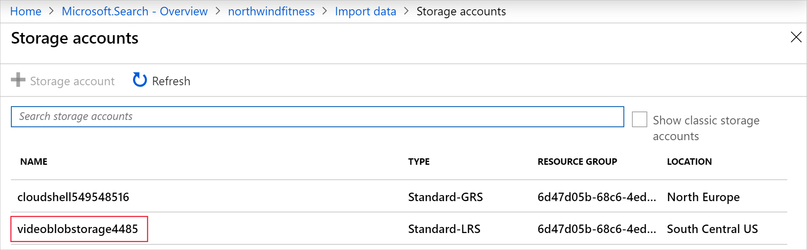

Azure Search is a rich search experience over a variety of content wherever the content is stored.

Your organization has a large number of exercise videos publicly available through its website. Users are struggling to find relevant content or are undertaking exercises beyond their fitness level. The exercise videos need to be indexed using the following properties video title, exercise difficulty, video length, and publication date.  It is hoped that these changes will improve user experience and result in fewer complaints about being unable to find relevant content.

In the unit, you'll load and index data in the Azure Search service we created earlier.

## Create the example video data set

1. Use the Cloud Shell to create a storage account and container.

    ```azurecli
    export AZURE_STORAGE_ACCOUNT="videoblobstorage"$RANDOM
    export CONTAINER="videocontainer"$RANDOM
    az storage account create --name $AZURE_STORAGE_ACCOUNT -g <rgn>[sandbox resource group name]</rgn> --kind StorageV2 --sku Standard_LRS
    export CREDENTIALS=$(az storage account show-connection-string --name $AZURE_STORAGE_ACCOUNT -o tsv)
    az storage container create --connection-string $CREDENTIALS --name $CONTAINER
    ```

1. Download the example video catalog into Cloud Shell storage.

    ```bash
    curl ... video-catalog.json
    ```

1. Upload the video catalog to the blob storage account.

    ```azurecli
    az storage blob upload --connection-string $CREDENTIALS --container-name $CONTAINER --file video-catalog.json --name VideoCatalog
    ```

1. The `video-catalog.json` contains the following data:

    ```json
    [
        {
            "id": "cc74bc3d-95b4-457f-bf5e-59c577938034",
            "Title": "Squats and Stars",
            "Difficulty": "7",
            "Length": "00:02:40",
            "Publication": "2019-04-29 12:34:56",
            "Size": "346"
        },
        {
            "id": "f94089de-d9f2-42d6-945d-276ae928564d",
            "Title": "Full body workout",
            "Difficulty": "9",
            "Length": "00:15:30",
            "Publication": "2019-04-24 11:14:06",
            "Size": "1897"
        },
        {
            "id": "d3a9f34f-d8a1-421b-bdd3-adbf826dbc84",
            "Title": "Crunches and Curls",
            "Difficulty": "4",
            "Length": "00:4:12",
            "Publication": "2019-04-22 09:56:26",
            "Size": "532"
        } ...
    ```

    A video has a title string, a difficulty rating integer, length in minutes, a publication date, and a file size in megabytes.

## Create an Azure Search index for your data in the Azure portal

1. Sign into the [Azure portal](https://portal.azure.com/learn.docs.microsoft.com?azure-portal=true) using the same account you activated the sandbox.

    

1. Search **northwindfitness** at the top of the dashboard, then select the search service you created.

    

1. On the **northwindfitness** search Overview page, select **Import data**.

1. On the **Connect to your data** page, select **Azure Blob Storage** as the **Data Source**.

    

1. Enter **videocatalog** in the **Name** field.
1. Change the **Parsing mode** to **JSON array**.
1. Select **Choose and existing connection**.

    

1. Select the video storage account.

    

1. Select the video container, then press the **Select**.

1. Select **Next: Add cognitive search (Optional)**.

    

    Azure Search will read the contents of the JSON file and create an index schema automatically.

1. On the **Add cognitive search (Optional)** page, select **Skip to: Customize Target Index**.

    

1. On the **Customize Target Index** page use the below information to fill out the fields.

    | Field | Value |
    | --- | --- |
    | **Key** | Select the **id** field |
    | **Suggester name** |  **northwindfitnesssugg** |
    | **Search mode** | Select **analyzingInfixMatching** option |

    Change the Type of the fields to match the above, and select the checkboxes, then select **Next: Create an indexer**.

1. On the **Create an indexer** page, select **Submit** to begin building the indexer.

    When the process completes, the portal will return you to the Search service overview.

    

1. Select the **indexers** tab, and then select **myindexer**.
1. At the top of **myindexer** page, select **Run**.

    

1. The indexer should import the video catalog, and show that 19 documents have been imported into the index.

## Test the index


1. On the Search service overview, select **Search explorer**.

    

1. In the **Query string** enter `search=*&$count=true`, then select **Search**.

    The search query above returns all the documents in the search index, including a count of all the documents.

1. Leave the Azure portal signed in for the next exercise.

## Edit and then rebuild an Azure Search index

The index can't be rebuilt in the Azure portal. You can only rebuild an index programmatically with the REST API and .NET SDK. If you are in the development stage, and only have access to the portal, you can delete and recreate the index.