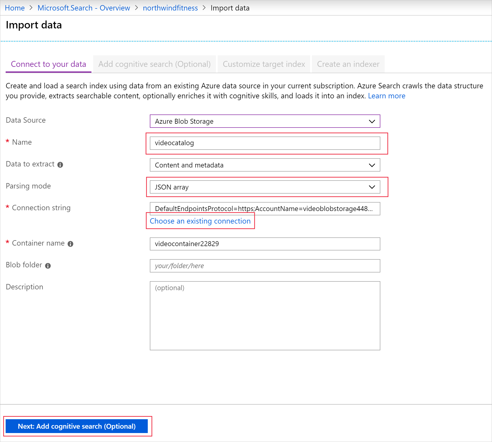
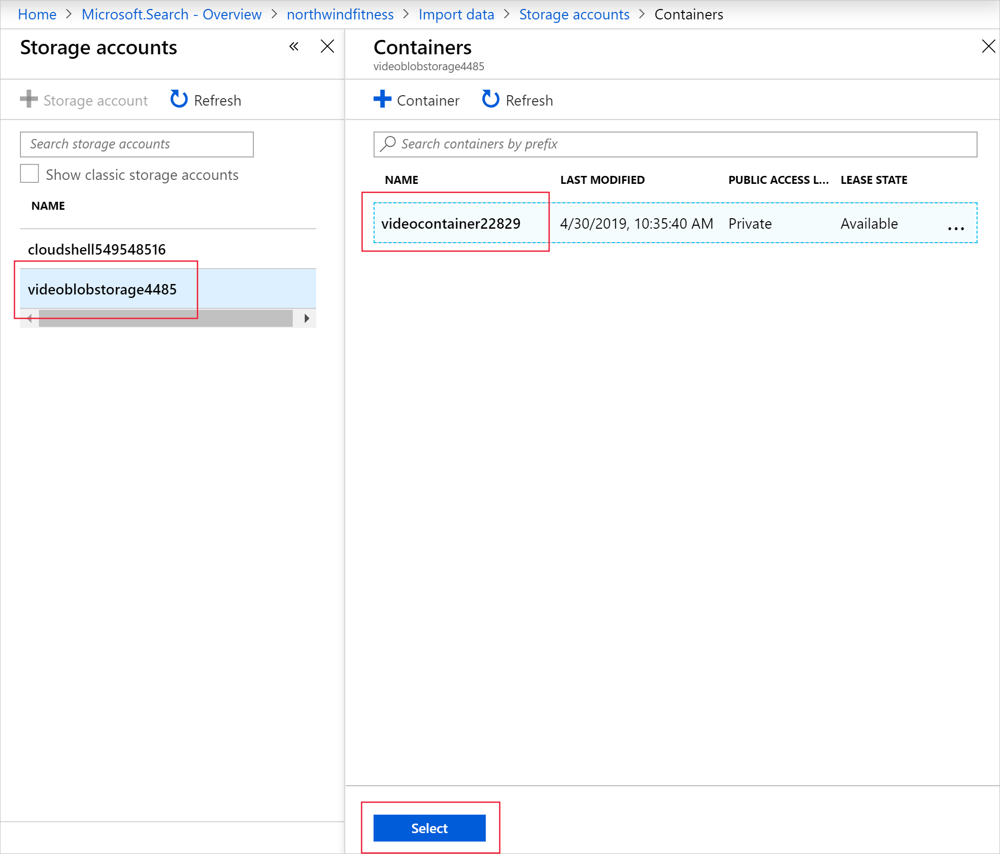
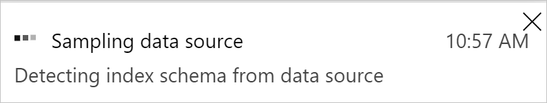
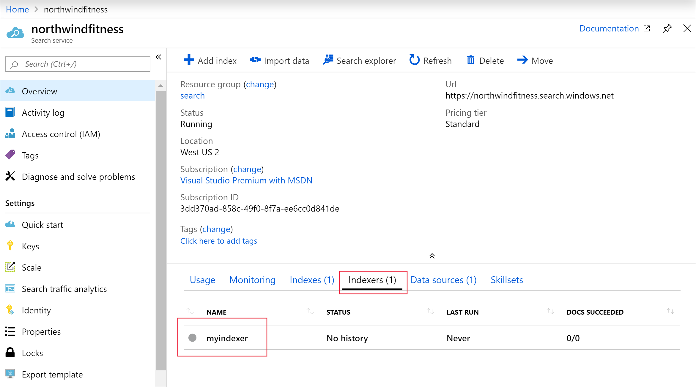
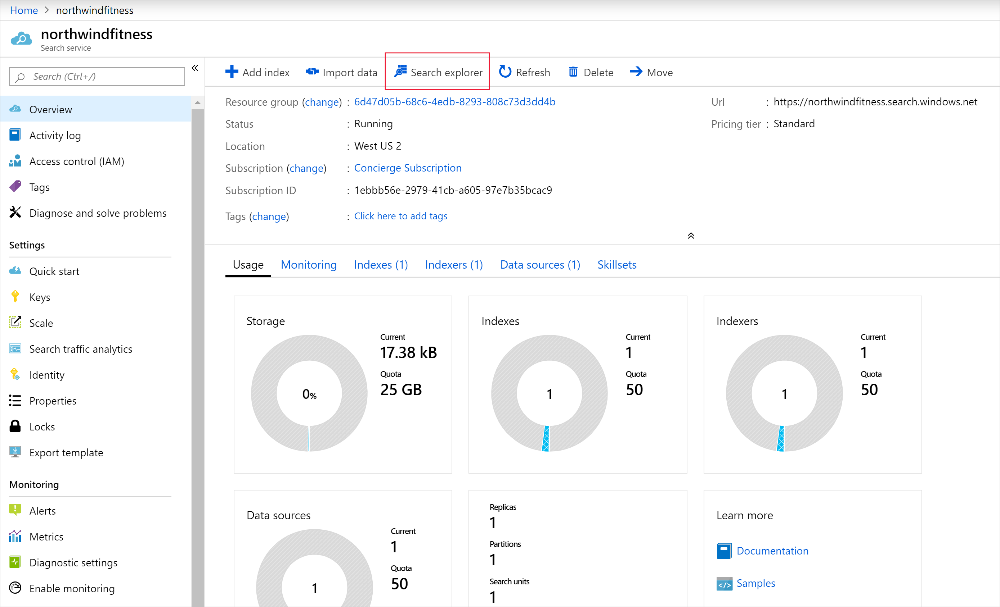
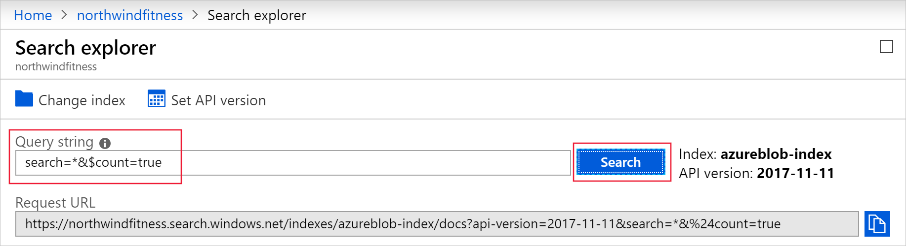

The Azure portal provides the Import data wizard that enables you to automatically create an index, and indexer, for supported data sources.

Your organization has a large number of exercise videos publicly available through its website. Users are struggling to find relevant content, or are undertaking exercises beyond their fitness level. The exercise videos need to be indexed using the following properties: video title, exercise difficulty, video length, and publication date. It is hoped that these changes will improve their experience, and result in fewer complaints about being unable to find relevant content.

Your database team has exported your company's current video catalog into a JSON array. This enables you to upload the catalog into Azure Blob storage so that is it accessible by a search indexer. The data is in the following format:

```json
[
    {
        "id": "cc74bc3d-95b4-457f-bf5e-59c577938034",
        "Title": "Squats and Stars",
        "Difficulty": "7",
        "Length": "00:02:40",
        "Publication": "2019-04-29 12:34:56",
        "Tags": ["cardio","floor","burn"],
        "Size": "346"
    },
    {
        "id": "f94089de-d9f2-42d6-945d-276ae928564d",
        "Title": "Full body workout",
        "Difficulty": "9",
        "Length": "00:15:30",
        "Publication": "2019-04-24 11:14:06",
        "Tags": ["cardio","floor","burn","free weights"],
        "Size": "1897"
    },
    {
        "id": "d3a9f34f-d8a1-421b-bdd3-adbf826",
        "Title": "Crunches and Curls",
        "Difficulty": "4",
        "Length": "00:4:12",
        "Publication": "2019-04-22 09:56:26",
        "Tags": ["cardio","floor","burn"],
        "Size": "532"
    }, ...
```

A video has a title string, a difficulty rating integer, length in minutes, a publication date and time, and a file size in megabytes.

In this exercise, you'll use the Import data wizard to create an index, and import your video catalog into the Azure Cognitive Search service you created earlier.

## Load the video catalog into Azure blob storage

1. Use the Cloud Shell to create a storage account and container.

    ```azurecli
    export AZURE_STORAGE_ACCOUNT="videoblobstorage"$RANDOM
    export CONTAINER="videocontainer"$RANDOM
    az storage account create --name $AZURE_STORAGE_ACCOUNT -g <rgn>[sandbox resource group name]</rgn> --kind StorageV2 --sku Standard_LRS
    export CREDENTIALS=$(az storage account show-connection-string --name $AZURE_STORAGE_ACCOUNT -o tsv)
    az storage container create --connection-string $CREDENTIALS --name $CONTAINER
    ```

1. Download your company's video catalog into the Cloud Shell storage.

    ```bash
    curl https://raw.githubusercontent.com/MicrosoftDocs/mslearn-introduction-to-azure-search/master/video-catalog.json -o video-catalog.json
    ```

1. Upload the video catalog to the blob storage account.

    ```azurecli
    az storage blob upload --connection-string $CREDENTIALS --container-name $CONTAINER --file video-catalog.json --name VideoCatalog
    ```

## Create a search index for your data in the Azure portal

1. Sign into the [Azure portal](https://portal.azure.com/learn.docs.microsoft.com?azure-portal=true) using the same account you activated the sandbox with.

1. On the Azure portal menu or from the **Home** page, select **All resources**.

1. Select the Azure Cognitive Search resource you created to navigate to its overview page. Note the ability to add indexes, import data, and search created indexes.

1. On the **northwindfitness** search Overview page, select **Import data**.

    

1. On the **Import data** page, complete the following fields.

    | Setting | Value |
    | --- | --- |
    | **Connect to your data** |
    | **Data Source** | From the dropdown, select **Azure Blob Storage** |
    | **Data source name** | Enter *videocatalog* |
    | **Parsing mode** | From the dropdown, select **JSON array** |
    | **Connection string** |  Select **Choose an existing connection** link |

    

1. On the **Storage accounts** page, select the video storage account.

    

1. Select the video storage account.

1. Select the video container, and then select **Select**.

1. At the bottom of the page, select **Next: Add cognitive skills (Optional)**.

    

    Azure Cognitive Search will read the contents of the JSON file, and create an index schema automatically.

1. On the **Add cognitive search (Optional)** tab, select **Skip to: Customize target index**.

    

1. The **Customize target index** tab enables you to change the automatically-generated index schema created by the Import data wizard. The fields are populated by the wizard after reading the file in blob storage. Use the following table to complete the named fields:

    | Field | Value |
    | --- | --- |
    | **Key** | From the dropdown, select **id** |
    | **Suggester name** |  **northwindfitnesssugg** |
    | **Search mode** | From the dropdown, select **analyzingInfixMatching** |

    Change the attributes and data types of the fields to match the following table:

    | Field name | Type | Retrievable | Filterable | Sortable | Facetable | Searchable | Analyzer | Suggester |
    | --- | --- | --- | --- | --- | --- | --- | --- | --- |
    | **Title** | Edm.String | ✔ |  | ✔ |  | ✔ | Standard - Lucene | ✔ |
    | **Difficulty** | Edm.Int64 | ✔ | ✔ | ✔ | ✔ |  |  |  |
    | **Length** | Edm.DateTimeOffset | ✔ | ✔ | ✔ | ✔ |  |  |  |
    | **Publication** | Edm.DateTimeOffset | ✔ | ✔ | ✔ | ✔ |  |  |  |
    | **Size** | Edm.Int64 | ✔ | ✔ | ✔ | ✔ |  |  |  |

    Select **Next: Create an indexer**.

1. On the **Create an indexer** tab, select **Submit** to begin building the indexer.

    When the process completes, the portal returns to the Search service overview.

    

1. Select the **Indexers** tab, and then select **azureblob-indexer**.

1. At the top of **azureblob-indexer** page, select **Run**, and then select **Yes**.

    

1. The indexer should import the video catalog, and show that 19 documents have been imported into the index.

## Test the index



1. Scroll to the search service overview, and from the top menu bar, select **Search explorer**.

    

1. In the **Query string** field, enter `search=*&$count=true`, and then select **Search**.

    The search query above returns all the documents in the search index, including a count of all the documents.

    ```json
    {
        "@odata.context": "https://northwindfitness.search.windows.net/indexes('azureblob-index')/$metadata#docs(*)",
        "@odata.count": 18,
        "value": [
            {
                "@search.score": 1,
                "id": "OTViNC1jYzc0YmMzZC00NTdmLWJmNWUtNTljNTc3OTM4MDM00",
                "Title": "Power Boxing",
                "Difficulty": 7,
                "Length": "2019-05-02T00:02:40Z",
                "Publication": "2019-04-29T12:34:56Z",
                "Size": 346
            },
            {
                "@search.score": 1,
                "id": "YTE0OC0xNGYxYjIxZS1lNjIxLTQ4MDMtODdjZGI4OWI2NTA30",
                "Title": "Kettlebells",
                "Difficulty": 8,
                "Length": "2019-05-02T00:07:11Z",
                "Publication": "2019-04-28T22:56:26Z",
                "Size": 899
            }, ...
    ```

1. Leave the Azure portal signed in for the next exercise, as you'll be continuing to explore more complex search features.
