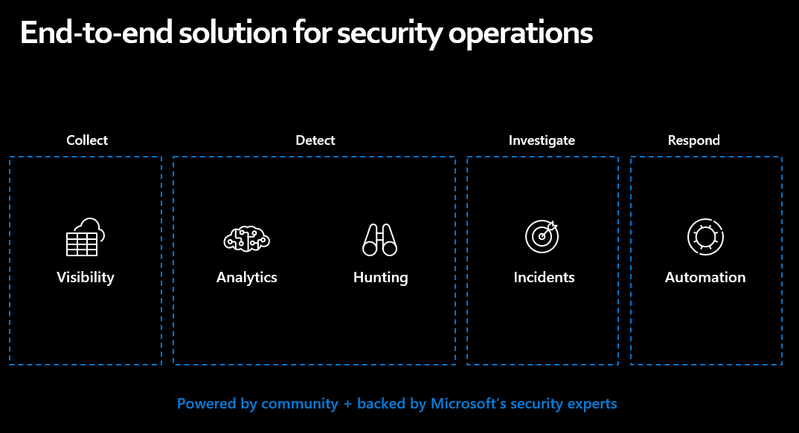

# What is Azure Sentinel 

Let's start with a few definitions and a quick tour through Security Information and Event Management (SIEM) systems in general and Azure Sentinel.

## What is Security Incident and Event Management (SIEM)?
A SIEM is a tool that enables organizations to collect, analyze and perform Security Operations on their computer systems, wether those be hardware appliances, applications, or both.

In it's simplest form, a SIEM will enable you to collect logs, query them, do some form of correlation or anomoly detection and create alerts and incidents based on findings.

The functionality that a SIEM may offer could include: 

**Log Management** - The ability to collect, store and query the log data from resources within our environment.

**Alerting** - Proactively looking within the log data for potential security incidents and Anomolies.

**Visualization** - 
Graphs and Dashboards that enable us to gain visual insights into our log data.

**Incident Management** - Creating, updating, assigning and investigating incidents that have been identified. 

**Querying Data** - Similar to Log Management, there should be a rich query language to enable us to query and understand our data.

## What is Azure Sentinel?

Azure Sentinel is a cloud native SIEM solution. This means that, unlike traditional SIEM solutions, you don't need to install any servers either on premises or in the cloud, to get things up and running, it's offered to you as a service. You can get up and running with Sentinel in just a few clicks in the Azure Portal.

It also means that Azure Sentinel is tightly integrated with other cloud services, enabling you to not only ingest logs at the click of a button, but to leverage other cloud services natively such as authorization and automation.

For example, Azure Sentinel supports Role Based Access control, so you can give different people in your team, different permissions depending on their role.

It is designed to help you enable end to end security operations including Collection, Detection, Investigation and Response.

Let's take a look at the key components that make up Azure Sentinel.