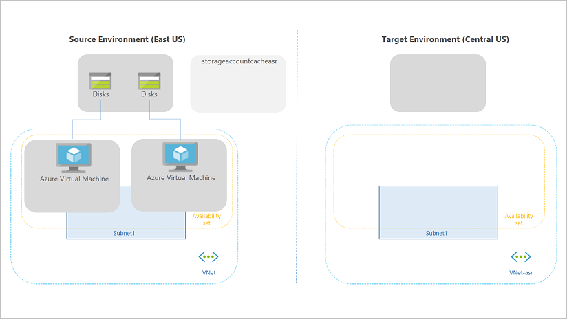

Azure Site Recovery manages the orchestration of disaster recovery. Azure Site Recovery is designed to replicate workloads from a primary location or region to a secondary location. 

You can perform a failover if you wish to shift where your workloads are running                                    or if there's an issue that's causing disruption at the primary location. After you perform a failover, the workloads that were running in the primary location or region can run in the secondary location. Once the issue at the primary location is resolved, you can fail back the workloads to the primary location.

If the primary location has an issue, Azure Site Recovery can replicate protected VMs to another Azure region.

## Replication

Replication is the process of continuously transferring the state of the protected workloads from the primary location or region to the secondary location. Replication from on-premises to Azure occurs across a TLS 1.2 connection on the public internet.

You can't configure replication over Azure VPN. However, you can configure replication over Azure ExpressRoute under the following conditions:

- Azure Site Recovery replicates data to Azure Storage over a public endpoint. You need to set up Microsoft peering or use an existing public peering (deprecated for new circuits) to use ExpressRoute for Site Recovery replication.

- Microsoft peering is the recommended routing domain for replication.

- Replication isn't supported over private peering.

- If you're protecting VMware machines or physical machines, ensure that the networking requirements for Configuration Server are also met. Connectivity to specific URLs is required by Configuration Server for orchestration of Site Recovery replication. You can't use ExpressRoute for this connectivity.

- After the virtual machines are failed over to an Azure virtual network, you can access them using the private peering setup with the Azure virtual network.

Replication between Azure sites occurs over the Microsoft network backbone.

## Replication policies

A replication policy defines the settings for the retention history of recovery points. It also defines the frequency of app-consistent snapshots.

By default, Azure Site Recovery creates a new replication policy with the following default settings:

- 24 hours for the retention history of recovery points
- 0 hours for the frequency of app-consistent snapshots

You can increase the retention history of recovery points to 14 days. You can configure app-consistent recovery points to be taken as frequently as once an hour.

The frequency of replication data transmission between primary and secondary locations depends on the type of workload being replicated:

- Hyper-V VMs: Replication can be performed every 30 seconds (except for premium storage), 5 minutes, or 15 minutes.
- Azure VMs, VMware VMs, physical servers: Replication is continuous.

> [!NOTE]
> You can't perform an offline replication using Azure Data Box or other storage technologies for the initial replication to Azure.

For scenarios where you're replicating from one Azure region to another, it's possible to replicate between Azure subscriptions if those subscriptions are associated with the same Azure AD tenant.

## Recovery points

Azure Site Recovery has customizable replication policies that you can use to define the retention history of recovery points and the frequency of snapshots. You can create a recovery point from a snapshot of a VM's disk.

The two types of snapshots available are *Crash-consistent* and *App-consistent*:

- **Crash-consistent** recovery represents the data on-disk at the time the snapshot is taken. The snapshots are captured every 5 minutes by default. The crash-consistent recovery point doesn't include anything that was in memory when the snapshot was taken.

- **App-consistent** recovery captures the same data as crash-consistent but also includes all in-memory data and in-process transactions. Including the in-memory data means that the Site Recovery can restore a VM and any running apps without any data loss. The snapshots aren't captured by default. You can enable them in the Replication policy if necessary.

All recovery points are kept for 24 hours by default, and you can extend this period to 14 days if necessary. If a disruption occurs and new recovery points can't be created, the oldest recovery points won't be overwritten. This is because Azure Site Recovery only replaces the oldest point if it generates new points. Until there are new recovery points, all the old points remain after you reach the retention window.

## Recovery plans

A recovery plan gathers machines into recovery groups for the purpose of failover. A recovery plan helps you define a systematic recovery process by creating small independent units that you can fail over. A unit typically represents an app in your environment.

- A recovery plan defines how machines fail over and the sequence in which they start after failover.

- You can use recovery plans for both failover to and failback from Azure.

- You can add up to 100 protected instances to one recovery plan.

- You can customize a plan by adding order, instructions, and tasks to it.

- After a plan is defined, you can run a failover on it.

- Machines can be referenced in multiple recovery plans, in which subsequent plans skip the deployment/startup of a machine if it was previously deployed using another recovery plan.

Recovering large applications can be a complex task. Manual steps make the process prone to error, and the person running the failover might not be aware of the intricacies of all apps. You can use a recovery plan to impose order and automate the actions needed at each step, using Azure Automation runbooks for failover to Azure, or scripts. For tasks that can't be automated, you can insert pauses for manual actions into recovery plans.

## What is a disaster-recovery drill?

A disaster-recovery drill is a way to check if you configured your solution correctly. The drill gives you confidence that your data and services are available even if a disaster happens. Typically, organizations set a recovery time objective (RTO) that indicates how long it will take to recover infrastructure. Your company should also define a recovery point objective (RPO), which defines the amount of data loss that is acceptable as a function of time. For example, if your company's RPO is one day, you'll need to create a backup of all your data each day. You'll also need to make sure it takes less than a day to restore this backup.

Azure Site Recovery gives you the flexibility to run a full disaster-recovery test scenario for all your VMs. You can create recovery plans that include one or more of your VMs. You can run failover multiple times and allow for a flexible policy to test different combinations of infrastructure.

## Failover and failback

A failover occurs when a decision is made to execute a disaster-recovery plan for your organization. When you initiate a failover, the VMs are created in the target resource group, target virtual network, target subnet, and target availability set. During a failover, you can use any recovery point.

The target environment becomes the de facto production environment in which your organization's production services run. After the target region is active, the source environment should no longer be used.

A production failover in Azure Site Recovery is similar a test drill. There are some exceptions: for product failover, the option is **Failover**; whereas, for test, it's **Test failover**.

You can choose to shut down the source VM before starting the failover so that no data is lost during the switch.

When the failover is complete, ensure that the VM is working as expected. Azure Site Recovery allows you to change the recovery point at this stage. If the failover works as expected, you can commit the failover. Azure Site Recovery deletes all the source VM recovery points and completes the failover. With your replicated infrastructure and data in the secondary region, you must remember that the new VM in the secondary region also needs protection.

> [!NOTE]
> Azure Site Recovery does not clean up the source environment after the failover is complete.

You can quickly start Azure Site Recovery failover and failback using the Azure portal. When running a failover, you'll select a recovery point. Running a failback is simply a reverse of this process; when a failover is successfully committed, you can protect the workload, and then it's available to failback.

Failover isn't automatic when the primary location suffers an unexpected outage. You can initiate failovers with single click in the portal, or you can use Azure Site Recovery PowerShell to trigger a failover. Failing back is a simple action in the Site Recovery portal.

> [!NOTE]
> Failback from Azure to an on-premises physical server isn't currently supported, but it's possible to fail back a physical server replicated to Azure to a VMware virtual machine.
>
> If the primary datacenter experiences an unexpected outage, you can trigger an unplanned failover from the secondary site. Site Recovery does not require connectivity from the primary site to perform the failover.

## VM reprotection

When a VM is failed over, the replication performed by Site Recovery no longer occurs. You must re-enable the protection to start protecting the failed-over VM. As you already have the infrastructure in a different region, you can start replicating back to the source region. Reprotection enables Azure Site Recovery to start replicating your new target environment back to the source environment where it started.
