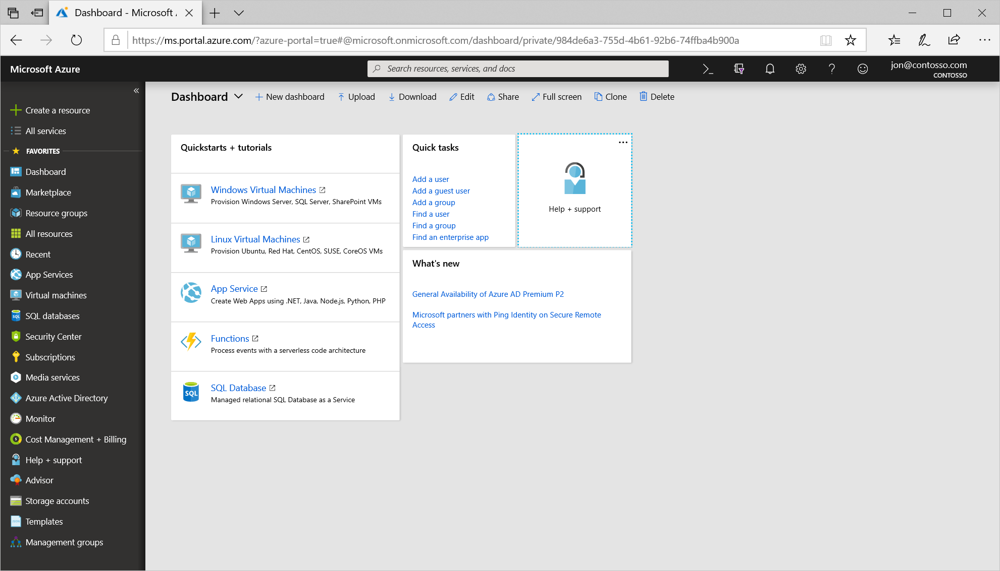
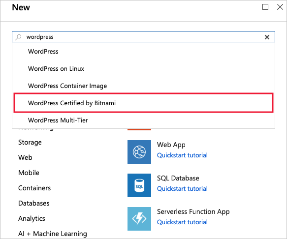
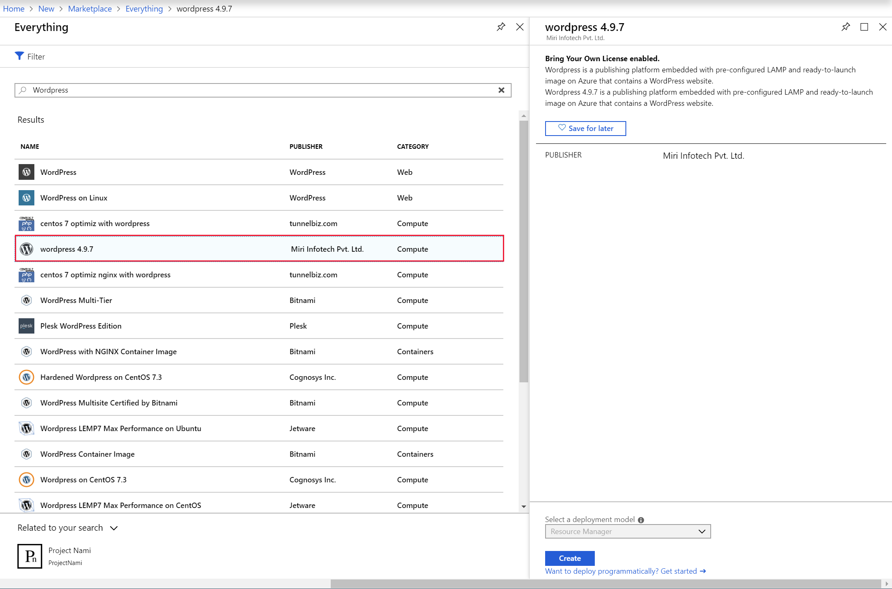
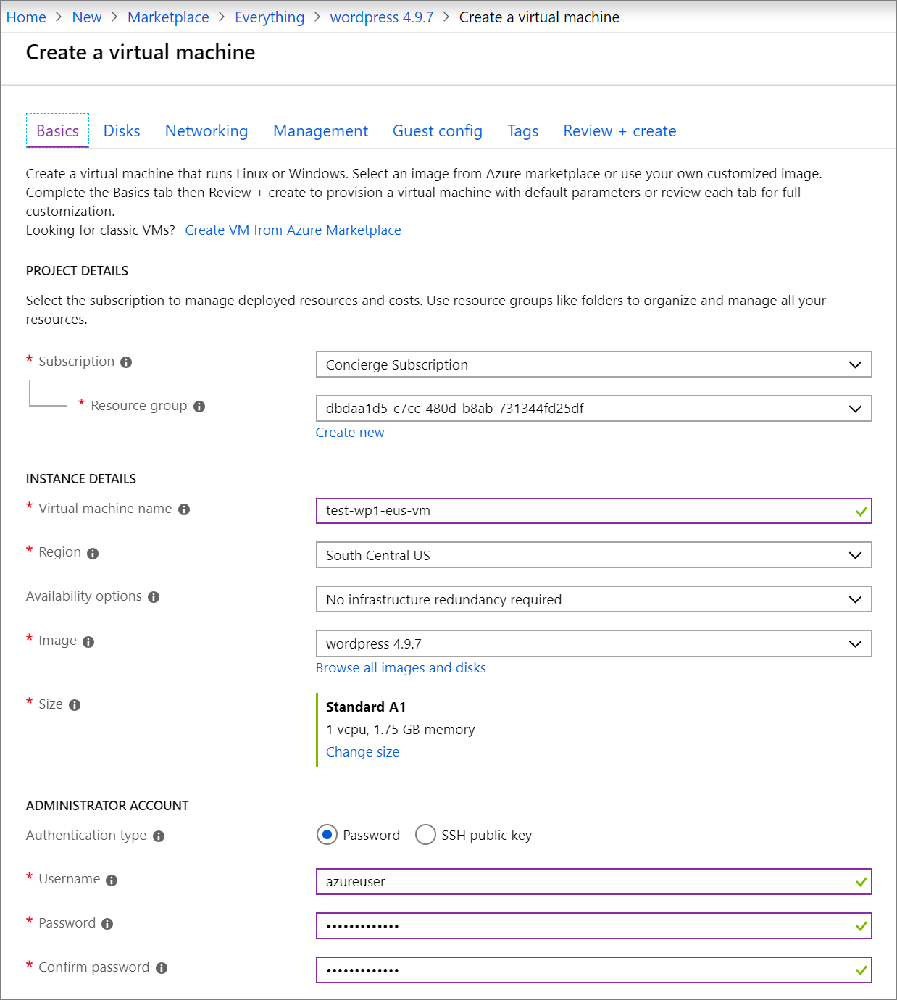
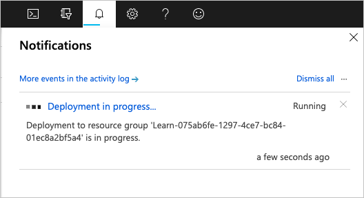
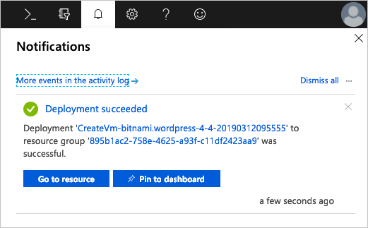
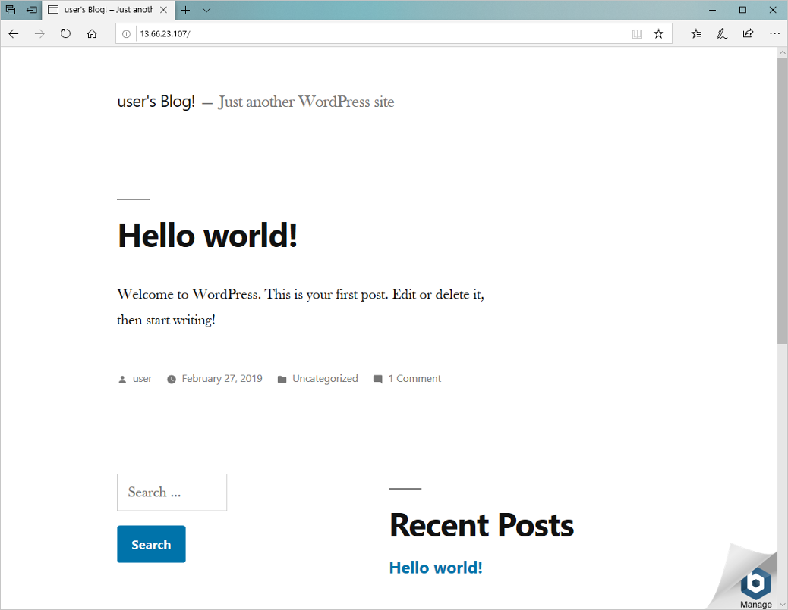

You've planned out the network infrastructure and identified a few VMs to migrate to the cloud. You have several choices for creating your VMs. The choice you make depends on the environment you are comfortable with. Azure supports a web-based portal for creating and administering resources. You can also choose to use command-line tools that run on MacOS, Windows, and Linux.

[!include]

#### Options to create and manage VMs

> [!VIDEO https://www.microsoft.com/videoplayer/embed/RE2yJKx]

Let's explore the Azure portal first - it's the easiest way to start with Azure.

## Azure portal

The **Azure portal** provides an easy-to-use browser-based user interface that allows you to create and manage all your Azure resources. For example, you can set up a new database, increase the compute power of your virtual machines, and monitor your monthly costs. It's also a great learning tool, since you can survey all available resources and use guided wizards to create the ones you need.

Once logged in, you're presented with two main areas. The first is a menu with the options to help you create resources, monitor resources, and manage billing. The second is a customizable dashboard that provides you with a snapshot view of all the essential services you've deployed to Azure. You'll most likely find the portal the most comfortable option to use when you start using Azure.

> [!TIP]
> The views that are presented as you make selections in the portal are often called _blades_. A blade may act as both a menu structure or a configuration panel. As you navigate throughout the Azure portal, UI will be stacked from left to right, and the web viewport will slide over to show the current blade. You can use the slider at the bottom to quickly move back to parent views.

### Create an Azure VM with the Azure portal

Let's assume you want to create a VM running a WordPress website. Setting up a site isn't difficult, but there are a couple of things to keep in mind. You need to install and configure an operating system, configure a website, install a database, and worry about things like firewalls. We're going to cover creating VMs in the next few modules, but let's create one here to see how easy it is. We won't go through all the options - check out one of the **Create a VM** modules to get complete details on each option.

1. Sign into the [Azure portal](https://portal.azure.com/learn.docs.microsoft.com?azure-portal=true) using the same account you activated the sandbox with.

1. You'll see the Azure resource creation and management menu on your left and the dashboard filling the rest of the screen.

    

1. Click on the **Create a resource** option in the top left corner of the portal page. This will open the Azure Marketplace blade. If the left-hand sidebar is collapsed, it will be a green "plus". You can expand the sidebar by clicking the expand caret to see the full text as shown in the image above.

    

    As you can see, there are many selectable options. We want to create a VM running a WordPress website. VMs are Azure compute resources, so select the **Compute** option on the available list and then search for WordPress VM images. You can click **See All** to get the full list.

1. Use the **Search the Marketplace** search bar, and look for "WordPress". You should now see a list of options. Select the option that reads **WordPress 4.9.7** as shown below.

    

    The blade that opens next will present licensing information for the image we're about to use. Click on **Create**.

    

1. You're presented with the **Create virtual machine** blade. Notice the wizard-based approach we can use to configure the VM.

### Configure the VM

We need to configure the basic parameters of our WordPress virtual machine. If some of the options at this point are unfamiliar to you, that is OK. We're going to discuss all of these options in a future module. You're welcome to copy the values used here.

1. Use the following values on the **Basics** tab.
    - The subscription should be set to _Concierge Subscription_.
    - Select **Use existing** for the region, and then select **Use existing** and <rgn>[sandbox resource group name]</rgn> from the Resource Group drop-down.
    - Enter a **Name** for the VM. Use _test-wp1-eus-vm_.
    - Select a **Region** close to you from the following list.
        [!include]
    - Choose _None_ for the **Availability options**. This is for high availability.
    - The **Image** should be the _WordPress 4.9.7_ option we selected from the Marketplace.
    - Leave the **Size** as the default _Standard A1_ - it will give you a single core and 1.75 GB of memory, which should be sufficient for a simple website.
    - Switch to **Password** for the authentication type, and enter a username and password.

    

1. There are several other tabs you can explore to see the settings you can influence during the VM creation. Once you are finished exploring, click **Review + create** to review and validate the settings.

1. On the review screen, Azure will validate your settings. You might need to supply some additional information based on the requirements of the image creator. Verify all the settings are set the way you want, and then click **Create** to deploy and create the VM.

1. You can monitor the deployment through the **Notifications** panel. Click the icon in the top toolbar to show or hide the panel.

    

1. The VM deployment process takes a few minutes to complete. You'll receive a notification informing you that the deployment succeeded. Click on the **Go to resource** button to go to the VM overview page.

    

1. Here you can see all the information and configuration options for your newly created WordPress VM. One of the pieces of information is the **Public IP address**.

    

11. Copy the IP address, open a new tab in your browser, and paste it in. It should browse to a brand-new WordPress site.

    

Congratulations! With a few steps, you deployed a VM that runs Linux, has a database installed, and has a functional website. Let's explore some other ways we could have created a VM.
