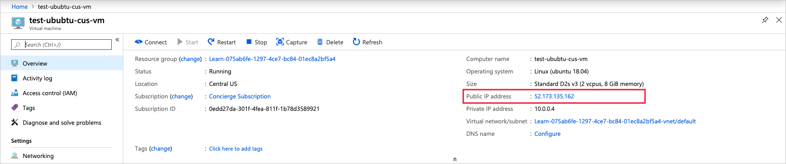

You've planned out the network infrastructure and identified a few VMs to migrate to the cloud. You have several choices for creating your VMs. The choice you make depends on the environment you're comfortable with. Azure supports a web-based portal for creating and administering resources. You can also choose to use command-line tools that run on Windows, Linux, and macOS.

#### Options to create and manage VMs

> [!VIDEO https://www.microsoft.com/videoplayer/embed/RE2yJKx]

Let's explore the Azure portal first - it's the easiest way to start with Azure.

## Azure portal

The **Azure portal** provides an easy-to-use browser-based user interface that enables you to create and manage all your Azure resources. For example, you can set up a new database, increase the compute power of your virtual machines, and monitor your monthly costs. It's also a great learning tool, because you can survey all available resources and use guided wizards to create the ones you need.

After you've signed in, you're presented with two main areas. The first is a menu with options to help you create resources, monitor resources, and manage billing. The second is the home page that shows some of the most commonly used services. You'll most likely find the portal the most comfortable option to use when you start using Azure.

### Create an Azure VM with the Azure portal

Let's assume you want to create a VM running an Ubuntu server. Setting up a site isn't difficult, but there are a couple of things to keep in mind. You need to install and configure an operating system, configure a website, install a database, and worry about things like firewalls. We're going to cover creating VMs in the next few modules, but let's create one here to see how easy it is. We won't go through all the options - check out one of the **Create a VM** module to get complete details on each option.

1. Sign into the [Azure portal](https://portal.azure.com/learn.docs.microsoft.com?azure-portal=true) using the same account you activated the sandbox with.

1. Select **Create a resource** in the top-left corner of the portal page. The Azure Marketplace pane appears.

    

1. As you can see, there are many selectable options. We want to create a VM running an Ubuntu server. VMs are Azure compute resources, so in the left menu pane, select **Compute**, and then search for and select **Ubuntu Server**. The **Ubuntu Server** panel appears.

1. Select **Ubuntu Server 18.04 LTS**. The **Ubuntu Server 18.04 LTS** panel appears. Select **Create**. The **Create virtual machine** panel appears.

### Configure the VM

We need to configure the basic parameters of our Ubuntu virtual machine. If some of the options at this point are unfamiliar to you, that's OK. We're going to describe all of these options in a future module. You're welcome to copy the values used here.

1. On the **Basics** tab, enter the following values for each setting.

    | Setting | Value  |
    | ------ | ------- |
    | **Project Details**  |
    | Subscription | Concierge Subscription |
    | Resource group | "**<rgn>[sandbox resource group name]</rgn>**" |
    | **Instance Details** |
    | Virtual machine name  | test-ubuntu-cus-vm |
    | Region | Select a geographical location close to you. |
    | Availability options  | No infrastructure redundancy required |
    | Image | Ubuntu Server 18.04 LTS |
    | Size | Standard D2s V3 |
    | **Administrator account** |
    | Authentication type | Password |
    | Username | Enter a username |
    | Password | Enter a password |

    [!include]

1. There are several other tabs you can explore to see the settings you can influence during the VM creation. After you're finished exploring, select **Review + create** to review and validate the settings.

1. Azure will validate your settings. You might need to supply some additional information based on the requirements of the image creator. Verify all the settings are set the way you want, and then select **Create** to deploy and create the VM.

1. You can monitor the deployment through the **Notifications** panel. select the icon in the top toolbar to show or hide the panel.

1. The VM deployment process takes a few minutes to complete. You'll receive a notification informing you that the deployment succeeded. Select **Go to resource** to go to the VM overview page.

1. Here, you can see all the information and configuration options for your newly-created Ubuntu VM. One of the pieces of information is the **Public IP address**.

    

1. By default, Ubuntu Server 18.04 LTS image doesn't install any reachable public services on the public IP address. However, recall that when you enabled password authentication in an earlier step, the UI also gave an option to enable SSH. SSH allows you to connect to your VM via the public IP using any SSH client.

Congratulations! With a few steps, you deployed a VM that runs Linux. Let's explore some other ways we could have created a VM.
