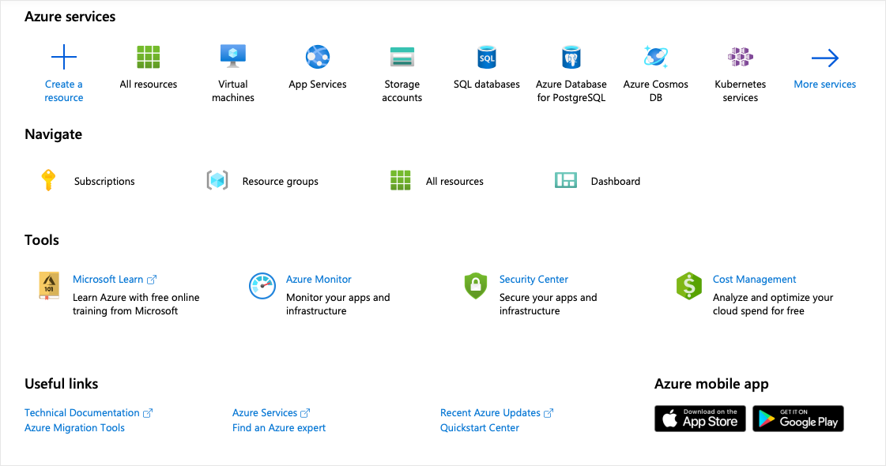

You've planned out the network infrastructure and identified a few VMs to migrate to the cloud. You have several choices for creating your VMs. The choice you make depends on the environment you're comfortable with. Azure supports a web-based portal for creating and administering resources. You can also choose to use command-line tools that run on MacOS, Windows, and Linux.

[!include]

#### Options to create and manage VMs

> [!VIDEO https://www.microsoft.com/videoplayer/embed/RE2yJKx]

Let's explore the Azure portal first - it's the easiest way to start with Azure.

## Azure portal

The **Azure portal** provides an easy-to-use browser-based user interface that allows you to create and manage all your Azure resources. For example, you can set up a new database, increase the compute power of your virtual machines, and monitor your monthly costs. It's also a great learning tool, since you can survey all available resources and use guided wizards to create the ones you need.

Once you're signed in, you're presented with two main areas. The first is a menu with  options to help you create resources, monitor resources, and manage billing. The second is the home page that shows some of the most commonly used services. You'll most likely find the portal the most comfortable option to use when you start using Azure.

### Create an Azure VM with the Azure portal

Let's assume you want to create a VM running an Ubuntu server. Setting up a site isn't difficult, but there are a couple of things to keep in mind. You need to install and configure an operating system, configure a website, install a database, and worry about things like firewalls. We're going to cover creating VMs in the next few modules, but let's create one here to see how easy it is. We won't go through all the options - check out one of the **Create a VM** module to get complete details on each option.

1. Sign into the [Azure portal](https://portal.azure.com/learn.docs.microsoft.com?azure-portal=true) using the same account you activated the sandbox with.

1. You'll see the Azure resource creation and management menu on your left and the Azure portal home page in the center.

    

1. Click on the **Create a resource** option in the top-left corner of the portal page. The Azure Marketplace pane will open.

    

    As you can see, there are many selectable options. We want to create a VM running an Ubuntu server. VMs are Azure compute resources, so select the **Compute** option on the available list and then search for Ubuntu VM images. You can click **See All** to get the full list.

1. Use the **Search the Marketplace** search bar to find "Ubuntu Server". You see a list of options. Select the option that reads **Ubuntu Server 18.04 LTS** as shown below.

    

1. The pane that opens next presents licensing information for the image we're about to use. Click **Create**.

1. You're presented with the **Create virtual machine** page. Notice the wizard-based approach we can use to configure the VM.

### Configure the VM

We need to configure the basic parameters of our Ubuntu virtual machine. If some of the options at this point are unfamiliar to you, that's OK. We're going to discuss all of these options in a future module. You're welcome to copy the values used here.

1. Use the following values on the **Basics** tab.
    - The **Subscription** should be set to _Concierge Subscription_.

    - The **Resource Group** should be set to <rgn>[sandbox resource group name]</rgn>.

    - Enter the **Virtual machine name** as _test-ubuntu-cus-vm_.

    - Select a **Region** close to you from the following list.
        [!include]

    - For **Availability options**, choose _No infrastructure redundancy required_.

    - The **Image** should be the _Ubuntu Server 18.04 LTS_ option we selected from the Marketplace.

    - Check to make sure the **Size** of the VM set as _Standard D2s V3_.

    - For the **Authentication type**, switch to **Password**. Enter a username and password.

    

2. There are several other tabs you can explore to see the settings you can influence during the VM creation. Once you're finished exploring, click **Review + create** to review and validate the settings.

3. On the review screen, Azure will validate your settings. You might need to supply some additional information based on the requirements of the image creator. Verify all the settings are set the way you want, and then click **Create** to deploy and create the VM.

4. You can monitor the deployment through the **Notifications** panel. Click the icon in the top toolbar to show or hide the panel.

    

5. The VM deployment process takes a few minutes to complete. You'll receive a notification informing you that the deployment succeeded. Click on the **Go to resource** button to go to the VM overview page.

    

6. Here you can see all the information and configuration options for your newly created Ubuntu VM. One of the pieces of information is the **Public IP address**.

    

7. By default Ubuntu Server 18.04 LTS image doesn't install any public reachable services on the public IP address. However, recall that we enabled password authentication earlier. This authentication type, allows you to connect to your VM via the public IP using any SSH client.

Congratulations! With a few steps, you deployed a VM that runs Linux, has a database installed, and has a functional website. Let's explore some other ways we could have created a VM.
