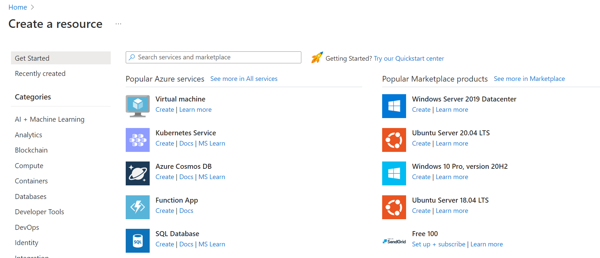

You've planned out the network infrastructure and identified a few VMs to migrate to the cloud. You have several choices for creating your VMs. The choice you make depends on the environment you're comfortable with. Azure supports a web-based portal for creating and administering resources. You can also choose to use command-line tools that run on Linux, macOS, and Windows.

#### Options to create and manage VMs

> [!VIDEO https://www.microsoft.com/videoplayer/embed/RE2yJKx]

Let's explore the Azure portal first - it's the easiest way to start with Azure.

## Azure portal

The **Azure portal** provides an easy-to-use browser-based user interface that enables you to create and manage all your Azure resources. For example, you can set up a new database, increase the compute power of your virtual machines, and monitor your monthly costs. It's also a great learning tool, because you can survey all available resources and use guided wizards to create the ones you need.

### Create an Azure VM with the Azure portal

Let's assume you want to create a VM running a web server on Ubuntu. Setting up a site isn't difficult, but there are a couple of things to keep in mind. You need to install and configure an operating system, configure a website, install a database, and worry about things like firewalls. We're going to cover creating VMs in the next few modules, but let's create one here to see how easy it is. We don't go through all the options - check out one of the **Create a VM** modules to get complete details on each option.

1. Sign in to the [Azure portal](https://portal.azure.com/learn.docs.microsoft.com?azure-portal=true) using the same account you used to activate the sandbox.

1. On the Azure home page, under **Azure services**, select **Create a resource**. The **Create a resource** pane appears, displaying popular products for Azure services.

    

1. We want to create a VM, so select **Virtual machine**.

1. The **Create virtual machine** pane appears.

### Configure the VM

You need to configure the basic parameters of your virtual machine. If some of the options at this point are unfamiliar to you, that's OK. We're going to describe all of these options in a future module. You're welcome to copy the values used here.

1. On the **Basics** tab, enter the following values for each setting.

    | Setting | Value  |
    | ------ | ------- |
    | **Project details**  |
    | Subscription | Concierge Subscription |
    | Resource group | Select **<rgn>[sandbox resource group name]</rgn>** from the drop-down |
    | **Instance details** |
    | Virtual machine name  | Enter *test-ubuntu-cus-vm* |
    | Region | From the dropdown list, select a geographical location close to you. |
    | Availability options  | No infrastructure redundancy required |
    | Security type  | Standard |
    | Image | Ubuntu Server 20.04 LTS - Gen2 |
    | VM architecture  | x64 |
    | Run with Azure Spot discount | Unchecked |
    | Size | Standard D2s V3 |
    | **Administrator account** |
    | Authentication type | SSH public key |
    | Username | Enter a username |
    | SSH public key source | Generate a new key pair |
    | Key pair name | **test-ubuntu-cus-vm_key** |
    | **Inbound port rules** |
    | Public inbound ports | Allow selected ports |
    | Select inbound ports | SSH (22) |

1. There are several other tabs you can explore to see the settings you can influence during the VM creation. After you're finished exploring, select **Review + create** to review and validate the settings.

1. Azure validates your configuration settings for a resource before it creates it. You might need to supply some additional information based on the requirements of the image creator built into Azure. It's simple; just open the tab that has an error. Verify all the settings are set the way you want, and then select **Create** to deploy and create the VM.

1. The **Generate new key pair** window opens. Select **Download private key and create resource**.

1. You can monitor the deployment in the **Deployment details** on the **Overview** pane or through the **Notifications** pane. Select the notifications icon in the top right toolbar to show or hide the Notifications pane.

    :::image type="content" source="../media/3-notifications.png" alt-text="Screenshot showing the notifications icon on toolbar and part of the notifications pane.":::

    The VM deployment process takes a few minutes to complete. You receive a notification informing you that the deployment succeeded.

1. Select **Go to resource**. The **Overview** page of your VM appears.

    Here, you can see all the information and configuration options for your newly created Ubuntu VM. One of the pieces of information is the **Public IP address**.

     :::image type="content" source="../media/3-public-ip-address.png" alt-text="Screenshot showing VM essentials and properties with the public IP address highlighted.":::

    When you enabled SSH public key authentication in an earlier step, the user interface also gave an option to enable SSH. SSH allows you to connect to your VM via the public IP using any SSH client.

Congratulations! With a few steps, you deployed a VM that runs Linux. Let's explore some other ways we could have created a VM.
