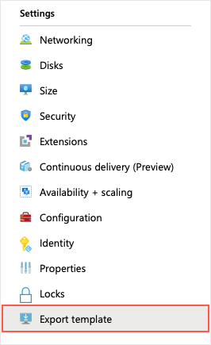
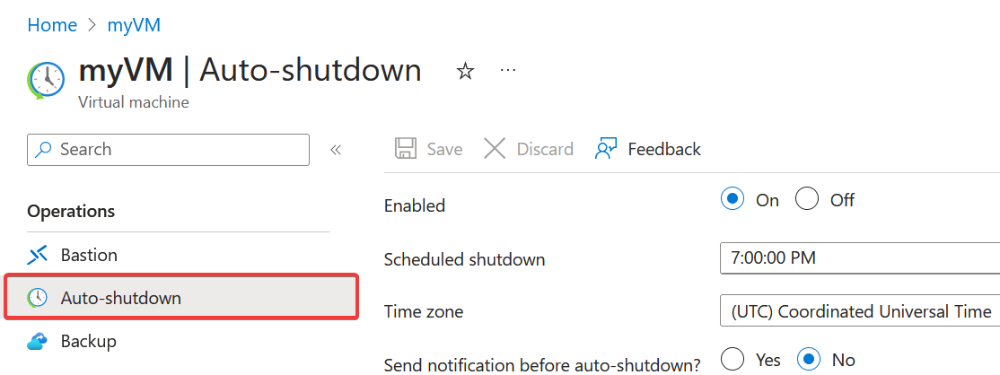

The Azure portal is the easiest way to create resources such as VMs when you're getting started. However, it's not necessarily the most efficient or quickest way to work with Azure, particularly if you need to create several resources together. In our case, we eventually create dozens of VMs to handle different tasks. Creating them manually in the Azure portal wouldn't be a fun task!

Let's look at some other ways to create and administer resources in Azure:

- Azure Resource Manager templates
- Azure PowerShell
- Azure CLI
- Azure REST API
- Azure Client SDK
- Azure VM Extensions
- Azure Automation Services

## Resource Manager templates

Let's assume you want to create a copy of a VM with the same settings. You could create a VM image, upload it to Azure, and reference it as the basis for your new VM. This process is inefficient and time-consuming. Azure provides you with the option to create a template from which to create an exact copy of a VM.

**Resource Manager templates** are JSON files that define the resources you need to deploy for your solution.

You can create a resource template for your VM. From the VM menu, under **Automation** select **Export template**.



> [!NOTE]
> The policies for the resources included in the sandbox for this Learn module prevent you from being able to export the VM you just created; that said, an exported template is an easy-to-edit JSON file. 
You have the option to download or save a template for later use, or immediately deploy a new VM based on the template. For example, you might create a VM from a template in a test environment, and find it doesn’t quite work to replace your on-premises machine. You can delete the resource group, which deletes all of the resources, tweak the template, and try again. If you only want to make changes to the existing deployed resources, you can change the template used to create it, and redeploy it. Resource Manager will change the resources to match the new template.

After you have it working the way you want it, you can use that template to easily replicate multiple versions of your infrastructure, such as staging and production. You can parameterize fields such as the VM name, network name, storage account name, and so on, and load the template repeatedly, using different parameters to customize each environment.

For more information about using templates, see [Quickstart: Create an Ubuntu Linux virtual machine using an ARM template](/azure/virtual-machines/linux/quick-create-template).


## Azure CLI

An option for scripting and command-line Azure interaction is the **Azure CLI**.

The Azure CLI is Microsoft's cross-platform command-line tool for managing Azure resources such as virtual machines and disks from the command line. It's available for Linux, macOS, Windows, or in a browser using the Cloud Shell.

For example, from the CLI, you can create an Azure VM with the `az vm create` command.

```azurecli
az vm create \
    --resource-group TestResourceGroup \
    --name test-wp1-eus-vm \
    --image Ubuntu \
    --admin-username azureuser \
    --generate-ssh-keys
```

The Azure CLI can be used with other scripting languages, like Ruby and Python.

Learn more about creating and managing VMs in the **Manage virtual machines with the Azure CLI tool** module.

For more information about using the Azure CLI to create VMs, see [Quickstart: Create a Linux virtual machine using the CLI](/azure/virtual-machines/linux/quick-create-cli).

## Azure PowerShell

**Azure PowerShell** is ideal for one-off interactive tasks and/or the automation of repeated tasks.

> [!NOTE]
> PowerShell is a cross-platform shell that provides services like the shell window and command parsing. Azure PowerShell is an optional add-on package that adds the Azure-specific commands (referred to as **cmdlets**). You can learn more about installing and using Azure PowerShell in a separate training module.

For example, you can use the `New-AzVM` cmdlet to create a new Debian-based Azure virtual machine.

```powershell
New-AzVm `
    -ResourceGroupName "TestResourceGroup" `
    -Name "test-wp1-eus-vm" `
    -Location "East US" `
    -Image Debian `
    -VirtualNetworkName "test-wp1-eus-network" `
    -SubnetName "default" `
    -SecurityGroupName "test-wp1-eus-nsg" `
    -PublicIpAddressName "test-wp1-eus-pubip" `
    -GenerateSshKey `
    -SshKeyName myPSKey
    -OpenPorts 22
```

As shown here, you supply various parameters to handle the large number of VM configuration settings available. Most of the parameters have reasonable values; you only need to specify the required parameters. Learn more about creating and managing VMs with Azure PowerShell in the **Automate Azure tasks using scripts with PowerShell** module.

For more information about using PowerShell to create VMs, see [Quickstart: Create a Linux virtual machine using PowerShell](/azure/virtual-machines/linux/quick-create-powershell).

## Terraform

Azure also has a Terraform provider, so you can easily use Terraform to create and manage your VMs. Terraform enables the definition, preview, and deployment of cloud infrastructure. Using Terraform, you create configuration files using HCL syntax. The HCL syntax allows you to specify the cloud provider - such as Azure - and the elements that make up your cloud infrastructure. After you create your configuration files, you create an execution plan that allows you to preview your infrastructure changes before they're deployed. Once you verify the changes, you apply the execution plan to deploy the infrastructure.

For more information, see the [Azure Terraform Provider](https://registry.terraform.io/providers/hashicorp/azurerm/latest/docs) and [Quickstart: Use Terraform to create a VM](/azure/virtual-machines/linux/quick-create-terraform).
## Programmatic (APIs)

Generally speaking, both Azure PowerShell and Azure CLI are good options if you have simple scripts to run and want to stick to command-line tools. When it comes to more complex scenarios, where the creation and management of VMs form part of a larger application with complex logic, another approach is needed.

You can interact with every type of resource in Azure programmatically.

### Azure REST API

The Azure REST API provides developers with operations categorized by resource and the ability to create and manage VMs. Operations are exposed as URIs with corresponding HTTP methods (`GET`, `PUT`, `POST`, `DELETE`, and `PATCH`) and a corresponding response.

The Azure Compute APIs give you programmatic access to virtual machines and their supporting resources.

For more information, see the [Virtual Machines REST API reference](/rest/api/compute/virtual-machines).

### Azure Client SDK

Even though the REST API is platform and language agnostic, most often developers look toward a higher level of abstraction. The Azure Client SDK encapsulates the Azure REST API, making it much easier for developers to interact with Azure.

The Azure Client SDKs are available for various languages and frameworks, including .NET-based languages such as C#, Java, Node.js, PHP, Python, Ruby, and Go.

Here's an example snippet of C# code to create an Azure VM using the `Microsoft.Azure.Management.Fluent` NuGet package.

```csharp
var azure = Azure
    .Configure()
    .WithLogLevel(HttpLoggingDelegatingHandler.Level.Basic)
    .Authenticate(credentials)
    .WithDefaultSubscription();
// ...
var vmName = "test-wp1-eus-vm";

azure.VirtualMachines.Define(vmName)
    .WithRegion(Region.USEast)
    .WithExistingResourceGroup("TestResourceGroup")
    .WithExistingPrimaryNetworkInterface(networkInterface)
    .WithLatestWindowsImage("MicrosoftWindowsServer", "WindowsServer", "2012-R2-Datacenter")
    .WithAdminUsername("jonc")
    .WithAdminPassword("aReallyGoodPasswordHere")
    .WithComputerName(vmName)
    .WithSize(VirtualMachineSizeTypes.StandardDS1)
    .Create();
```

Here's the same snippet in Java using the **Azure Java SDK**.

```java
String vmName = "test-wp1-eus-vm";
// ...
VirtualMachine virtualMachine = azure.virtualMachines()
    .define(vmName)
    .withRegion(Region.US_EAST)
    .withExistingResourceGroup("TestResourceGroup")
    .withExistingPrimaryNetworkInterface(networkInterface)
    .withLatestWindowsImage("MicrosoftWindowsServer", "WindowsServer", "2012-R2-Datacenter")
    .withAdminUsername("jonc")
    .withAdminPassword("aReallyGoodPasswordHere")
    .withComputerName(vmName)
    .withSize("Standard_DS1")
    .create();
```

## Azure VM extensions

Let's assume you want to configure and install more software on your virtual machine after the initial deployment. You want this task to use a specific configuration, monitored and executed automatically.

**Azure VM extensions** are small applications that enable you to configure and automate tasks on Azure VMs after initial deployment. 

For more information, see [Azure virtual machine extensions and features](/azure/virtual-machines/extensions/overview).
## Azure Automation services

Saving time, reducing errors, and increasing efficiency are some of the most significant operational management challenges faced when managing remote infrastructure. If you have numerous infrastructure services, you might want to consider using higher-level services in Azure to help you operate from a higher level.

**Azure Automation** enables you to integrate services that allow you to automate frequent, time-consuming, and error-prone management tasks with ease. These services include **process automation**, **configuration management**, and **update management**.

- **Process Automation**. Let's assume you have a VM that is monitored for a specific error event. You want to take action, and fix the problem as soon as it's reported. Process automation enables you to set up watcher tasks that can respond to events that may occur in your datacenter.

- **Configuration Management**.  Perhaps you want to track software updates that become available for the operating system that runs on your VM. There are specific updates you may want to include or exclude. Configuration management enables you to track these updates, and take action as required. You use **Microsoft Endpoint Configuration Manager** to manage your company's PC, servers, and mobile devices. You can extend this support to your Azure VMs with Configuration Manager.

- **Update Management**. Use this service to manage updates and patches for your VMs. With this service, you're able to assess the status of available updates, schedule installation, and review deployment results to verify updates applied successfully. Update management incorporates services that provide process and configuration management. You enable update management for a VM directly from your **Azure Automation** account. You can also enable update management for a single virtual machine from the virtual machine pane in the portal.

## Auto-shutdown

Auto-shutdown is a feature in Azure that allows you to automatically shut down your VMs on a schedule. Use Auto-shutdown to save costs by ensuring that your VMs are not running when they aren't needed. You can set the schedule for auto-shutdown to occur daily or weekly, and you can also specify the time zone for the schedule.

To navigate to the Auto-shutdown feature in a VM in the Azure portal, go to the VM's blade in the portal, click on "Auto-shutdown" under the "Operations" section, and then configure the auto-shutdown settings according to your preferences.




As you can see, Azure provides various tools to create and administer resources so that you can integrate management operations into a process _that works for you_. Let's examine some of the other Azure services to make sure your infrastructure resources are running smoothly.
