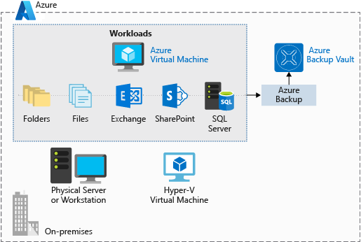

Data backup and recovery is a necessary piece of the planning for any good infrastructure. Assume a bug erases some company data, or maybe you need to retrieve some archived data for auditing purposes. Maintaining a good backup strategy ensures that you aren't scrambling when data or software needs to be restored.

**Azure Backup** is a _backup as a service_ offering that protects physical or virtual machines no matter where they reside: on-premises or in the cloud.

Azure Backup can be used for a wide range of data backup scenarios, such as:

- Files and folders on Windows OS machines (physical or virtual, local or cloud)
- Application-aware snapshots (Volume Shadow Copy Service)
- Popular Microsoft server workloads such as Microsoft SQL Server, Microsoft SharePoint, and Microsoft Exchange
- Native support for Azure Virtual Machines, both Windows, and Linux
- Linux and Windows 10 client machines

## Advantages of using Azure Backup

Traditional backup solutions don't always take full advantage of the underlying Azure platform. The result is a solution that tends to be expensive or inefficient. The solution either offers too much or too little storage, doesn't offer the correct types of storage, or has cumbersome and long-winded administrative tasks. Azure Backup was designed to work in tandem with other Azure services and provides several distinct benefits.

- **Automatic storage management**. Azure Backup automatically allocates and manages backup storage and uses a pay-as-you-use model. You only pay for what you use.

- **Unlimited scaling**. Azure Backup uses the power and scalability of Azure to deliver high availability.

- **Multiple storage options**. Azure Backup offers locally redundant storage where all copies of the data exist within the same region and geo-redundant storage where your data is replicated to a secondary region.

- **Unlimited data transfer**. Azure Backup doesn't limit the amount of inbound or outbound data you transfer. Azure Backup also doesn't charge for the data that is transferred.

- **Data encryption**. Data encryption allows for secure transmission and storage of your data in Azure.

- **Application-consistent backup**. An application-consistent backup means that a recovery point has all required data to restore the backup copy. Azure Backup provides application-consistent backups.

- **Long-term retention**. Azure doesn't limit the length of time you keep the backup data.

## Use Azure Backup

Azure Backup uses several components that you download and deploy to each computer you want to back up. The component that you deploy depends on what you want to protect.

- Azure Backup agent
- System Center Data Protection Manager
- Azure Backup Server
- Azure Backup VM extension

Azure Backup uses a Recovery Services vault for storing the backup data. Azure Storage blobs back up a vault, making it an efficient and economical long-term storage medium. With the vault in place, you can select the machines to back up, and define a backup policy (when snapshots are taken and for how long they’re stored).
