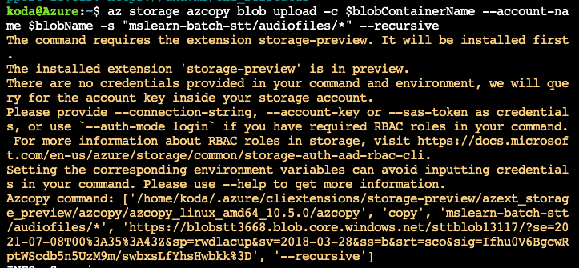

Batch Transcription can process WAV (PCM Codec), MP3 (PCM Codec), and OGG (Opus Codec) files sampled at 8kHz or 16kHz. These must be at a publicly accessible or shared access signature (SAS) URI.  It can process one or more files per batch. If more than one file is provided, the system attempts to process these in parallel, minimizing turn-around time.

Let's start by preparing our environment. The following script creates our cognitive services account and storage container.

1. Select **Copy** on the following code block to copy the command.

    ```bash
    # Get and set the subscription and RG
    subscription=$(az account list --query [0].id -o tsv)
    resourceGroupName=$(az group list --query "[0] | name" -o tsv)
    
    # Create the cognitive services account
    az cognitiveservices account create \
        --name cognitive-services-account-resource-speech \
        --resource-group $resourceGroupName \
        --kind SpeechServices \
        --sku S0 \
        --location westus2 \
        --subscription $subscription\
        --yes
    
    # Set the key and endpoint for the speech service
    apiKeySpeech=$(az cognitiveservices account keys list -g $resourceGroupName -n cognitive-services-account-resource-speech --query [key1] -o tsv)
    endpointSpeech=https://westus2.api.cognitive.microsoft.com/sts/
    
    # Create blob
    blobName=blobstt$RANDOM
    az storage account create \
        --name $blobName \
        --resource-group $resourceGroupName \
        --location westus2 \
        --sku Standard_ZRS \
    
    # Create container
    blobContainerName=sttblob$RANDOM
    blobConnectionString=$(az storage account show-connection-string -g $resourceGroupName -n $blobName --query "connectionString" -o tsv)
    az storage container create \
        --name $blobContainerName \
        --public-access blob \
        --connection-string $blobConnectionString
    ```

1. Paste the code into the Cloud Shell session by selecting Ctrl+Shift+V on Windows and Linux, or by selecting Cmd+Shift+V on macOS.

1. Press <kbd>Enter</kbd> to run the command and create you cognitive services account and storage container.

## Load  audio files into the storage container

1. Run the following command to download the audio files and source code.

    ```
    git clone https://github.com/MicrosoftDocs/mslearn-batch-stt.git
    ```

1. Run the following command to copy the audio files to the storage container

    ```
    az config set extension.use_dynamic_install=yes_without_prompt
    az storage azcopy blob upload -c $blobContainerName --account-name $blobName -s "mslearn-batch-stt/audiofiles/*" --recursive
    ```



1. Run the following command to generate the SAS token

    ```bash
    storageKey=$(az storage account keys list -g $resourceGroupName -n $blobName --query [0].value)
    end=`date -u -d "120 minutes" '+%Y-%m-%dT%H:%MZ'`
    sasToken=$(az storage blob generate-sas -c $blobContainerName -n $blobName --connection-string $blobConnectionString --permissions w --expiry $end --https-only)


1. Run the following command use the .NET application to transcribe your audio files

    ```dotnet
    cd mslearn-batch-stt
    dotnet user-secrets set CognitiveServices:BatchSTT:key $apiKeySpeech
    dotnet user-secrets set CognitiveServices:BatchSTT:endpoint $endpointSpeech
    dotnet user-secrets set CognitiveServices:BatchSTT:sasToken $sasToken
    dotnet restore
    dotnet run
    ```