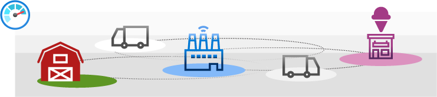

Implementing a solution across multiple companies can be challenging, because you need to trust data from partners. In most cases, you use a central database. Data is stored in one location as the source of truth. The company who maintains the database must be trusted as the data's central authority.

Blockchain lets you implement a business process when you need to trust data and participants without using a central database.

Suppose you're a solutions architect at a dairy processing company that produces ice cream. You use a supply chain to receive raw dairy goods from multiple dairies. Your company ships packaged ice cream to various retailers. There have been food quality and safety issues caused by improper temperature storage during shipment. Because multiple companies are responsible to ship and store the product, it's been difficult to identify the supply chain party at fault. You want to create a system that identifies issues in the supply chain quickly. Each supply chain company wants to integrate their existing systems with the solution and independently audit shipments if there's a food-safety recall.

In this module, you'll see how blockchain allows business partners to trust each other's data without a central authority. You'll also learn a bit about how blockchain works. The goal is to help you decide if blockchain is a good choice for your scenario.

## Learning objectives

In this module, you'll learn how to:

* Explain how blockchain enables trust and business processes between participants.
* Evaluate when to use blockchain for a solution.
* Classify available Azure blockchain options for a solution.

## Prerequisites

* Basic knowledge of programming concepts such as variables and conditional logic
