Now that we know the basics of blockchain, let's see how it works behind the scenes. This information should help you decide whether blockchain works for your scenario.

## How is data distributed?

In our scenario, there are multiple companies. We could have a centralized database at the dairy processing company. However, no one participant wants to be the central authority. We could use a blockchain distributed ledger. Using blockchain removes the need for a central authority. Also, each participant with a blockchain node has a copy of the ledger so that they can do their own auditing and integration with their systems. But, there isn't a requirement for each company to have their own node. Nodes may be shared between partners.

Each node is connected to other nodes using a blockchain network. For example, Dalia Pelayo farms, the ice cream factory, and the ice cream shops each have a node they manage. Contoso West and Contoso East are separate partners that share the same parent company. Contoso has one node. There doesn't need to be a one to one relationship of nodes to companies.

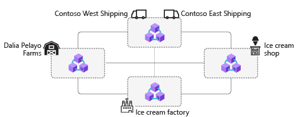

## Changing state

Data in a blockchain represents state. That's why digital tokens like cryptocurrency are a good fit for blockchain. If we think about the ownership of physical currency, a coin can only be in one person's pocket at a time. If the coin is in your pocket, the state of ownership is yours. If you give the coin to your friend, the state changes to your friend owning the coin. In our scenario, shipments move through the supply chain. Responsibility for the product must be transferred. The data we're interested in is the responsible party, temperature, and if the product is in compliance.

Blockchain uses transactions to change the state of the data from one value to another. For example, we need to know if the ice cream is stored below freezing. In a shipment of ice cream, a temperature sensor reports the temperature periodically. The reported temperature is a transaction that is sent to a blockchain transaction node.

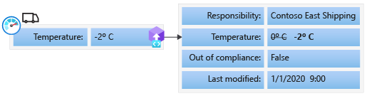

In the ice cream scenario, when a shipment is sent through the supply chain, a transaction is sent each time the status changes. For example, the illustration shows transactions for a typical shipment to the ice cream factory. Each transaction changes either the responsible party or the temperature. The current state of the ledger is the transactions applied in order.

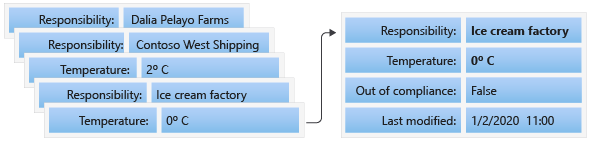

When sending a transaction, you send it to a blockchain transaction node. Let's suppose Dalia Pelayo Farms sends a shipment of milk using Contoso West Shipping. Dalia Pelayo Farms shipment system sends a transaction to their blockchain node. The transaction updates the shipment responsibility from the farmer to Contoso West Shipping.

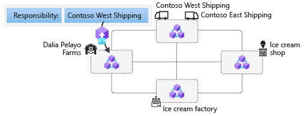

Blockchain sends the transaction throughout the blockchain network. Each node gets a copy of the transaction.

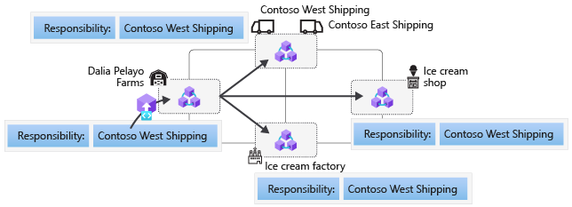

Each node processes the transaction but it still requires validation using a consensus mechanism. Consensus enables consistency and trust for the distributed ledger.

## How can you trust ledger data is consistent?

In a distributed network, it's difficult to determine what is true because data changes must occur across all nodes. What happens if the ice cream factory node doesn't get a shipping transaction? How would they know if milk has been shipped from the farm? What if the shipping company's refrigerated truck fails and the milk spoils? Could the shipping company modify their ledger to avoid responsibility?

Blockchain uses a consensus mechanism to validate and agree on the data across all blockchain nodes. Consensus provides a way for all decentralized nodes to come to the same state. When transferring value or responsibility, order matters. For example, if you transfer ownership of a car to your friend, you can't also transfer ownership to a colleague at work. This issue is known as the double spend problem which consensus solves. Consensus ensures the correct order of transactions and the integrity of the blockchain. As part of consensus, a group of transactions is validated as a block and the network must agree if the block should be included in the blockchain.

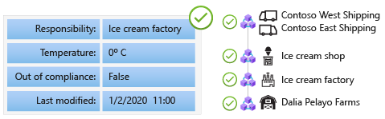

There are several blockchain consensus algorithms including proof of work, proof of stake, and proof of authority. Each algorithm solves consistency in a different way. In simple terms, consensus provides a way for the distributed ledger to come to a common state.

## What is a block?

A block is a cluster of data within the blockchain that stores transaction information. The number of transactions in a block is typically time-based. For example, the illustration shows a block containing transactions that occurred in the past 10 minutes.

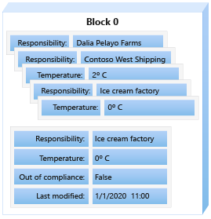

Through consensus, validated blocks are added to the blockchain at each node. Because all nodes have the same blocks in the chain, the ledger is consistent across the network. As a result, all the nodes contain the same validated data in an agreed upon order.

## How can you trust the ledger is immutable?

You would think that if you have control of the ledger in your node, you could just change the data in your copy. How can it be immutable?

Blockchain uses a cryptographic hash to create a link between blocks. By linking blocks, the order of transactions can be agreed upon through the consensus algorithm. A **cryptographic hash** is an algorithm that maps data of an arbitrary size to a bit representation of fixed size. You can think of it as a digital fingerprint. Bitcoin uses the SHA-256 hash algorithm. If you use an SHA-256 hash function on a 100 page document, the function output is a 256-bit hash value. If you change just one character in the document and regenerated the hash, the output is a different 256-bit hash value. Now, imagine if we use a block as the input to the hash function. The output is a unique hash value for the data in the block.

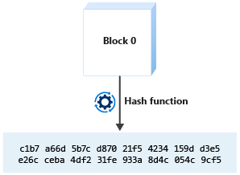

Blockchain uses hashes to detect if any changes have been made to the blocks. By including the previous block's hash value when generating the next block's hash, blocks are chained together through hashes.

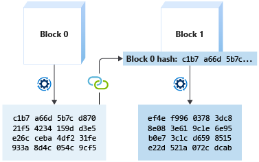

Blockchain provides trust by using hashes to prove data history hasn't changed. By including the hash of the previous block when creating a new block, an immutable chain of transactions is created in order.

If any block is modified in the chain, the hash of later blocks is different. As a result, validation discovers the discrepancy.

## Trusted logic

Blockchain allows us to store data that is consistent and can be trusted. How do we add logic that executes the same at each node?

In our scenario, we need logic to transfer responsibility of the product from one participant to another. We also need to use data from IoT temperature sensor to know if the temperature is too high.

A decentralized application (DApp) is an application on a distributed computing system. In this module, we focus on using the Ethereum blockchain protocol. Ethereum DApps are called smart contracts. A smart contract contains logic that is executed as part of a transaction. On Ethereum, you program the logic using a programming language called Solidity.

Smart contracts are deployed to the blockchain and are referenced by an address. To use a smart contract, you create an instance. A smart contract instance contains state data and program logic. In our scenario, a smart contract instance contains data such as, the responsible participant, location, and if the product temperature is out of compliance. We can execute functions to transfer responsibility or receive temperature telemetry for the instance.

When the responsibility of a product transfers to another party, a transaction is executed. Smart contract logic updates the state data. In our ice cream scenario, the ice cream factory shipping system creates a smart contract instance for a new ice cream shipment. The factory shipping system sends a transaction that calls the *TransferResponsibility* function to transfer the responsibility of the shipment to Contoso East shipping. The blockchain network sends the transaction to all nodes. The smart contract logic executes at each node.

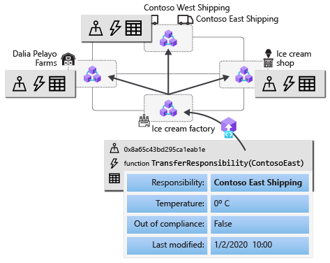

What if during shipment the refrigeration unit fails and the temperature of the ice cream goes above freezing? An IoT temperature sensor monitors the ice cream temperature and sends transactions periodically. If the temperature is above freezing, the smart contract logic marks the shipment as noncompliant.

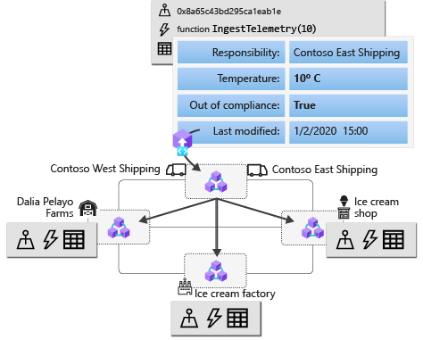

Because the transaction is included in a chain of blocks, there's an immutable record of when the shipment became noncompliant. The ice cream shop can refuse delivery and can avoid food safety issues.

Just like data in the blockchain, a smart contract is immutable. Once deployed, the logic can't be changed. Therefore, you can trust that smart contract logic always executes the same on all nodes. Any code changes require a new smart contract be deployed at a new address.
