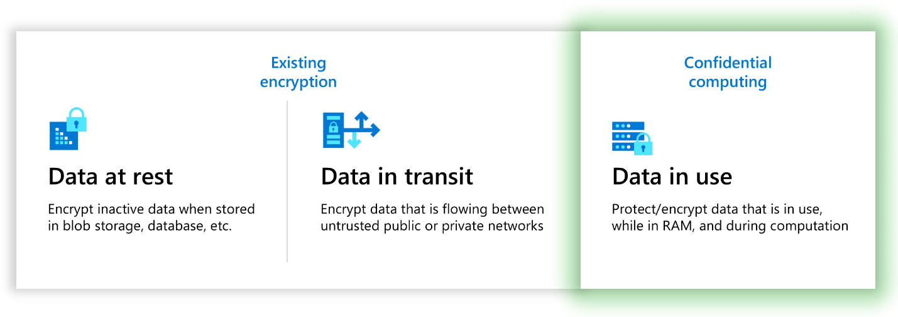

As you can see in the following graphic, confidential computing closes a gap in data encryption capabilities by enabling encryption while data is in memory and being processed. Confidential computing protects sensitive or highly regulated datasets and application workloads in a secure public cloud platform. In addition, confidential computing extends beyond existing solutions that protect data at rest and in transit. 

Confidential computing is an industry term defined by the [Confidential Computing Consortium](https://confidentialcomputing.io/) (CCC) &mdash; a foundation dedicated to defining and accelerating the adoption of confidential computing. The CCC defines confidential computing as: "The protection of data in use by performing computations in a hardware-based, attested Trusted Execution Environment (TEE)."

A TEE enforces execution of only authorized code. Any data in the TEE can't be read or tampered with by any code outside of the TEE. TEEs form the basis of the confidential computing threat model, which aims at removing or reducing the ability for a cloud provider operator and other actors in the tenant's domain to access code and data while they're being executed.

TEEs are also being used to protect proprietary business logic, analytics functions, machine learning algorithms, or entire applications.

Because you're focused on cloud migration, you also want to understand how these concepts work in the cloud. As you find out, Azure confidential computing isn't a single technology, but multiple technologies that help increase trust in Azure for sensitive workloads. 

- Prevent unauthorized access to data, with little to no change from existing practices. Meet regulatory compliance needs. Keep full control of data to satisfy government regulations for protecting personal information and secure organizational IP.

- Ensure secure collaboration. Process data from multiple sources to unlock insight without exposing the input data or code or model IP to other parties.

## Azure confidential computing portfolio

Microsoft offers multiple technologies for confidential computing.  

#### Foundational technologies

| **Item** | **Description** | **Purpose** |
|---|---|---|
| Virtual machines | Multiple options from AMD and Intel support confidential computing. | Create confidential computing from raw virtual machines. |
| [Microsoft Azure Attestation](/azure/attestation/overview) | The remote attestation service in Azure | Use for validating the trustworthiness of multiple TEEs and verifying the integrity of the binaries running inside the TEEs. |
| [Azure Key Vault Managed HSM](/azure/key-vault/managed-hsm/) | A cloud service that enables you to safeguard cryptographic keys for your cloud applications | Store and manage your private keys in a fully managed, highly available, single-tenant, standards-compliant service that uses FIPS 140-2 Level 3 validated hardware security modules (HSM). |
| [Trusted Launch](/azure/virtual-machines/trusted-launch) | A feature set in Generation 2 VMs that brings hardened security features to virtual machines in Azure | Protect against boot kits, rootkits, and kernel-level malware with a secure boot and virtual trusted platform module with boot integrity monitoring. |
| [App-enclave aware containers](/en-us/azure/confidential-computing/enclave-aware-containers) | Use Intel SGX with Azure Kubernetes Service (AKS) | Create confidential computing nodes on AKS to isolate applications within an enclave environment. |
| [Confidential VM node pools on AKS](/azure/confidential-computing/confidential-node-pool-aks) | Container node pools that take advantage of VMs that use a hardware-based TEE | Confidential VMs using AMD container applications deny the hypervisor and other host-management code access to VM memory and state and add defense in depth protections against operator access. |

#### Application-specific technologies

| **Item** | **Description** | **Purpose** |
|---|---|---|
| [Azure Confidential Ledger](/azure/confidential-ledger/overview) | A tamper-proof register for storing sensitive data | For record-keeping and auditing or for data transparency in multiple-party scenarios. It offers Write-Once-Read-Many guarantees, which make data non-erasable and non-modifiable. The service is built on the [Confidential Consortium Framework](https://www.microsoft.com/research/project/confidential-consortium-framework/) from Microsoft Research. |
| [Always Encrypted with secure enclaves in Azure SQL](/sql/relational-databases/security/encryption/always-encrypted-enclaves) | A TEE to run SQL queries | Protect the confidentiality of data from malware and high-privileged unauthorized users. |
| [Azure Virtual Desktop on confidential virtual machines (Public preview)](https://techcommunity.microsoft.com/t5/azure-virtual-desktop-blog/confidential-virtual-machine-support-for-azure-virtual-desktop/ba-p/3686350) | A TEE to run Azure Virtual Desktop solution | Protect against operator access and encrypt data in use for virtual desktops. |
| [SQL Server on confidential virtual machines](/azure/azure-sql/virtual-machines/windows/sql-vm-create-confidential-vm-how-to) | Confidential VMs using Secure Encrypted Virtualization-Secure Nested Paging (SEV-SNP) technology | Store sensitive data in the cloud and meet strict compliance requirements. |

The services in the portfolio provide vectors of protection, including from these factors:

- The cloud operator
- The tenant operator 
- Other tenants
- Physical access to the systems
- Collaborators for both data and IP

As you can see, multiple options help you protect sensitive workloads in Azure. Which options you use depends on several factors. For example, is the application greenfield or are you migrating it to Azure? 

If you're migrating applications, it might be easier to create confidential computing from raw virtual machines and then migrate. Or you can deploy [containers that use those VM types](/azure/confidential-computing/confidential-node-pool-aks). 

If you're building a new application on Azure, what use case are you trying to address? Depending on your needs, one of the other services can help. For example, Always Encrypted with secure enclaves in Azure SQL or Azure Confidential Ledger.

The remainder of this module focuses on two approaches to achieve confidential computing with Azure Virtual Machines.  

> [!NOTE]
> If you're container-oriented, you might want to deploy and manage your application in Azure Kubernetes Service (AKS) instead. Because AKS uses VMs to run containers, you can apply confidential technologies to container nodes and pools as well.
