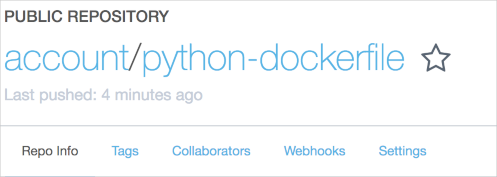

Up until now, you downloaded and ran Docker images created by others. Here, you'll build your own container images. You'll learn how to:

* Create an image using a manual process.
* Create the same image using a more automated process, called a Dockerfile.
* Publish your image to Docker Hub, a public container registry.

## What is a Dockerfile?

A Dockerfile is a text file that describes everything your container needs to run.

An instruction in the Dockerfile can define:

* The parent image your image is based on.
* A software package to install.
* A configuration or other file your app needs to run.
* Networking settings, such as a port you want to make available.
* The command to run when the container starts.

You can create a container image using a manual process or use a Dockerfile to automate the process. Creating a Docker image manually is a good way to understand the process. Using a Dockerfile makes the process faster and easier to repeat.

## What is Docker Hub?

Docker Hub is a place for you to store and download Docker images. You can download Docker images that have been created by Docker and the Docker community, such as the Nginx image you used previously. You can also share your own images with the Docker community or just with your team.

## Create an image manually

Here you'll create a Docker image that runs a basic Python application.

1. Start by bringing up a container instance from the [python](https://hub.docker.com/_/python/?azure-portal=true) image.

    ```bash
    docker run --name python-demo -it python bash
    ```

    It'll take a few moments for Docker to pull down this image from Docker Hub. While you wait, let's look at what the command does.

    * The `--name` argument specifies your container's name, "python-demo".
    * The `-i` and `-t` arguments are combined into one argument, `-it`. These arguments create an interactive session with the running container.
      * `-i` creates an interactive session with the container.
      * `-t` creates a pseudo terminal that remains in a running state.
    * `python` specifies the base image. Docker downloads this image from Docker Hub. This image is preconfigued with an environment for Python programming.
    * `bash` specifies the program to run.

    Think of this setup as an interactive environment for you to write Python apps. Once you have your app up and running, you can capture an image, or snapshot, of your environment. As you improve your app, you can create additional images for you or your team.

    Your terminal session switches to the container's pseudo terminal. Your prompt resembles this:

    ```docker
    root@d8ccada9c61e:/#
    ```

1. From your Docker session, run this to create a directory named `./app` and move to it.

    ```bash
    mkdir ./app && cd ./app
    ```

    Although not required, the `./app` directory gives you a place to add your Python code.

1. Run this to create a very basic Python program.

    ```bash
    echo 'print("Hello World!")' > hello.py
    ```

    This program prints "Hello World!" to the terminal.

    > [!TIP]
    > In practice, you can _mount_ a directory on your workstation to a directory on your container. This enables you to use your favorite editor on your workstation to write code. When you save your file, that file also appears on your container.

1. Run the following to try out your Python program.

    ```bash
    python hello.py
    ```

    You see this.

    ```output
    Hello World!
    ```

1. Exit your interactive session.

    ```bash
    exit
    ```

1. From your Linux VM, run `docker ps` to list all running containers:

    ```bash
    docker ps
    ```

    You see that nothing is running. 

    ```output
    CONTAINER ID        IMAGE               COMMAND             CREATED             STATUS              PORTS               NAMES
    ```

    That's because exiting the container ends your Bash session. When the application or service your container runs exits, Docker stops the container.

1. Run `docker ps` a second time and include the `-a` argument. This command returns all containers, running or stopped.

    ```bash
    docker ps -a
    ```

    You see something like this:

    ```output
    CONTAINER ID        IMAGE               COMMAND             CREATED             STATUS                      PORTS               NAMES
    cf6ac8e06fd9        python              "bash"              27 seconds ago      Exited (0) 12 seconds ago                       python-demo
    ```

   Your container, **python-demo**, has a status of **Exited**.

1. Run `docker commit` to create an image from your container.

   ```bash
   docker commit python-demo python-custom
   ```

   Here, Docker creates an image named **python-custom** from your container named **python-demo**. The image name can be whatever you want.

1. Run `docker images` to list your images.

    ```bash
    docker images
    ```

    You see the **python-custom** image.

    ```output
    REPOSITORY          TAG                 IMAGE ID            CREATED             SIZE
    python-custom       latest              1f231e7127a1        6 seconds ago       922MB
    python              latest              638817465c7d        24 hours ago        922MB
    ```

1. Use `docker run` to test out your image.

    ```bash
    docker run python-custom python app/hello.py
    ```

    Recall that `docker run` takes the command to run as its final argument. Here, the command is `python app/hello.py`.

    You see this.

    ```output
    Hello World!
    ```

    Because you're not running this container interactively, the Python program runs and the container stops.

## Use a Dockerfile to create an image automatically

Here you'll use a more automated process to create the same Docker image that runs your Python program.

Building an image manually is a great way to experiment and explore new features. But say you want to share the process with your team or make it repeatable. For example, say you want to create a new image each evening that runs the latest version of the software your team is building.

That's where the Dockerfile comes in. Think of a Dockerfile as a way to describe instructions you would otherwise do manually.

1. From your Linux VM, run this command to create a Dockerfile that runs your Python program.

    ```bash
    cat << EOF > Dockerfile
    FROM python
    
    WORKDIR ./app
    
    RUN echo 'print("Hello World!")' > hello.py
    
    CMD python hello.py
    EOF
    ```

    This example is just an easy way for you to create the file. In practice, you would use your favorite code editor to create it.

    Print your Dockerfile to the console.

    ```bash
    cat Dockerfile
    ```

    You see this.

    ```output
    FROM python
    
    WORKDIR ./app
    
    RUN echo 'print("Hello World!")' > hello.py
    
    CMD python hello.py
    ```

    Let's break down what the Dockerfile does.

    * `FROM` specifies the parent image to base this image on. Here, the parent image is **python**.
    * `WORKDIR` specifies the working directory for any `RUN` and `CMD` statements that appear later in the Dockerfile. Docker creates this directory for you, in this case, `./app`.
    * `RUN` specifies a command to run in the container. You can use `RUN` to install software, make configuration changes, and cleanup the container before it's captured. Here, we write a basic Python program to `./app/hello.py`.
    * `CMD` specifies the process to run when the container starts. Here, we run `python hello.py` from the `/.app` directory.

    You've probably noticed that these are nearly the exact same steps you took to build the image manually. Expressing these steps as code makes the process easier to share and repeat.

1. Run `docker build` to create the image, using the instructions specified in the Dockerfile.

    ```bash
    docker build -t python-dockerfile .
    ```

    It will typically take only a few seconds for Docker to build your image.

    You see output like the following.

    ```output
    Sending build context to Docker daemon  2.048kB
    Step 1/4 : FROM python
     ---> 638817465c7d
    Step 2/4 : WORKDIR ./app
     ---> Running in 990d17e86466
    Removing intermediate container 990d17e86466
     ---> 59a074a092cc
    Step 3/4 : RUN echo 'print("Hello World!")' > hello.py
     ---> Running in aed707c53bc5
    Removing intermediate container aed707c53bc5
     ---> d7f55a9d0e85
    Step 4/4 : CMD python hello.py
     ---> Running in e87ec55a8d36
    Removing intermediate container e87ec55a8d36
     ---> 98c39b91770f
    Successfully built 98c39b91770f
    Successfully tagged python-dockerfile:latest
    ```

1. Use the `docker images` to list your images.

    ```bash
    docker images
    ```

    You see the **python-dockerfile** image you just built.

    ```output
    REPOSITORY          TAG                 IMAGE ID            CREATED             SIZE
    python-dockerfile   latest              8ed5f85c5e5b        24 seconds ago      923MB
    python-custom       latest              6789cbe2cceb        4 minutes ago       923MB
    python              latest              a9d071760c82        2 weeks ago         923MB
    ```

1. Use `docker run` to test out your container.

    ```bash
    docker run python-dockerfile
    ```

    You see this.

    ```output
    Hello World!
    ```

    Unlike when you tested the image you created manually, here you don't specify the command to run, `python app/hello.py`. Your Dockerfile specifies that, so the command is built into the image.

## Publish your image to Docker Hub

To publish an image to Docker Hub, you need an account. Here you'll set up your Docker Hub account and publish your **python-dockerfile** image to Docker Hub.

1. [Create your Docker Hub account](https://hub.docker.com?azure-portal=true).

1. Export your Docker Hub account name as an environment variable. Replace **account-name** with your account name.

    ```bash
    export docker_account=account-name
    ```

    This environment variable will make it easier for you to run the commands that follow.

1. Run `docker tag` to tag your image with your Docker Hub account name.

    ```bash
    docker tag python-dockerfile $docker_account/python-dockerfile
    ```

1. Run `docker login` to log in to Docker Hub.

    ```bash
    docker login
    ```

    When prompted, enter your username and password.

1. Run `docker push` to push, or upload, your **python-dockerfile** image to Docker Hub.

    ```bash
    docker push $docker_account/python-dockerfile
    ```

    You see output similar to the following:

    ```output
    The push refers to repository [docker.io/account/python-dockerfile]
    f39073ca4d5a: Pushed
    9dfcec2738a9: Pushed
    ffab8273c674: Mounted from account/python
    e6f6cbe5e14e: Mounted from account/python
    3eb255f8a6ac: Mounted from account/python
    b860b6c48eec: Mounted from account/python
    1fa8778eb779: Mounted from account/python
    fa0c3f992cbd: Mounted from account/python
    ce6466f43b11: Mounted from account/python
    719d45669b35: Mounted from account/python
    3b10514a95be: Mounted from account/python
    latest: digest: sha256:b816c32382d06ac74530d56f2a7b83000c86174218f430c6bb5039fdcfba38aa size: 2631
    ```

    Your Docker image is now stored in Docker Hub. You can use `docker pull` or `docker run` from another computer to download or run your image from Docker Hub. Here are two examples:

    1. This example pulls the latest image from Docker Hub.

        ```bash
        docker pull my_docker_account/python-dockerfile
        ```

    1. This example runs the container.

        ```bash
        docker run my_docker_account/python-dockerfile
        ```

1. Test out your container.

    Navigate to [your Docker Hub account](https://hub.docker.com?azure-portal=true). From the **Repositories** tab, you see your Docker image.

    
