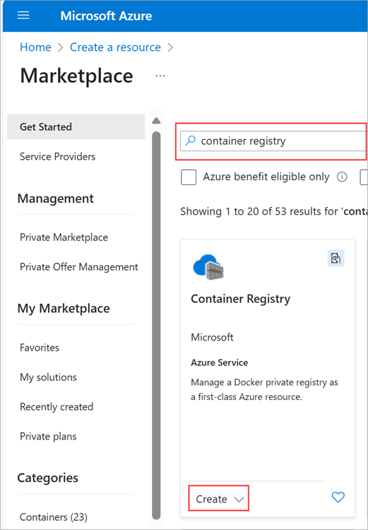
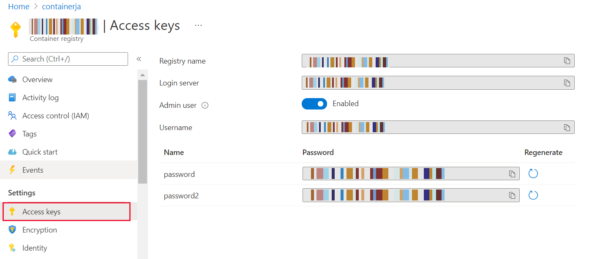
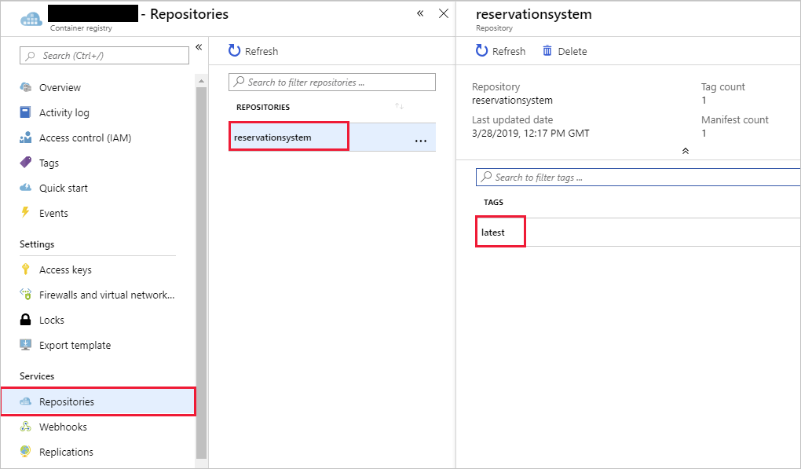
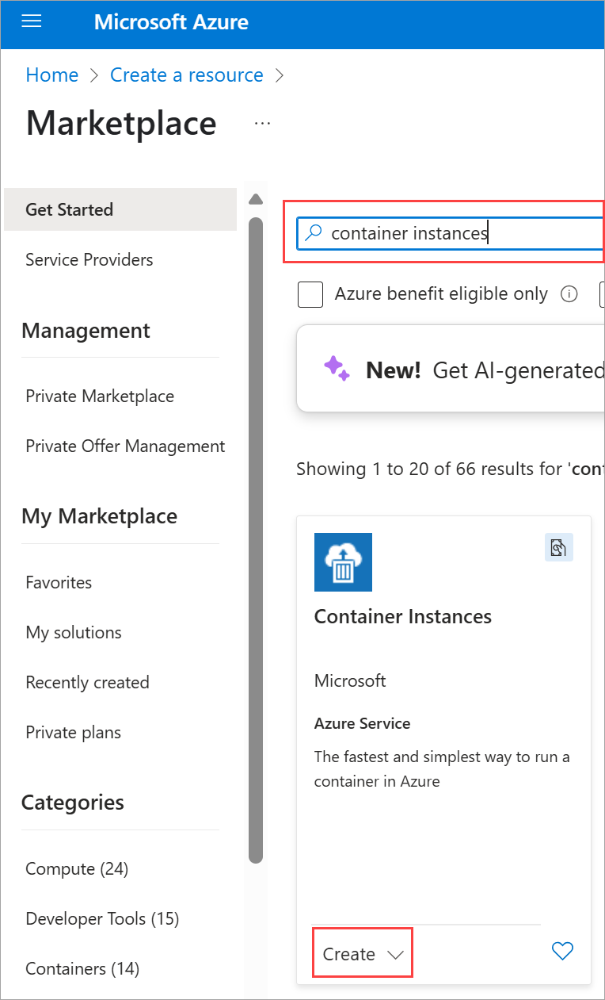
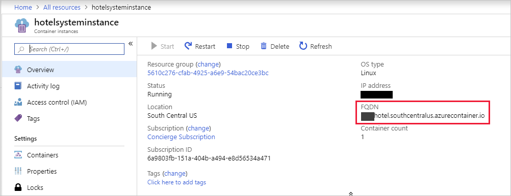

Azure Container Instance enables you to run a Docker image in Azure.

You previously packaged and tested your web app as a local Docker image. You now want to make the web application available globally. So, you decide to run the image as an Azure Container Instance.

In this exercise, you'll rebuild the image for the web app and upload it to Azure Container Registry. You'll use the Azure Container Instance service to run the image.

[!include[](../../../includes/azure-sandbox-activate.md)]

## Create a container registry

1. Sign in to the [Azure portal](https://portal.azure.com/learn.docs.microsoft.com?azure-portal=true) using your MSLearn account.

1. Choose **Create a resource**, select **Containers**, and then click **Container Registry**

    [!include[](../../../includes/azure-sandbox-regions-first-mention-note-friendly.md)]

    

2. Specify the values in the following table for each of the properties, and then click **Create**. For the registry name, select a name of your choice. The registry name must be unique within Azure, and contain 5-50 alphanumeric characters. For more information on naming, see [Naming conventions for Azure resources](https://docs.microsoft.com/azure/architecture/best-practices/naming-conventions)

    | Property  | Value  |
    |---|---|
    | Name | Choose a unique name |
    | Subscription | Concierge Subscription  |
    | Resource Group | Use the existing resource group <rgn>[Sandbox resource group]</rgn> |
    | Location | Use the default location |
    | Admin user | Enable |
    | SKU | Standard |

    > [!NOTE]
    > This exercise enables the admin account, for uploading images and testing the registry. In a production environment, you should disable the admin account and switch to Azure Active Directory Identities once you are satisfied that the registry is operating as expected.

3. Wait until the container registry has been deployed before continuing.

4. Select **All resources**, select your registry, and then click **Access keys**.

5. Make a note of the **Registry name**, **Login server**, **Username**, and **password** for your registry.

    

## Upload the image for the hotel reservation system app to Azure Container Registry

1. In your local command line, run the following command to tag the `reservationsystem` image with the name of your registry. Replace `<registry-name>` with the name of your registry in Azure Container Registry.

    ```bash
    docker tag reservationsystem:latest <registry-name>.azurecr.io/reservationsystem:latest
    ```

2. Run the `docker image ls` command to verify that the image has been tagged correctly.

    ```bash
    docker image ls
    ```

    The output of the command should look similar to this.

    ```console
    REPOSITORY                                    TAG                 IMAGE ID            CREATED             SIZE
    reservationsystem                             latest              a56281e7038f        4 minutes ago       1.76GB
    <registry-name>.azurecr.io/reservationsystem  latest              a56281e7038f        4 minutes ago       1.76GB
    microsoft/dotnet                              2.1-sdk             ff665cc04279        14 hours ago        1.73GB
    ```

3. Sign in to your registry in Azure Container Registry. Use the `docker login` command and specify the login server for the registry that you noted earlier. Enter the username and password for the registry when prompted

    ```bash
    docker login <login-server>
    ```

4. Upload the image to the registry in Azure Container Registry with the `docker push` command.

    ```bash
    docker push <registry-name>.azurecr.io/reservationsystem:latest
    ```

    Wait while this command completes. It will take a couple of minutes.

## Verify the contents of the registry

For the rest of the exercise, you'll return to the Azure portal running in the sandbox.

1. In the Azure portal return to your registry.

1. Under **Services**, click **Repositories**. Verify that the **reservationsystem** repository appears. Click the **reservationsystem** repository and verify that the repository contains an image with the tag **latest**.

    

## Load and run an image using Azure Container Instance

1. In the Azure portal, Choose **Create a resource**, select **Containers**, and then click **Container Instance**

    

1. On the **Basics** page, specify the values in the following table for each of the properties, and then click **OK**.

    | Property  | Value  |
    |---|---|
    | Name | hotelsysteminstance |
    | Container image type | Private |
    | Container image | \<*registry-name*\>.azurecr.io/reservationsystem:latest |
    | Image registry login server | Enter the login server name for your registry |
    | Image registry username | Enter the username for your registry |
    | Image registry password | Enter the password for your registry |
    | Subscription | Concierge Subscription  |
    | Resource Group | Use the existing resource group <rgn>[Sandbox resource group]</rgn> |
    | Location | Use the default location |

1. On the **Configuration** page, specify the values in the following table for each of the properties, and then click **OK**.

    | Property  | Value  |
    |---|---|
    | OS Type | Linux |
    | Number of cores | 1 |
    | Memory (GB) | 1.5 |
    | Public IP address | Yes  |
    | DNS name label | Choose a unique name. This will be used as part of the container's URL. |
    | Port | 80 |
    | Open additional ports | No |
    | Port protocol | TCP |
    | Restart policy | Always |
    | Environment variable | *leave blank* |
    | Add additional environment variables | No |
    | Command override | *leave blank *|

1. On the **Summary** page, wait for validation to complete, and correct any errors if necessary. Click **OK**.

1. When the container instance has been created, click **All resources**, and go to the page for the container instance.

1. On the **Overview** page, find the fully qualified domain name of the container instance.

    

1. Using a web browser, navigate to the URL http://\<*fqdn*\>/api/reservations/1, where *\<fqdn\>*  is the fully qualified domain name of the container instance. The web app should respond with a JSON document containing the details for reservation 1, as in the previous exercise.

You uploaded the Docker image to Azure Container Registry, and you ran the image using the Azure Container Instance service.