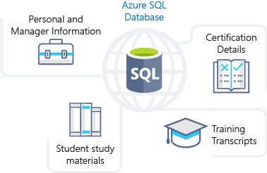
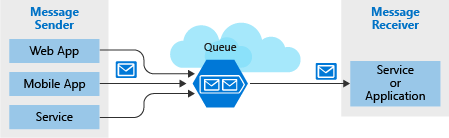

Looking at the benefits of Azure data storage, you understand that it offers the best options for storing your learning portal. Now let's explore the benefits and options in detail to see how it fits your business needs.

## How Azure data storage can meet your business storage needs

Azure provides several storage options that accommodate specific types of data storage needs.

:::row:::
  :::column:::
    
  :::column-end:::
    :::column span="3":::  
**Azure SQL Database**

Azure SQL Database is a relational database as a service (DaaS) based on the latest stable version of the Microsoft SQL Server database engine. SQL Database is a high-performance, reliable, fully managed and secure database. You can use it to build data-driven applications and websites in the programming language of your choice without needing to manage infrastructure.

You can migrate your existing SQL Server databases with minimal downtime using the Azure Database Migration Service. The service uses the *Microsoft Data Migration Assistant* to generate assessment reports that provide recommendations to help guide you through required changes prior to performing a migration. Once you assess and perform any remediation required, you're ready to begin the migration process. The Azure Database Migration Service performs all of the required steps. You just change the connection string in your apps. 

The following illustration shows the types of data from the online learning portal scenario that would be stored in an Azure SQL database.

:::column-end:::
:::row-end:::
:::row:::
  :::column:::
    
  :::column-end:::
    :::column span="3":::  
**Azure Cosmos DB**

Azure Cosmos DB is a globally distributed database service. It supports schema-less data that lets you build highly responsive and **Always On** applications to support constantly changing data. You can use this feature to store data that is updated and maintained by users around the world. The following illustration shows a sample Azure Cosmos DB database that's used to store data that's accessed by people located across the globe.

:::column-end:::
:::row-end:::
:::row:::
  :::column:::
    
  :::column-end:::
    :::column span="3":::  
**Azure Blob storage**

Azure Blob Storage is *unstructured*, meaning that there are no restrictions on the kinds of data it can hold. Blobs are highly scalable and apps work with blobs in much the same way as they would work with files on a disk, such as reading and writing data. Blob Storage can manage thousands of simultaneous uploads, massive amounts of video data, constantly growing log files, and can be reached from anywhere with an internet connection. 

Blobs aren't limited to common file formats. A blob could contain gigabytes of binary data streamed from a scientific instrument, an encrypted message for another application, or data in a custom format for an app you're developing.

Azure Blob storage lets you stream large video or audio files directly to the user's browser from anywhere in the world. Blob storage is also used to store data for backup, disaster recovery, and archiving. It has the ability to store up to 8 TB of data for virtual machines. The following illustration shows an example usage of Azure blob storage.

:::column-end:::
:::row-end:::
:::row:::
  :::column:::
    
  :::column-end:::
    :::column span="3":::  
**Azure Data Lake Storage Gen2**

The Data Lake feature allows you to perform analytics on your data usage and prepare reports. Data Lake is a large repository that stores both structured and unstructured data.

**Azure Data Lake Storage Gen2** combines the scalability and cost benefits of object storage with the reliability and performance of the Big Data file system capabilities. The following illustration shows how Azure Data Lake stores all your business data and makes it available for analysis.

:::column-end:::
:::row-end:::
:::row:::
  :::column:::
    
  :::column-end:::
    :::column span="3":::  
**Azure Files**

Azure Files offers fully managed file shares in the cloud that are accessible via the industry standard Server Message Block (SMB) protocol. Azure file shares can be mounted concurrently by cloud or on-premises deployments of Windows, Linux, and macOS. Applications running in Azure virtual machines or cloud services can mount a file storage share to access file data, just as a desktop application would mount a typical SMB share. Any number of Azure virtual machines or roles can mount and access the file storage share simultaneously. Typical usage scenarios would be to share files anywhere in the world, diagnostic data, or application data sharing. 

The following illustration shows Azure Files being used to share data between two geographical locations. Azure Files uses the Server Message Block (SMB) protocol that ensures the data is encrypted at rest and in transit.

:::column-end:::
:::row-end:::
:::row:::
  :::column:::
    
  :::column-end:::
    :::column span="3":::  
**Azure Queue**

Azure Queue storage is a service for storing large numbers of messages that can be accessed from anywhere in the world. To put it in perspective, a single queue message is up to 64 KB in size, and a queue can contain millions of messages.

Typically, there are one or more sender components and one or more receiver components. Sender components add messages to the queue, while receiver components retrieve messages from the front of the queue for processing. The following illustration shows multiple sender applications adding messages to the Azure Queue and one receiver application retrieving the messages.

You can use queue storage to:

- Create a backlog of work and to pass messages between different Azure web servers.
- Distribute load among different web servers/infrastructure and to manage bursts of traffic.
- Build resilience against component failure when multiple users access your data at the same time.

:::column-end:::
:::row-end:::
:::row:::
  :::column:::
    
  :::column-end:::
    :::column span="3":::  
**Disk Storage**

Disk storage provides disks for virtual machines, applications, and other services to access and use as they need, similar to how they would in on-premises scenarios. Disk storage allows data to be persistently stored and accessed from an attached virtual hard disk. The disks can be managed or unmanaged by Azure, and therefore managed and configured by the user. Typical scenarios for using disk storage are if you want to lift and shift applications that read and write data to persistent disks, or if you are storing data that is not required to be accessed from outside the virtual machine to which the disk is attached. 

Disks come in many different sizes and performance levels, from solid-state drives (SSDs) to traditional spinning hard disk drives (HDDs), with varying performance abilities.

When working with VMs, you can use standard SSD and HDD disks for less critical workloads, and premium SSD disks for mission-critical production applications. Azure Disks have consistently delivered enterprise-grade durability, with an industry-leading ZERO% annualized failure rate. The following illustration shows an Azure virtual machine using separate disks to store different data.

:::column-end:::
:::row-end:::
:::row:::
  :::column:::
    
  :::column-end:::
    :::column span="3":::  
**Storage tiers**

Azure offers three storage tiers for blob object storage:

1. **Hot storage tier**: optimized for storing data that is accessed frequently.

1. **Cool storage tier**: optimized for data that is infrequently accessed and stored for at least 30 days.

1. **Archive storage tier**: for data that is rarely accessed and stored for at least 180 days with flexible latency requirements.

:::column-end:::
:::row-end:::
:::row:::
  :::column:::
    
  :::column-end:::
    :::column span="3":::  
**Encryption and replication**

Azure provides security and high availability to your data through encryption and replication features.

#### Encryption for storage services

The following encryption types are available for your resources:

1. **Azure Storage Service Encryption (SSE)** for data at rest helps you secure your data to meet the organization's security and regulatory compliance. It encrypts the data before storing it and decrypts the data before retrieving it. The encryption and decryption are transparent to the user.

1. **Client-side encryption** is where the data is already encrypted by the client libraries. Azure stores the data in the encrypted state at rest, which is then decrypted during retrieval.

#### Replication for storage availability

A replication type is set up when you create a storage account. The replication feature ensures that your data is durable and always available. Azure provides regional and geographic replications to protect your data against natural disasters and other local disasters like fire or flooding.

  :::column-end:::
:::row-end:::
