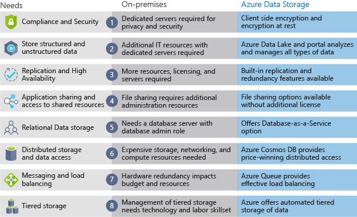

Now that you know about the benefits and features of Azure data storage, let's see how it differs from on-premises storage.

The term "on-premises" refers to the storage and maintenance of data on local hardware and servers. There are several factors to consider when comparing on-premises to Azure data storage.

:::row:::
  :::column:::
    
  :::column-end:::
	:::column span="3":::
**Cost effectiveness**

An on-premises storage solution requires dedicated hardware that needs to be purchased, installed, configured, and maintained. This can be a significant up-front expense (or capital cost). Change in requirements can require investment in new hardware. Your hardware needs to be capable of handling peak demand which means it may sit idle or be under-utilized in off-peak times.

Azure data storage provides a pay-as-you-go pricing model which is often appealing to businesses as an operating expense instead of an upfront capital cost. It's also scalable, allowing you to scale up or scale out as demand dictates and scale back when demand is low. You are charged for data services only as you need them.

:::column-end:::
:::row-end:::
:::row:::
  :::column:::
    
  :::column-end:::
	:::column span="3":::
**Reliability**

On-premises storage requires data backup, load balancing, and disaster recovery strategies. These can be challenging and expensive as they often each need dedicated servers requiring a significant investment in both hardware and IT resources.

Azure data storage provides data backup, load balancing, disaster recovery, and data replication as services to ensure data safety and high availability.

:::column-end:::
:::row-end:::
:::row:::
  :::column:::
    
  :::column-end:::
	:::column span="3":::
**Storage types**

Sometimes multiple different storage types are required for a solution, such as file and database storage. An on-premises approach often requires numerous servers and administrative tools for each storage type.

Azure data storage provides a variety of different storage options including distributed access and tiered storage. This makes it possible to integrate a combination of storage technologies providing the best storage choice for each part of your solution.

:::column-end:::
:::row-end:::
:::row:::
  :::column:::
    
  :::column-end:::
	:::column span="3":::
**Agility**

Requirements and technologies change. For an on-premises deployment this may mean provisioning and deploying new servers and infrastructure pieces, which is a time consuming and expensive activity.

Azure data storage gives you the flexibility to create new services in minutes. This flexibility allows you to change storage back-ends quickly without needing a significant hardware investment.

The following illustration shows differences between on-premises storage and Azure data storage.

  :::column-end:::
:::row-end:::