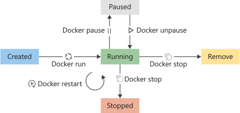

Recall, we said the container becomes the unit we'll use to distribute our applications. We also mentioned the container is in a standardized format used by both our developer and operation teams.

In our example, we're developing an order tracking portal that our company's various outlets will use. With the Docker image built, our operations team is now responsible for the deployment, rollout of updates, and management of our order tracking portal.

In our previous unit, we looked at how a Docker image is built. Here we'll look a bit at a Docker container's life cycle and how to manage containers. We also look at how we should think about configuring data storage and the network options for our containers.

## How to manage Docker containers

A Docker container has a life cycle that we can manage and track the state of the container.



We use the start command to place a container in the run state. We can also restart a container that is already running. When restarting a container, the container receives a termination signal to allow any running processes to shut down gracefully before the container's kernel is terminated.

A container is considered in a running state until it's either paused, stopped or killed. A container, however, may also exit from the run state by itself. A container can self-exist when the running process completes or if the process goes into a fault state.

A running container can be paused using the pause command. This command suspends all processes in the container.

A running container can be stopped using the stop command. The stop command allows the working process to shut down gracefully by sending it a termination signal. The container's kernel terminates once the process shuts down.

We use the kill command to send a kill signal if we need to terminate the container. The running process doesn't capture the kill signal, only the container's kernel. This command will forcefully terminate the working process in the container.

Finally, we use the remove command to remove containers that are in a stopped state. Once we remove a container, all data stored in the container gets destroyed.

## How to view available containers

We use the `docker ps` command to list running containers.  If you want to see all containers in all states, use the `docker -ps -a` command.

Here is an example.

```code
docker -ps -a
```

Here is the output from the above command.

```output
CONTAINER ID    IMAGE        COMMAND         CREATED       STATUS           PORTS        NAMES
d93d40cc1ce9    tmp-ubuntu:latest  "dotnet website.dll …"  6 seconds ago    Up 5 seconds        8080/tcp      happy_wilbur
33a6cf71f7c1    tmp-ubuntu:latest  "dotnet website.dll …"  2 hours ago     Exited (0) 9 seconds ago            adoring_borg
```

There are three items to review in the above output:

- The image name listed in the _IMAGE_ column. In our example, *tmp-ubuntu: latest*. Notice how we're allowed to create more than one container from the same image. This feature is a powerful management feature that we use to enable scaling in our solutions.

- The status of the container listed in the _STATUS_ column. In our example, we have one container that is running and one container that has exited. The container's status usually is our first indicator of the health of the container.

- The name of the container listed in the _NAMES_ column. Apart from the container ID in the first column, containers will also receive a name. In our example, we didn't explicitly provide a name for each container, and as a result, Docker gave the container a random name. You give a container an explicit name using the `--name` flag using the run command.

### Why are containers given a name?

This feature allows us to run multiple container instances of the same image. Container names are unique, which means if you specify a name, that name can't be reused to create a new container. The only way to reuse a specific name is to remove the previous container.

## How to run a container

Use the `docker run` command to start a container. We only need to specify the image to run with its name or ID to launch the container from the image. A container launched in this manner provides the user with an interactive experience.

Here, we're adding the `-d` flag to run the container with our website in the background.

```code
docker run -d tmp-ubuntu
```

The command, in this case, only returns the ID of the new container.

Once an image is specified to run, Docker finds the image, loads container from the image, and executes the command specified as the entry point. It's at this point that the container is available for management.

## How to pause a container

We use the `docker pause` command to pause a container. Here is an example.

```code
docker pause happy_wilbur
```

Pausing a container will suspend all processes. This command allows the container to continue processes at a later stage. The `docker unpause` command unsuspends all processes.

### How to restart a container

We use the `docker restart` command to restart containers. Here is an example.

```code
docker restart happy_wilbur
```

The container receives a stop command, followed by a start command. If the container doesn't respond to the stop command, then a kill signal is sent.

### How to stop a container

We use the `docker stop` command to stop a running container. Here is an example.

```code
docker stop happy_wilbur
```

The stop command sends a termination signal to the container and the process running in the container.

### How to remove a container

We use the `docker rm` command to remove a container. Here is an example.

```code
docker rm happy_wilbur
```

All data in the container is destroyed once you remove the container. It's essential to always consider containers as temporary when thinking about storing data.

## Docker container storage configuration

As we've mentioned earlier, we must always consider containers as temporary when the application in a container needs to store data.

Let's assume our tracking portal creates a log file in a subfolder to the root of the application, that is, directly to the file system of the container. When our app writes data to the log file, the system writes the data to the writable container layer.

Even though this approach works, it, unfortunately, has several drawbacks.

- Container storage is temporary

    Our log file won't persist between container instances. For example, let's assume that we stop and remove the container. When we launch a new container instance, the new instance base itself of the image specified, and all our previous data will be missing. Remember, all data in a container is destroyed with the container when we remove a container.

- Container storage is coupled to the underlying host machine

    Accessing or moving the log file from the container is difficult to do as the container is coupled to the underlying host machine. We'll have to connect to the container instance to access the file.

- Container storage drives are less performant

    Containers implement a storage driver to allow our applications to write data. This driver introduces an extra abstraction to communicate with the host OS kernel and is less performant than writing directly to a host filesystem.

Containers can make use of two options to persist data. The first option is to make use of _volumes_, and the second is _bind mounts_.

### What is a volume?

A volume is stored on the host filesystem at a specific folder location. We'll choose a folder where we know the data isn't going to be modified by non-Docker processes.

Docker creates and manages the new volume by using the `docker volume create` command. This command can form part of our Dockerfile definition, which means that we can create volumes as part of the container creation process. Docker will create the volume if it doesn't exist when you try to mount the volume into a container the first time.

Volumes are stored within directories on the host filesystem. Docker will mount and manage the volumes in the container. Once mounted, these volumes are isolated from the host machine.

Multiple containers can simultaneously use the same volumes. Volumes also don't get removed automatically when a container stops using the volume.

In our example, we can create a directory on our container host and mount this volume into the container when we create the tracking portal container. When our tracking portal logs data, we can access this information via the container host's filesystem. We'll have access to this log file even if our container is removed.

### What is a bind mount?

A bind mount is conceptually the same as a volume, however, instead of using a specific folder, you can mount any file or folder on the host. We're also expecting the host can change the contents of these mounts. Just like volumes, the bind mount is created if we mount it, and it doesn't yet exist on the host.

Bind mounts have limited functionality compared to volumes, and even though they're more performant, they depend on the host having a specific folder structure in place.

Volumes are considered the preferred data storage strategy to use with containers.

## Docker container network configuration

The default Docker network configuration allows for the isolation of containers on the Docker host. This feature enables us to build and configure applications that can communicate securely with each other.

Docker provides us with three pre-configured network configurations:

- Bridge
- Host
- none

You choose which of these network configurations to apply to your container depending on its network requirements.

### What is the bridge network?

The bridge network is the default configuration applied to containers when launched without specifying any additional network configuration. This network is an internal, private network used by the container and isolates the container network from the Docker host network.

Each container in the bridge network is assigned an IP address and subnet mask with the hostname defaulting to the container name.  Containers connected to the default bridge network are allowed to access other bridge connected containers by IP address. The bridge network doesn't allow communication between containers using hostnames.

By default, Docker doesn't publish any container ports. We use the Docker port  `--publish` flag to enable port mapping between the container ports and the Docker host ports.

The publish flag effectively configures a firewall rule that maps the ports.

In our example, our tracking portal is accessible to clients browsing to port 80. We'll have to map port 80 from the container to an available port on the host.  We have port 8080 open on the host, which allows us to set the flag like this:

```code
--publish 80:8080
```

Any client browsing to the Docker host IP and port 8080 can access the tracking portal.

### What is the host network?

The host network allows us to run the container on the host network directly. This configuration effectively removes the isolation between the host and the container at a network level.

In our example, let's assume we decide to change the networking configuration to the host network option. Our tracking portal is still accessible using the host IP. We can now use the well known port 80 instead of a mapped port.

Keep in mind that the container can use only ports not already used by the host.

### What is the none network?

We use the none network option to disable networking for containers.

### Operating system considerations

Keep in mind that there are differences between desktop operating systems for the Docker network configuration options. For example, the _Docker0_ network interface isn't available on macOS when using the bridge network, and using the host network configuration isn't supported for both Windows and macOS desktops.

These differences might affect the way your developers configure their workflow to manage container development.
