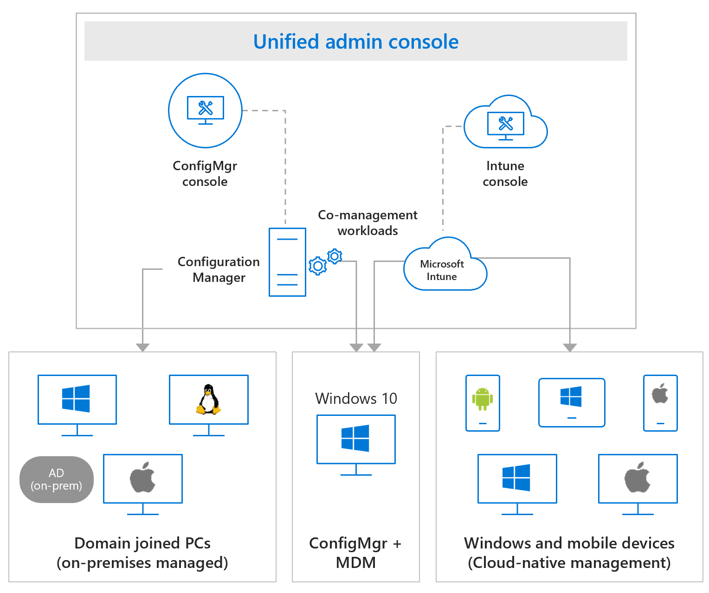

<!-- Endpoint Manager capabilities
Slides 12-24 -->
Effectively managing endpoints presents a number of challenges. For instance, how do you manage existing investments? How do you provide proper security in the form of access control and encryption? What do you determine which user, device, or app is in compliance based on your corporate requirements? 

Microsoft Endpoint Manager provides the services and tools you need in one location to manage your organization's endpoint. 

Modern IT provides cloud intelligence at the core. Microsoft Endpoint Manager (MEM) provides this modern management. MEM doesn't require you to make an either/or decision between on-prem and cloud management. You can do both, and modernize at your own pace, to manage risk in a smart way. To take advantage of the cloud and modern IT, but also give you the tools and capabilities to also manage your existing on-prem investments.

Microsoft Endpoint Manager has the following attributes:
- Secure and Intelligent
- Streamlined and Flexible
- Maximized Investment

## Secure and Intelligent
Endpoint manager provides native integration with cloud-powered security controls and risk-based conditional access for apps and data.

### Intelligent Security
Microsoft Endpoint Manager enables a unique set of capabilities to simplify endpoint security management, which include:
- **Windows Hello, Attestation** - 
- **Security Baselines** - Simplify migration to policy settings using security baselines. 
- **BitLocker Management** - Bitlocker based modern Encryption Management e.g. Key recover and report 
- **Advanced Threat Protection** - Microsoft Defender Advanced Threat Protection (Microsoft Defender ATP), along with its partners for iOS and Android, provides a comprehensive Mobile Threat Defense solution.
- **Secure Score** - Secure score helps you assess your workload security posture by recommending a prioritized list of security vulnerabilities for remediation.

Using:
Windows Hello, Attestation
Security Baselines
BitLocker Management
Advanced Threat Protection
Secure Score

Benefits:
Manage Windows Hello
Deploy recommended settings with security baselines
Administer device encryption (BitLocker; FileVault)
Automate remediation with Microsoft Defender ATP
Assess your security posture with Secure Score

### Risk-based Control
Microsoft Endpoint Manager helps ensure cross-platform device controls in your zero-trust strategy.

- **Endpoint compliance and risk**
  - Adapt in real-time to changes in device health.
  - Leverage Microsoft 365 cloud to evaluate risks
  - Risks calculated based on advanced Microsoft machine learning
- **Conditional Access** - 
  - Define contextual policies at the user, location, device, and app levels
  - Evaluate compliance Azure AD enforces Conditional Access 
- **App Protection Policy** - 
  - **Protect Office365 data on unmanaged devices** - App protection policies help to protect Office 365 data where devices are unmanaged or managed by 3rd party
- **Extend native platform security to meet all use cases** -
- **Third Party Risk and Compliance Signaling** - 

Using:
Endpoint Compliance and Risk
Conditional Access
App Protection Policy
Third Party Risk and Compliance Signaling

Benefits:
Adapt in real-time to changes in device health
Leverage Microsoft 365 cloud to evaluate risks
Protect Office365 data on unmanaged devices
Extend native platform security to meet all use cases
Factor in third party risk and compliance signaling

## Streamlined and Flexible
Flexible support for diverse corporate and BYOD scenarios while increasing productivity and collaboration.

### Unified Management
Manage your PCs, Macs, and mobile devices in one place.
- **Manage all your endpoints from a single pane of glass** - M365 Admin Center provides a single pane of glass for all management activities.
- **Extend on-premises infrastructure with cloud security** - Guided deployments?
- **Provide the best Office 365 management experience** - Provide the best Office Experience with security and config management, cloud content optimization.
- **Manage key mobile apps Microsoft Outlook and Edge** - Stay secure with Microsoft Apps (aka Office 365 Pro Plus) and Microsoft Edge for iOS and Android.

Using:
Mobility and PC Management
M365 Admin Center
Guided Deployments
Office 365 Pro Plus
Edge

Benefits:
Manage all your endpoints from a single pane of glass
Extend on-premises infrastructure with cloud security
Provide the best Office 365 management experience
Manage key mobile apps Microsoft Outlook and Edge

### Zero Touch Provisioning
With Microsoft Endpoint Manager, you can simplify software updates and provisioning for all devices.

Using:
Windows Autopilot
Android Enterprise
Apple DEP
Samsung Knox Mobile Enrollment

Benefits:
Decrease costly image creation workload
Self-service provisioning directly by end users
Faster time to productivity
Out of the box security
Lower OPEX for staying current

## Maximizes Investment
Maximize your investment and accelerate time to value with fast rollout of services and devices with end-to-end integration across familiar Microsoft stack.

### Advanced Analytics

Using:
Technology Experience Score
Desktop Analytics
Log Analytics
Real Time Advanced Threat Detection
Dynamic User Risk Assessment

Benefits:
Proactively maintain device performance and health
Data-driven IT change management shows impact to business and user experience
Leverage machine-learning for recommended security and configuration settings

### Deep Microsoft 365 Integration
Maximize end-user value by native integration with other Microsoft 365 capabilities.

Using:
Role Based Admin
Graph API
PowerShell
Audit
Cloud Content Optimization

Benefit:
Unified IT administration experience
Continuous security improvements for everyone
Automated app compatibility and software updates for OS and apps 
Increased end user satisfaction through native platform experiences

Using described:
Use role-based administration to secure the access that is needed to administer Configuration Manager 
Secure access to the objects that you manage, like collections, deployments, and sites
Extend or build unique, intelligent applications using Microsoft Graph API, Device Compliance API, SDK for app protection policies
Create sophisticated PowerShell scripts to accomplish complex tasks easily Audit
Cloud content optimization

## Benefits of Co-Management

Co-management adds new functionality to your existing Configuration Manager deployment, without changing how you already work. When you enable co-management, you immediately begin benefitting from the cloud. You can apply that value to your existing management infrastructure and processes.

When you enroll existing Configuration Manager clients in co-management, you gain the following immediate value:  

- Conditional access with device compliance  
- Intune-based remote actions, for example: restart, remote control, or factory reset
- Centralized visibility of device health  
- Link users, devices, and apps with Azure Active Directory (Azure AD)  
- Modern provisioning with Windows Autopilot  
- Remote actions

<!-- >

NOTES:

MEM provides a means to modern management. Modern management is the following:
- Cloud intelligence that is at the core of the management solution.
- An improved end user experience.
- A single console for simplified IT admin and ops
- Enablement of IT partners with the business
- Connect IT with security
- Help IT quantify impact and prioritize
- Enable strong partner ecosystem

 It provides an improved end user experience in a single console for simplified IT administration and operations management. MEM helps administrators protect corporate resources. 

Also, see:

https://docs.microsoft.com/learn/modules/introduction-to-modern-management-in-microsoft-365/2-benefits-modern-management
-->