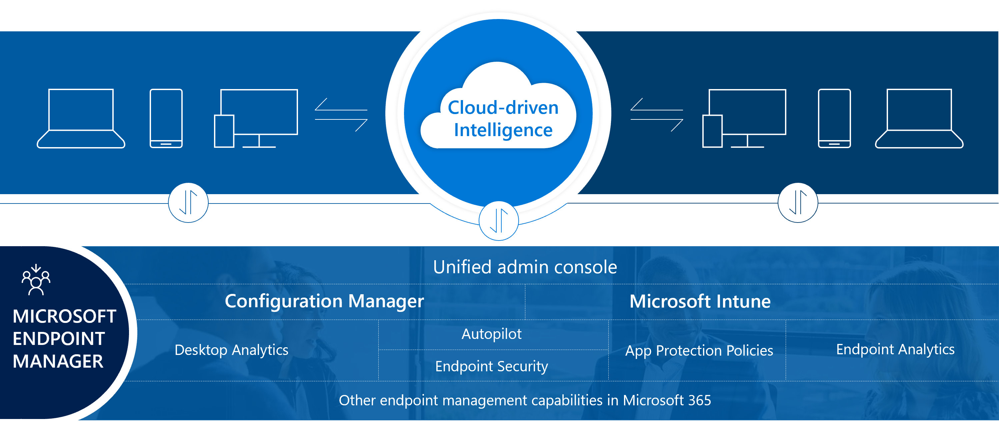

Microsoft Endpoint Manager is a single, integrated management platform for managing, protecting, and monitoring all of your organization's endpoints.

Endpoints include the mobile devices, desktop computers, virtual machines, embedded devices, and servers that your organization uses. Additionally, endpoints also include the apps used by your organization. 

By protecting and monitoring your organization's endpoints using Microsoft Endpoint Manager, you accomplish the following actions:
- Protect the data that the people at your organization are accessing.
- Ensure your organization is using proper credentials to access and share company data.
- Safeguard the devices and apps that access your organization resources.
- Confirm security rules are in place based on your organizations requirements. 

The Microsoft Endpoint Manager console helps keep your organization's cloud and on-premises devices, apps, and data secure. Endpoint Manager integrates Microsoft Intune, Microsoft Endpoint Configuration Manager, Desktop Analytics, and Windows Autopilot. 

To quickly step through the areas of Microsoft Endpoint Manager, see [Tutorial: Walkthrough Intune in Microsoft Endpoint Manager](https://docs.microsoft.com/mem/intune/fundamentals/tutorial-walkthrough-endpoint-manager).

## Microsoft Intune

Microsoft Intune, which is available within Microsoft Endpoint Manager, is a cloud-based mobile device management (MDM) and mobile application management (MAM) provider for your apps and devices. It lets you protect your organization by controlling features and settings on Android, Android Enterprise, iOS/iPadOS, macOS, and Windows 10 devices. It integrates closely with Azure Active Directory (Azure AD) for identity and access control and Azure Information Protection for data protection. When you use it with Microsoft 365, you can enable your workforce to be productive on all their devices while keeping your organization's information protected. If you have on-premises infrastructure, such as Exchange or an Active Directory, you can use Intune connectors to help you connect to external services. Intune is included in Microsoft's [Enterprise Mobility + Security (EMS) suite](https://www.microsoft.com/microsoft-365/enterprise-mobility-security). 

In the following diagram, you can see how Intune interacts with other components in both your on-premises and cloud infrastructure:

## Microsoft Endpoint Configuration Manager

Configuration Manager is an on-premises management solution to manage desktops, servers, and laptops that are on your network or are internet-based. You can cloud-enable Configuration Manager to integrate with Intune, Azure AD, Microsoft Defender ATP, and other cloud services. Use Configuration Manager to deploy apps, software updates, and operating systems, as well as configure sites and clients, and run and monitor management tasks. Configuration Manager supports Windows and Mac OS versions. The devices you manage with Configuration Manager can run in virtual environments. This includes Hyper-V on Windows servers as well as Virtual Machines (VM) in Azure. If you run a server as an Azure based VM, you can install the Configuration Manager client on that device.    

### Co-management

Co-management is where you concurrently manage Windows 10 devices with both Configuration Manager and Microsoft Intune. It combines your existing on-premises Configuration Manager and Active Directory investment with the cloud by using Intune, Azure AD, and other Microsoft 365 cloud services. You choose whether Configuration Manager or Intune is the management authority. You keep some tasks on-premises, while running other tasks in the cloud with Intune.

There are two main paths to reach co-management:  
- **Existing Configuration Manager clients**: You have Windows 10 devices that are already Configuration Manager clients. You set up hybrid Azure AD, and enroll them into Intune.  
- **New internet-based devices**: You have new Windows 10 devices that join Azure AD and automatically enroll to Intune. You install the Configuration Manager client to reach a co-management state.  

When you enroll existing Configuration Manager clients in co-management, you gain the following immediate value:  
- Conditional access with device compliance  
- Intune-based remote actions, such as restart, remote control, or factory reset
- Centralized visibility of device health  
- Link users, devices, and apps with Azure Active Directory (Azure AD)  
- Modern provisioning with Windows Autopilot  

In the following diagram, you can see how Windows 10 devices can be manged with both Configuration Manager and Microsoft Intune:

## Desktop Analytics

Desktop Analytics is a cloud-based service that integrates with Configuration Manager to help you update devices. It provides insight and intelligence for you to make more informed decisions about the update readiness of your Windows clients. The service combines data from your organization with data aggregated from millions of devices connected to the Microsoft cloud. It provides information on security updates, apps, and devices in your organization, and identifies compatibility issues with apps and drivers. 

## Windows Autopilot

Windows Autopilot simplifies enrolling devices in Intune. You provide the enrollment details up front before the end user receives a new computer. The Windows Autopilot process runs immediately after powering on a new computer for the first time, enabling employees to configure new devices to be business-ready with just a few clicks. You can also use Windows Autopilot to reset, repurpose, and recover devices. Leveraging cloud-based services, you can automatically join devices to Azure AD, auto-enroll devices into MDM services, such as Microsoft Intune, restrict rights on the computer, auto-assign devices to configuration groups, and customize the Out-of-box-experience (OOBE) content to be specific for your organization.

