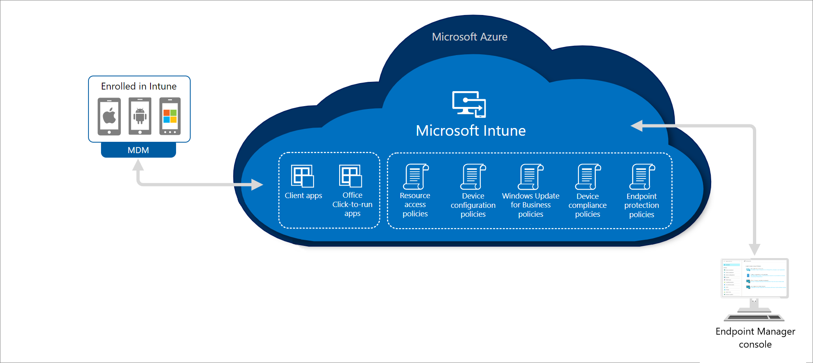

Before a device is enrolled with Intune or Configuration Manager, you may need to provision the device. Provisioning is a process when your organization issues new or repurposed devices to individuals in your organization. As part of the process, the indivdual user signs in to the device and steps through the process of connecting to your organization. You can either enroll the devices with Intune or Configuration Manager during the provisioning process or after depending on your needs.

## Provisioning

- Decrease costly image creation workload
- Self-service provisioning directly by end users
- Faster time to productivity
- Out of the box security
- Lower OPEX for staying current

