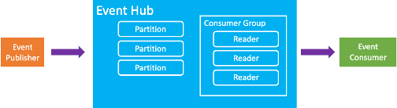

Event Hubs is one of three types of message broker available on Azure. Message brokers act as intermediaries between event producers, such as mobile phone apps, and event consumers, like dashboards or data processing pipelines. Event Hubs acts as a large buffer for incoming information (rather than commands) sent by producers that are safe to be processed asynchronously. Consumers can then pull from that queue and process the data on their own schedule.

For example, in our security company scenario, Event Hubs might receive event information from home sensors, and store them in memory. The processing server pulls this information from Event Hubs and processes it on a best-effort basis. This type of processing allows for near real-time information onto appear on customer’s monitoring webpages, and allows for detection of events designed to trigger a security response.

## Why would I want a message broker?

Message brokers logically and temporally decouple event producers from event consumers. Decoupling creates an event pipeline that is more modular. So that it scales more easily, and is typically more reliable than a tightly coupled system.

### Temporal Decoupling

The temporal decoupling provided by message brokers means that the event producer and event consumers don’t need to run concurrently. In other words, the producer can send a message (data) without the consumer being available, and the consumer can process information without the producer being available. Temporal decoupling can provide a stronger guarantee that messages are received and it means that producers aren't blocked while consumers are processing data.
### Load Balancing and Load Leveling

Because of their limited responsibility, Event Hubs is better able to handle sudden influxes of traffic than a directly coupled consumer that needs to spend time processing each message. As consumers pull data at their own rate, they avoid overloading at any given moment and can process any backlog during moments of lower traffic. What's more, Event Hubs supports multiple concurrent consumers, potentially making it simpler to achieve load balancing than with a directly coupled model. In addition, if a consumer fails, the message persists on Event Hubs. Allowing another consumer to process the message or the original consumer to process the message when it comes back online.

## Event Hubs is a versatile service

Event Hubs is a fully managed platform-as-a-service. It simplifies the creation and maintenance of reliable, scalable data pipelines. Event Hubs can compile and organize data from multiple sources, before storing it or sending it to an event consumer. It provides you with a single platform for your systems to ingest, buffer, store, and process data, at scale. All while allowing multiple clients with multiple purposes to receive and process the same message.

Event Hubs is compatible with a wide variety of languages and tools. **Data can be read and processed using languages such as Python and Go**, and it’s compatible with common protocols, Apache Kafka applications, the Spring Framework for Java, and more. Further, Event Hubs emits exhaustive metrics that provide the state of your resources to Azure Monitor. They also let you assess the overall health of the Event Hubs service not only at the namespace level but also at the entity level.

## When is Event Hubs a suitable solution?

Event Hubs is suited specifically for ingesting high volumes of messages quickly and reliably. It’s suitable for receiving data from thousands, or more, event publishers simultaneously and ensuring the data is stored in a non-volatile state. It supports connection mechanisms like *Advanced Message Queuing Protocol* (AMQP) and *WebSockets* to support low-bandwidth and low-latency message delivery. For example, these capabilities might allow monitoring of firewall activity or processing of live website use to rapidly update product recommendations.

There are scenarios where other message brokers are more suitable than Event Hubs. Event Hubs can enable near real-time responses to messages. However, due to its asynchronous nature, Event Hubs isn't always the best choice if the event creators are critically dependent on specific actions taking place in a specific window of time.

Event Hubs is also not the best choice when delivery of all information is absolutely business critical. Event Hubs can guarantee *at least once* delivery to its singular Capture consumer. But, if your application has multiple groups that consume the same messages. Then your client application is responsible for connecting to and consuming the events while they're still in the cache. The cache lifetime is configurable, and defaults to 24 hours, but if some downtime prevents your consumer applications from running, you may miss those events.

If Event Hubs isn't the perfect fit for your problem, Azure provides other messaging services. Including:

- **Azure Service Bus**, which uses a pull model, similarly to Event Hubs, but is designed for the delivery of mission-critical commands for which a delivery guarantee is required.
- **Azure Event Grid**, which uses a push rather than pull model. A push model follows a publisher-subscriber pattern. In this pattern, a source (such as a mobile app) triggers an event that is pushed to all subscribers, or is discarded if no subscribers exist.