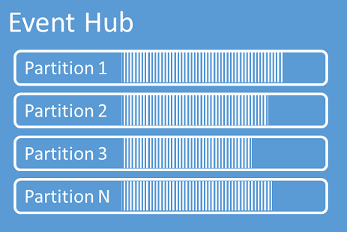
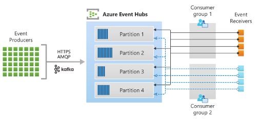

At its core, Event Hubs can be thought of as a message or event log. We use the terms *event* and *message* here to mean a small packet of information or datagram that contains some kind of notification. For example, in our security system scenario, the event may be a notification that a motion sensor has been tripped. When an event producer, such as the motion sensor, sends data to Event Hubs, that event is saved to Event Hubs’ specialized cache. The event consumer – such as a custom application – pulls events from Event Hubs, reads them, and processes them at a rate it sees fit.

## Language and framework integration

Event Hubs is available in the following languages:

* .NET Core supported languages such as C# and F#
* Java
* Python
* JavaScript
* Go
* C (send only)

## Choosing a tier and throughput

Event Hubs is a platform-as-a-service that runs on Azure. As such, you need an Azure subscription, which you can create for free.

You control the scaling of Event Hubs based on how many throughput units or processing units you purchase. A single throughput unit equates to:

* Ingress: Up to 1 MB per second or 1000 events per second (whichever comes first).
* Egress: Up to 2 MB per second or 4096 events per second.

Other performance aspects depend on the pricing tier chosen, with basic, standard, premium, and dedicated pricing tiers being available.

Each plan supports different maximum event retention periods – ranging from 24 hours with the basic tier to up to at least 90 days with premium and dedicated tiers. Higher tiers also offer larger storage volumes of up to 10 TB per capacity unit. These tiers also offer different pricing structures for different levels of throughput, numbers of events, and capture functionality. Notably, non-basic tiers provide integration with *Apache Kafka* and a *Schema Registry*, which are used by senders and receivers of data to validate data integrity.

## Loose coupling and data expiry

Event Hubs uses a *pull model* that differentiates it from some other messaging services, such as Azure Service Bus Queues. The pull model means that Event Hubs holds the message in its cache and allows it to be read. When a message is read from Event Hubs, it isn't deleted. It's left in the cache, where it can be read, as needed, by more consumers. Messages are deleted from Event Hubs automatically once they've existed in the cache for more than their expiry period. The expiry period, known as *time-to-live*, is 24 hours by default but is customizable.

This loose coupling means that Event Hubs isn't opinionated about which consumers read its messages. So long as security requirements are met, Azure Active Directory and network configurations are supported, Event Hubs accepts the consumer. This lack of opinionated treatment can mean less time is spent configuring pipelines. But, it also means that there's no built-in mechanism to handle messages that aren't processed as you expect them to be.

For example, imagine that an event is processed but is provided with invalid formatting that causes your consumer function to malfunction. Since Event Hubs is simply acting as a data provider, it doesn't have a built-in mechanism to detect or handle this downstream error and deletes the message once its time-to-live has expired. If processing this data were mission critical, you'd need to make sure you handled the failure some other way, such as exception handling code within the consuming function.

### Partitioning data automatically

Events received by Event Hubs are added to the end of its data stream. This data stream orders the events based on the time they're received, and consumers can seek along this stream using time offsets.

Event Hubs can optionally partition events based on attributes to form multiple data streams. For example, in our security scenario, motion sensor data might be sent to one stream and door-opening sensor data sent to another. Event Hubs uses partition keys – which are sender supplied values – to identify which data should be allocated to which partition. Partitions can be used to divide or prioritize work, and ensure that certain types of data are physically stored together for ease of processing and backup.

## Consumer groups

All consumers of data stored in Event Hubs are assigned to one consumer group and one partition. Whereas each partition has a separate data stream, each consumer group has their own view (stream offset) of each partition stream. In other words, each consumer group can independently seek and read data, from each partition, at their own pace.

Multiple consumers can be assigned to the same consumer group. But, it's recommended that within a consumer group, only one consumer is allocated to each partition. More that one consumer in the same partition can lead to multiple consumers receiving identical information, potentially leading to a duplication of work.

## Checkpointing

Checkpointing is built-in functionality that allows each consumer group to formally ‘bookmark’ a location in each partition. Typically, checkpointing allows the consumer group to keep track of which messages have been processed. But, it can also be used to mark the last reader position if there's a network disconnect. Checkpointing is the responsibility of the consumer group to manually perform, and has no pre-determined interpretation by Event Hubs.

## Security and privacy

By default, all Event Hubs resources are secure and can only be accessed by the account owner. To grant access, you can offer authorized access using *Azure Active Directory* or *Shared Access Signatures* (SAS) for whenever a client tries to access an Event Hubs resource. Azure Active Directory provides role-based access control, so you can grant permissions to a security principal, such as a user or a group, using a token. You can also use SAS to provide limited and delegated access to Event Hubs resources using time or valid use constraints. **Microsoft recommends using Azure Active Directory for maximum security**, as you don’t need to store the access tokens, which reduce potential security risks of a compromised SAS.