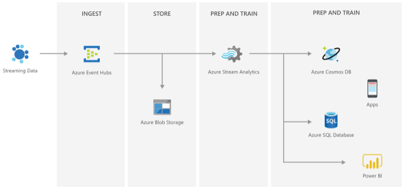

In this unit, we’ll learn about other Azure services you can integrate Event Hubs with, along with presenting a few considerations here that offer insight into some applications of Event Hubs. Using these scenarios, you may come up with other ideas on how you might integrate Event Hubs into your applications.

## Event Hubs as part of Azure

Event Hubs directly integrates with many Azure services, which can make development of pipelines easier and safer. Three important integrations are *Capture support*, integration with *Event Grid*, and integration with *Stream Analytics.*

*Capture support* provides a built-in consumer that can be configured to save every message, or a subset of messages, directly into a storage account. This storage account can be used as an emergency archive or a slow processing channel (also called a cold path) for data whose analysis isn't time-sensitive. Capture support provides some assurances when consumers may be slow to process data or must be temporarily taken offline.

Additionally, Event Hubs provides direct integration with *Event Grid*, which is an Azure-standard means of receiving notifications from one service and using them to trigger other services. For example, when Event Hubs receives a message, the message can pass to Event Grid, which wakes an Azure Function or Logic App that acts as the true consumer.

Event Hubs and *Azure Stream Analytics* are both built to work with continuous, large-scale streams of events. The direct integration of the two allows Stream Analytics to efficiently identify trends or perform aggregations in near-real time.

## Anomalies detection

Detecting anomalies in credit and debit card transactions is a vital component to keeping people financially secure. Yet, if thousands of devices are sending millions of events per second, tracking this information can be difficult and prone to errors. You can configure parameters for Event Hubs to capture anomalies like purchases on one card from multiple regions. You can route these events to your chosen Blob or Data Lake storage. Then, you can then analyze and process the events in real-time using *Azure Stream Analytics*. What’s more, you can further integrate Event Hubs with *Azure Functions*, to get push notifications for when an event is triggered, making for a seamless pipeline.

## Medical telemetry devices

Telemetry devices are used for many medical purposes, such as mobile heart monitoring, EKG machines in hospitals, and pacemakers, to name a few. These devices free up valuable resources and time for medical practitioners by accurately and quickly give off life-saving data. Capturing this data live, reduces the number of follow-up appointments that patients need to make. Consumers can set the event hub to capture any live data that would be considered abnormal and integrate with *Stream Analytics* to get real-time processing and analysis of this data.

## Real-time updates

Knowing what is happening, as it happens, is vital to many organizations. E-commerce businesses, such as fashion realtors, often need to track hourly, and daily sales and inventory data. Event Hubs would receive a message for every action that a customer takes. Such as when a customer looks at a product, or how many pictures of the product they looked at, and any other browsing information. By integrating Event Hubs with other services, like *Azure Function* and *Databricks* to read and analyze the data. Organizations can get up to the minute information so they can update the product recommendation services as needed. Consumers can then use *Microsoft's Power BI* to create interactive visualizations of this data as a dashboard. Overall, making the data easier to understand so you get the information you need to make the best business decisions.

:::image type="content" source="../media/4-power-bi-example.png" alt-text="Screenshot showing an example of a retail dashboard in Power BI.":::