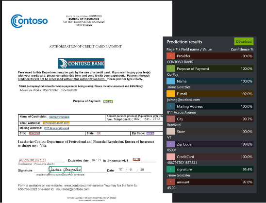

Azure AI Document Intelligence is a cognitive service that extracts data from images and documents using machine learning. Document Intelligence can analyze and extract data from various types of documents, including: tables, PDFs, pictures, written and typed documents, receipts, invoices, and business cards.

Normally, using manual processes to extract data from forms is time-consuming and difficult. With Document Intelligence you can automate this process to reduce manual entry errors and save time, while also increasing accessibility to data.

## Layout API

Document Intelligence Layout API can extract text, selection marks, and table structures—including the row and column numbers associated with the text—and their bounding box coordinates.

## Prebuilt models

Document Intelligence Prebuilt models are available for four applications: invoices, sales receipts, identifications, and business cards.

### Prebuilt Invoice model

The Prebuilt Invoice model extracts data from invoices in various formats and returns structured data. This model extracts key information such as invoice ID, customer and vendor details, shipping and billing information, price totals, and tax amounts.

The Invoice model can extract full line items and component parts – description, amount, quantity, product ID, date, and more. What's more, this model is designed to analyze and return all of the text and tables in structured data to automate the invoice process.

### Prebuilt Receipt model

This model is used to analyze English sales receipts from restaurants, retail, gas stations and more. Receipts from Australia, Canada, United Kingdom, India, and the United States, can be analyzed. The Prebuilt receipt model extracts the information you need, such as the time and date of the transaction, merchant information, and the tax and total amounts. The data can be extracted from different kinds of receipts, in both scanned copies or phone images.

### Prebuilt ID model

This model extracts information from worldwide passports and American drivers' licenses, such as the document number, name, country of residence, and expiration date, and returns it in a structured list.

### Prebuilt Business Cards model

This model extracts key information, such as names and contact numbers, and compiles it into an organized JSON response.

## Custom models

Document Intelligence offers custom data extraction *models* that can be tailored to your specific forms to extract text, key/value pairs, selection marks, and table data. The models are trained from the data you provide, improving the data extraction and outputting structured data in a customizable format. Custom models are perfect for forms that you use repeatedly, such as documents specific to your organization or industry.

You can create a custom model by uploading examples of your documents in the Azure portal. You can even create a highly accurate model by *labeling* the correct data to extract from your examples.

