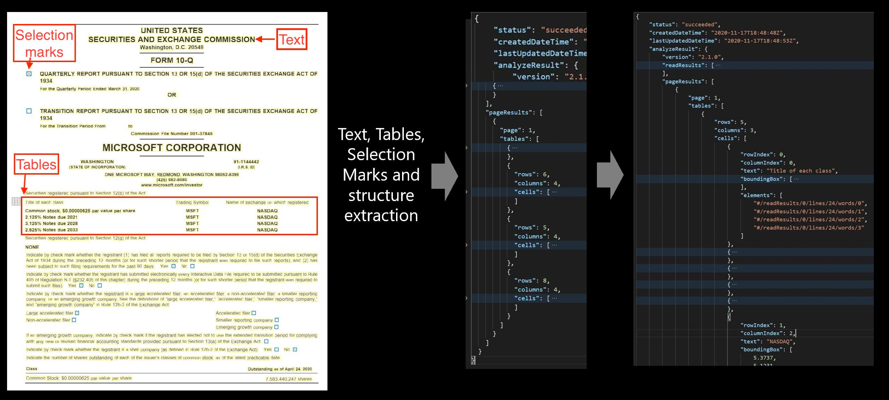

To use Azure AI Document Intelligence, you first need an Azure subscription, which you can create for free, and a Document Intelligence resource. The resource provides you with an endpoint and key, with which you can access the Document Intelligence service through REST or by using the appropriate software development kit (SDK). SDKs are available in these languages:

- .NET
- Python
- Java
- JavaScript

Document Intelligence is capable of analyzing JPG and PNG images, along with PDF and TIFF documents to extract and compile the key data you need in a JSON format.

## The services

There are three services with different functions available through Document Intelligence:

**Layout API** extracts text, tables, selection marks, and structure information from documents and returns them in an organized JSON response. Document Intelligence can parse documents of varying type and quality, including phone-captured images, scanned documents, and PDFs.

**Prebuilt models** analyze three unique form types: invoices, sales receipts, and business cards. This service combines Optical Character Recognition (OCR) capabilities with deep learning models that understand invoice, receipt, and business card information to extract key information in multiple languages.

**Custom models** are created by uploading five or more sample forms. Document Intelligence then 'trains' a custom model that can extract data tailored specifically to your forms. After you train a custom model, you can test and retrain it to reliably extract data from more forms according to your needs.

Document Intelligence is designed to put the key information you need in one place. When you use a prebuilt or custom model, it becomes easier to find and utilize that information.
