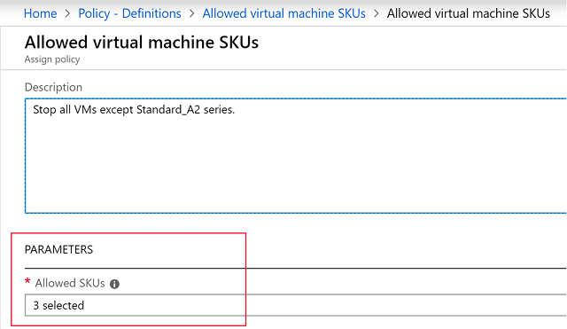
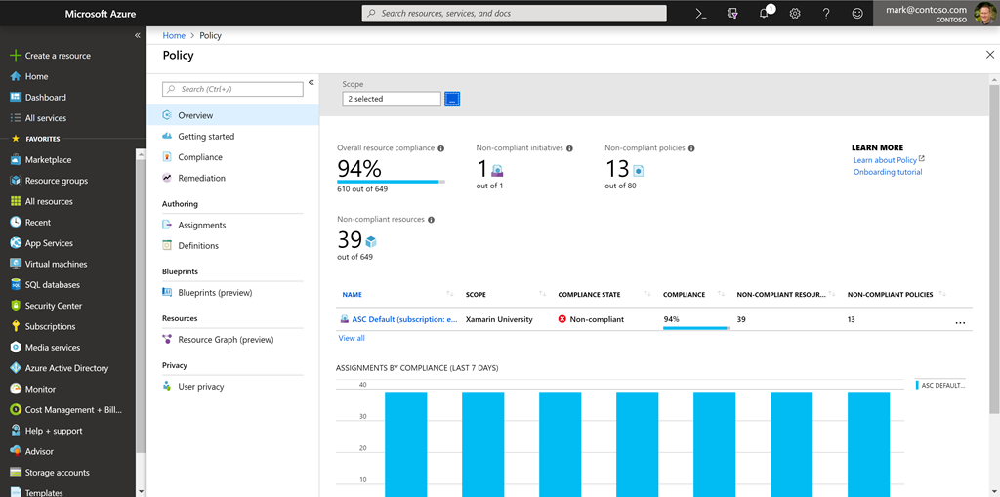

Planning out a consistent cloud infrastructure starts with setting up policy. Your policies will enforce your rules for created resources, so your infrastructure stays compliant with your corporate standards, cost requirements, and service-level agreements (SLAs) you have with your customers.

:::row:::
  :::column:::
    
  :::column-end:::
    :::column span="3":::
**Azure Policy** is a service in Azure that you use to define, assign, and, manage standards for resources in your environment. It can prevent the creation of disallowed resources, ensure new resources have specific settings applied, and run evaluations of your existing resources to scan for non-compliance. 

Azure Policy comes with many built-in policy and initiative definitions that you can use, under categories such as Storage, Networking, Compute, Security Center, and Monitoring.
  :::column-end:::
:::row-end:::

Imagine we allow anyone in our organization to create virtual machines (VMs). We want to control costs, so the administrator of our Azure tenant defines a policy that prohibits the creation of any VM with more than 4 CPUs. Once the policy is implemented, Azure Policy will stop anyone from creating a new VM outside the list of allowed SKUs. Also, if you try to _update_ an existing VM, it will be checked against policy. Finally, Azure Policy will audit all the existing VMs in our organization to ensure our policy is enforced. It can audit non-compliant resources, alter the resource properties, or stop the resource from being created.

> [!TIP]
> Azure Policy can integrate with Azure DevOps, by applying any continuous integration and delivery pipeline policies that affect the pre-deployment and post-deployment of your applications.

## Creating a policy

The process of creating and implementing an Azure Policy begins with creating a _policy definition_. Every policy definition has conditions under which it is enforced. And, it has an accompanying effect that takes place if the conditions are met. To apply a policy, you will:

1. Create a policy definition
2. Assign a definition to a scope of resources
3. View policy evaluation results

### What is a policy definition?

A *policy definition* expresses what to evaluate and what action to take. For example, you could ensure all public websites are secured with HTTPS, prevent a particular storage type from being created, or force a specific version of SQL Server to be used.

Here are some of the most common policy definitions you can apply.

> [!div class="mx-tableFixed"]
> | Policy definition | Description |
> |--------|-------------|
> | Allowed Storage Account SKUs | This policy definition has a set of conditions/rules that determine whether a storage account that is being deployed is within a set of SKU sizes. Its effect is to deny all storage accounts that do not adhere to the set of defined SKU sizes. |
> | Allowed Resource Type | This policy definition has a set of conditions/rules to specify the resource types that your organization can deploy. Its effect is to deny all resources that are not part of this defined list. |
> | Allowed Locations | This policy enables you to restrict the locations that your organization can specify when deploying resources. Its effect is used to enforce your geographic compliance requirements. |
> | Allowed Virtual Machine SKUs | This policy enables you to specify a set of VM SKUs that your organization can deploy. |
> | Not allowed resource types | Prevents a list of resource types from being deployed. |

The policy definition itself is represented as a JSON file - you can use one of the pre-defined definitions in the portal or create your own (either modifying an existing one or starting from scratch). There are [hundreds of samples available on GitHub](https://github.com/Azure/azure-policy).

Here is an example of a Compute policy that only allows specific virtual machine sizes:

```json
{
  "if": {
    "allOf": [
      {
        "field": "type",
        "equals": "Microsoft.Compute/virtualMachines"
      },
      {
        "not": {
          "field": "Microsoft.Compute/virtualMachines/sku.name",
          "in": "[parameters('listOfAllowedSKUs')]"
        }
      }
    ]
  },
  "then": {
    "effect": "Deny"
  }
}
```

Notice the `[parameters('listofAllowedSKUs')]` value; this is a replacement token that will be filled in when the policy definition is applied to a scope. When a parameter is defined, it's given a name and optionally given a value. 

### Assign a definition to a scope of resources

Once you've defined one or more policy definitions, you'll need to assign them. A _policy assignment_ is a policy definition that has been assigned to take place within a specific scope. 

This scope could range from a full subscription down to a resource group. Policy assignments are inherited by all child resources. This means that if a policy is applied to a resource group, it is applied to all the resources within that resource group. However, you can exclude a subscope from the policy assignment. For example, we could enforce a policy for an entire subscription and then exclude a few select resource groups.

You can assign any of these policies through the Azure portal, PowerShell, or Azure CLI. When you assign a policy definition, you will need to supply any parameters which are defined.



### Policy effects

Requests to create or update a resource through Azure Resource Manager are evaluated by Azure Policy first. Policy creates a list of all assignments that apply to the resource and then evaluates the resource against each definition. Policy processes several of the effects before handing the request to the appropriate Resource Provider to avoid any unnecessary processing if the resource violates policy.

Each policy definition in Azure Policy has a single effect. That effect determines what happens when the associated policy rule is matched. When that happens, Azure Policy will take a specific action based on the assigned effect.

| Policy Effect | What happens? |
|---------------|---------------|
| Deny | The resource creation/update fails due to policy. |
| Disabled | The policy rule is ignored (disabled). Often used for testing. |
| Append | Adds additional parameters/fields to the requested resource during creation or update. A common example is adding tags on resources such as Cost Center or specifying allowed IPs for a storage resource. |
| Audit, AuditIfNotExists | Creates a warning event in the activity log when evaluating a non-compliant resource, but it doesn't stop the request. |
| DeployIfNotExists | Executes a template deployment when a specific condition is met. For example, if SQL encryption is enabled on a database, then it can run a template after the DB is created to set it up a specific way. |

### View policy evaluation results

Azure Policy can allow a resource to be created even if it doesn't pass validation. In these cases, you can have it trigger an audit event which can be viewed in the Azure Policy portal, or through command-line tools. The easiest approach is in the portal as it provides a nice graphical overview which you can explore. You can find the Azure Policy section through the search field or _All Services_.



From this screen, you can spot resources which are not compliant and take action to correct them. 

> [!TIP]
> If you continue in the Azure Fundamentals learning path, you'll see Azure Policy in more detail in the [Control and organize Azure resources with Azure Resource Manager](https://docs.microsoft.com/learn/modules/control-and-organize-with-azure-resource-manager/) module.