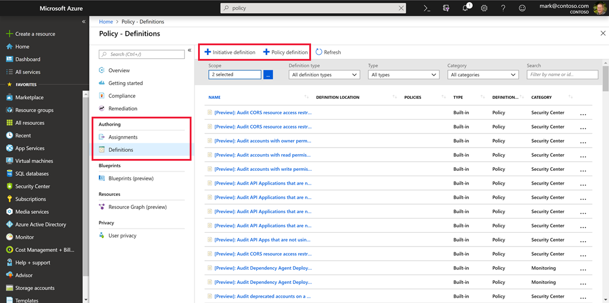

Managing a few policy definitions is easy, but once you have more than a few, you will want to organize them. That's where _initiatives_ come in.

Initiatives work alongside policies in Azure Policy. An *initiative definition* is a set or group of policy definitions to help track your compliance state for a larger goal. Even if you have a single policy, we recommend using initiatives if you anticipate increasing the number of policies over time.

Like a policy assignment, an *initiative assignment* is an initiative definition assigned to a specific scope. Initiative assignments reduce the need to make several initiative definitions for each scope. This scope could also range from a management group to a resource group.

Once defined, initiatives can be assigned just as policies can - and they apply all the associated policy definitions.

### Defining initiatives

Initiative definitions simplify the process of managing and assigning policy definitions by grouping a set of policies into a single item. For example, you could create an initiative named *Enable Monitoring in Azure Security Center*, with a goal to monitor all the available security recommendations in your Azure Security Center.

Under this initiative, you would have the following policy definitions:

| Policy definition | Purpose |
|-------------------|---------|
| Monitor unencrypted SQL Database in Security Center | For monitoring unencrypted SQL databases and servers. |
| Monitor OS vulnerabilities in Security Center | For monitoring servers that do not satisfy the configured baseline. |
| Monitor missing Endpoint Protection in Security Center | For monitoring servers without an installed endpoint protection agent. |

You can define initiatives using the Azure portal, or command-line tools. In the portal, you use the "Authoring" section.

