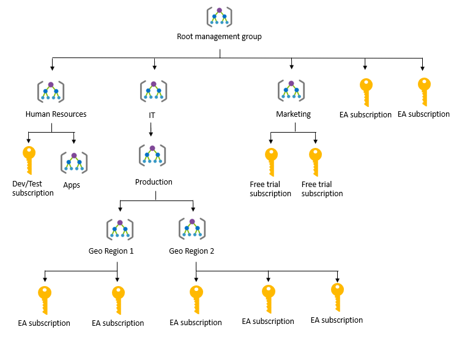

Access management occurs at the Azure subscription level. This allows an organization to configure each division of the company in a specific fashion based on their responsibilities and requirements. Planning and keeping rules consistent across subscriptions can be challenging without a little help.

Azure Management Groups are containers for managing access, policies, and compliance across _multiple_ Azure subscriptions. Management groups allow you to order your Azure resources hierarchically into collections, which provide a further level of classification that is above the level of subscriptions. All subscriptions within a management group automatically inherit the conditions applied to the management group. Management groups give you enterprise-grade management at a large scale no matter what type of subscriptions you might have.

The following diagram shows an example of creating a hierarchy for governance using management groups.

Create a hierarchy so you can apply a policy, for example, limit VM locations to US West Region on the group "Infrastructure Team management group". This policy will inherit onto both EA subscriptions under that management group and will apply to all VMs under those subscriptions. This security policy cannot be altered by the resource or subscription owner allowing for improved governance.

Another scenario where you would use management groups is to provide user access to multi subscriptions. By moving many subscriptions under that management group, you can create one role-based access control (RBAC) assignment on the management group, which will inherit that access to all the subscriptions. One assignment on the management group can enable users to have access to everything they need instead of scripting RBAC rules over different subscriptions.

You can manage your Azure subscriptions more effectively by using Azure Policy and Azure role-based access controls (RBACs). These provide distinct governance conditions that you can apply to each management group. The resources and subscriptions you assign to a management group automatically inherit the conditions that you apply to that management group.

> [!TIP]
> If you continue in the Azure Fundamentals learning path, you'll learn more about RBAC in the [Control and organize Azure resources with Azure Resource Manager](https://docs.microsoft.com/learn/modules/control-and-organize-with-azure-resource-manager/) module.