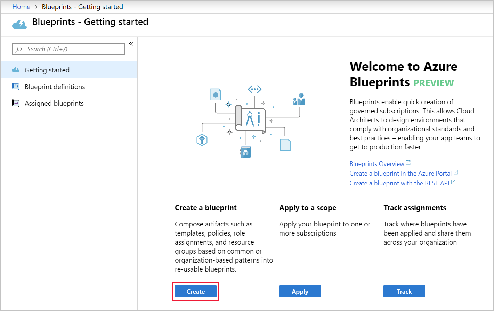

Adhering to security or compliance requirements, whether government or industry requirements, can be difficult and time-consuming. To help you with auditing, traceability, and compliance of your deployments, use **Azure Blueprint** artifacts and tools.

:::row:::
  :::column:::
    :::image type="icon" source="../media/5-azureblueprint.png":::
  :::column-end:::
    :::column span="3":::
Just as a blueprint allows an engineer or an architect to sketch a project's design parameters, **Azure Blueprints** enables cloud architects and central information technology groups to define a repeatable set of Azure resources that implements and adheres to an organization's standards, patterns, and requirements. Azure Blueprints makes it possible for development teams to rapidly build and deploy new environments with the trust they're building within organizational compliance using a set of built-in components, such as networking, to speed up development and delivery.
  :::column-end:::
:::row-end:::

Azure Blueprints is a declarative way to orchestrate the deployment of various resource templates and other artifacts, such as:

- Role assignments
- Policy assignments
- Azure Resource Manager templates
- Resource groups

> [!TIP]
> Azure Blueprints are also useful in Azure DevOps scenarios, where blueprints are associated with specific build artifacts and release pipelines and can be tracked more rigorously.

The process of implementing Azure Blueprint consists of the following high-level steps:

1. Create an Azure Blueprint
2. Assign the blueprint
3. Track the blueprint assignments

With Azure Blueprint, the relationship between the blueprint definition (what _should be_ deployed) and the blueprint assignment (what _was_ deployed) is preserved. This connection supports improved deployment tracking and auditing.

The Azure Blueprints service is backed by the globally distributed Azure Cosmos database. Blueprint objects are replicated to multiple Azure regions. This replication provides low latency, high availability, and consistent access to your blueprint objects, regardless of which region Blueprints deploys your resources to.

### How is it different from Resource Manager templates?

The Azure Blueprints service is designed to help with environment setup. This setup often consists of a set of resource groups, policies, role assignments, and Resource Manager template deployments. A blueprint is a package to bring each of these artifact types together and allow you to compose and version that package&mdash;including through a CI/CD pipeline. Ultimately, each setup is assigned to a subscription in a single operation that can be audited and tracked.

Nearly everything that you want to include for deployment in Blueprints can be accomplished with a Resource Manager template. A Resource Manager template is a document stored inside Azure Templates Service. The template gets used for deployments of one or more Azure resources, but once those resources deploy, there's no active connection or relationship to the template.

With Blueprints, the relationship between the blueprint definition (what should be deployed) and the blueprint assignment (what was deployed) is preserved. This connection supports improved tracking and auditing of deployments. Blueprints can also upgrade several subscriptions at once that are governed by the same blueprint.

There's no need to choose between a Resource Manager template and a blueprint. Each blueprint can consist of zero or more Resource Manager template artifacts. This support means that previous efforts to develop and maintain a library of Resource Manager templates are reusable in Blueprints.

### How it's different from Azure Policy

A blueprint is a package or container for composing focus-specific sets of standards, patterns, and requirements related to the implementation of Azure cloud services, security, and design that can be reused to maintain consistency and compliance.

A policy is a default-allow and explicit-deny system focused on resource properties during deployment and for already existing resources. It supports cloud governance by validating that resources within a subscription adhere to requirements and standards.

Including a policy in a blueprint enables the creation of the right pattern or design during assignment of the blueprint. The policy inclusion makes sure that only approved or expected changes can be made to the environment to protect ongoing compliance to the intent of the blueprint.

A policy can be included as one of many artifacts in a blueprint definition. Blueprints also support using parameters with policies and initiatives.
