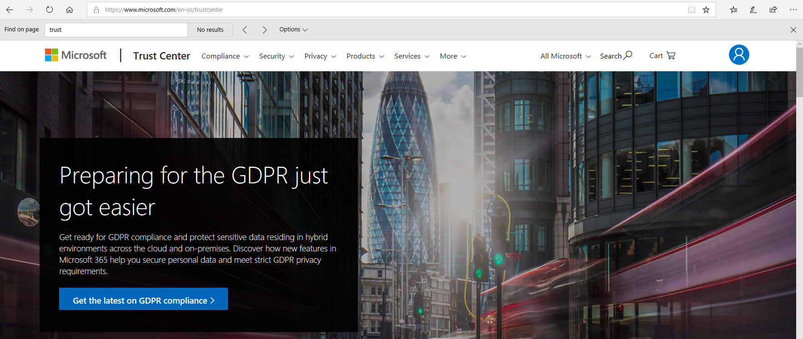

Governing your own resources and how they are used is only part of the solution when using a cloud provider. You also have to understand how the _provider_ manages the underlying resources you are building on.

Microsoft takes this management seriously and provides full transparency with four sources:

1. Microsoft Privacy Statement
1. Microsoft Trust Center
1. Service Trust Portal
1. Compliance Manager

## Microsoft Privacy Statement

The Microsoft privacy statement explains what personal data Microsoft processes, how Microsoft processes it, and for what purposes.

The statement applies to the interactions Microsoft has with you and Microsoft products such as Microsoft services, websites, apps, software, servers, and devices. It is intended to provide openness and honesty about how Microsoft deals with personal data in its products and services.

There is a link to the privacy statement in the summary of this module.

## What is the Microsoft Trust Center?

**Trust Center** is a website resource containing information and details about how Microsoft implements and supports security, privacy, compliance, and transparency in all Microsoft cloud products and services. Trust Center is an important part of the Microsoft Trusted Cloud Initiative, and provides support and resources for the legal and compliance community including:

- In-depth information about security, privacy, compliance offerings, policies, features, and practices across Microsoft cloud products.
- Recommended resources in the form of a curated list of the most applicable and widely used resources for each topic.
- Information specific to key organizational roles, including business managers, tenant admins or data security teams, risk assessment and privacy officers, and legal compliance teams.
- Cross-company document search, which is coming soon and will enable existing cloud service customers to search the Service Trust Portal.
- Direct guidance and support for when you can't find what you're looking for.

## What is the Service Trust Portal?

The **Service Trust Portal** (STP) hosts the Compliance Manager service, and is the Microsoft public site for publishing audit reports and other compliance-related information relevant to Microsoft's cloud services. STP users can download audit reports produced by external auditors and gain insight from Microsoft-authored reports that provide details on how Microsoft builds and operates its cloud services.

STP also includes information about how Microsoft online services can help your organization maintain and track compliance with standards, laws, and regulations, such as:

:::row:::
  :::column:::
- ISO
- SOC
- NIST
  :::column-end:::
  :::column:::
- FedRAMP
- GDPR
  :::column-end:::
:::row-end:::

:::image type="content" source="../media/6-servicetrustportal.png" alt-text="Screenshot of the Service Trust Portal website."  loc-scope="other"::: <!-- this is Service Trust Portal, APEX10 -->

Service Trust Portal is a companion feature to the Trust Center, and allows you to:

- Access audit reports across Microsoft cloud services on a single page.
- Access compliance guides to help you understand how you can use Microsoft cloud service features to manage compliance with various regulations.
- Access trust documents to help you understand how Microsoft cloud services help protect your data.

## Compliance Manager

**Compliance Manager** is a workflow-based risk assessment dashboard within the Service Trust Portal that enables you to track, assign, and verify your organization's regulatory compliance activities related to Microsoft professional services and Microsoft cloud services such as Microsoft 365, Dynamics 365, and Azure.

Compliance Manager provides the following features:

- Combines the following three items:
    1. Detailed information provided by Microsoft to auditors and regulators, as part of various third-party audits of Microsoft 's cloud services against various standards (for example, ISO 27001, ISO 27018, and NIST).
    2. Information that Microsoft compiles internally for its compliance with regulations (such as HIPAA and the EU GDPR).
    3. An organization's self-assessment of their own compliance with these standards and regulations.
- Enables you to assign, track, and record compliance and assessment-related activities, which can help your organization cross team barriers to achieve your organization's compliance goals.
- Provides a Compliance Score to help you track your progress and prioritize auditing controls that will help reduce your organization's exposure to risk.
- Provides a secure repository in which to upload and manage evidence and other artifacts related to compliance activities.
- Produces richly detailed reports in Microsoft Excel that document the compliance activities performed by Microsoft and your organization, which can be provided to auditors, regulators, and other compliance stakeholders.

:::image type="content" source="../media/6-compliancemanager.png" alt-text="Screenshot showing Compliance Manager website with a set of three sample assessments." loc-scope="other":::

Compliance Manager provides ongoing risk assessments with a reference of risk-based scores for regulations and standards displayed in a dashboard view. Alternatively, you can create assessments for the regulations or standards that matter more to your organization.

As part of the risk assessment, Compliance Manager also provides recommended actions you can take to improve your regulatory compliance. You can view all action items, or select the action items that correspond with a specific certification.

> [!IMPORTANT]
> Compliance Manager is a dashboard that provides a summary of your data protection and compliance stature and recommendations for improvement. The Customer Actions provided in Compliance Manager are recommendations only; it is up to each organization to evaluate the effectiveness of these recommendations in their respective regulatory environment prior to implementation. Recommendations found in Compliance Manager should not be interpreted as a guarantee of compliance.
