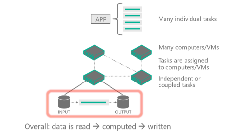
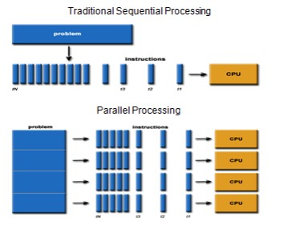
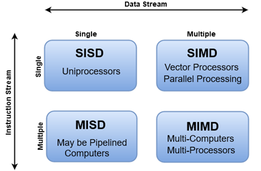
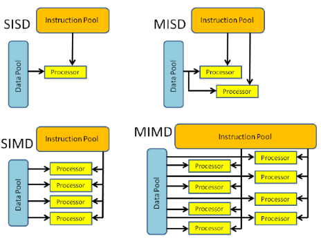
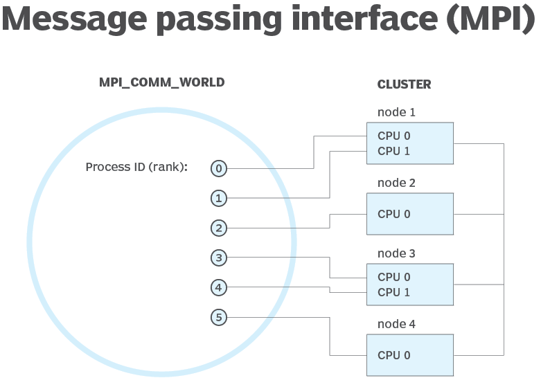

High Performance Computing (HPC) is the practice of using significant computing power that provides high performance compared to what you can get when using your laptop and/or workstation. It solves large problems that need to run on multiple cores simultaneously.

It's done by splitting up a problem into smaller computable units and distributing those units into a distributed
system. It continuously communicates between them to reach the final solution way faster than running the same
computation on fewer cores.

There are several HPC and batch processing choices available on Azure. If you talk with an Azure expert, they would advise you to focus on three options: Azure Batch, Azure CycleCloud, and Microsoft HPC Pack. The following units in this module focus on each option. It's important to note that these choices aren't mutually exclusive. They build upon one another and can
be thought of as different tools in a toolbox.

Here, you learn about high-performance computing in general, and learn about Azure HPC.

## What is HPC at Azure?

There are many different industries that require powerful computing resources for specialized tasks. For example:

- In genetic sciences, gene sequencing.
- In oil and gas exploration, reservoir simulations.
- In finance, market modeling.
- In engineering, physical system modeling.
- In meteorology, weather modeling.

These tasks require processors that can carry out instructions fast. HPC applications on Azure can scale to thousands of compute cores, extend on-premises large compute, or run as a 100% cloud native solution. This HPC solution including the head node, compute nodes, and storage nodes, runs in Azure with no hardware infrastructure to maintain. This solution is built on the Azure-managed services: Virtual Machine Scale Sets, Virtual Network and Storage Accounts.

These services run in a high-availability environment, patched and supported, allowing you to focus on your solution instead of the environment they run in. An Azure HPC system also has the advantage that you can dynamically add resources as they're needed, and remove them when demand falls.

## What is Parallel Computing on Distributed Systems

Parallel Computing is the simultaneous use of multiple compute resources to solve a computational problem:

- A problem is broken into discrete parts that can be solved concurrently.
- Each part is further broken down to a series of instructions.
- Instructions from each part execute simultaneously on different processors.
- An overall control/coordination mechanism is employed.

## Different Stages of Parallelism

There are different ways to classify parallel computers and Flynn's Taxonomy is one of the most common ways to do so. It
distinguishes multi-processor computer architectures according to how they can be classified along the two independent
dimensions of Instruction Stream and Data Stream. Each of these dimensions can have only one of two possible states:
**Single** or **Multiple**.

This diagram shows a client application or hosted service interacting with Batch to upload input, create jobs, monitor
tasks, and download output.

We can take a look at the four different classifications in more detail.

|  **SISD**    |  **SIMD**   |**MISD**  | **MIMD** |
| :------------------- | :-------------------  | :------------------- | :------------------- |
| - Serial (nonparallel) computer   - Single Instruction: Only one instruction stream is being acted on by the CPU during any one clock cycle   - Single Data: Only one data stream is being used as input during any one clock cycle.   - Oldest type of computer.  **Examples:**  1. Early generation mainframes   2. Minicomputers, Workstations   3. Single processor core PCs            | - Parallel computer   - Single Instruction: All processing units execute the same instruction at any given clock cycle.   - Multiple Data: Each processing unit can operate on a different data element.   - Best suited for specialized problems characterized by a high degree of regularity, such as graphics/image processing.   - Most modern computers, with graphics processor units (GPUs) employ SIMD instructions and execution units.   **Examples:**  1. Processor Arrays: Thinking Machines CM-2, MasPar MP-1 & MP-2, ILLIAC IV  2. Vector Pipelines: IBM 9000, Cray X-MP, Y-MP & C90, Fujitsu VP, NEC SX-2, Hitachi S820, ETA10  | - Parallel computer   - Multiple Instructions: Each processing unit operates on the data independently via separate instruction streams.   - Single Data: A single data stream is fed into multiple processing units.   - Few (if any) actual examples of this class of parallel computer have ever existed.   **Examples:**  1. Multiple frequency filters operating on a single signal stream   2. Multiple cryptography algorithms attempting to crack a single coded message            | - Parallel computer   - Multiple Instructions: Every processor may be executing a different instruction stream.   - Multiple Data: Every processor may be working with a different data stream.   - Currently, the most common type of parallel computer - most modern supercomputers fall into this category.  **Examples:**  1. Most current supercomputers 2. Networked parallel computer clusters and "grids" 3. Multi-processor SMP computers 4. Multi-core PCs         |
|  |  |  |  |

## Different types of HPC Jobs: Massively Parallel vs Tightly Coupled

Parallel jobs have computational problems divided into small, simple, and independent tasks that can be run at the same
time, often with little or no communication between them.

- Common use cases for parallel jobs include risk simulations, molecular modeling, contextual search, and logistics
  simulations.

  Tightly Coupled Jobs have a large shared workload that is broken into smaller tasks that communicate continuously. The
  different nodes in the cluster communicate with one another as they perform their processing.

- Common use cases for tightly coupled jobs include:
  - computational fluid dynamics
  - weather forecast modeling
  - material simulations
  - automobile collision emulations
  - geospatial simulations
  - traffic management

### What is Message Passing Interface (MPI)

- MPI is a system that aims to provide a portable and efficient standard for message passing. It's high-performing,
  portable and scalable, and was developed to work on networks of different parallel computers.

- MPI has helped in networking and parallel computing on an industrial and global scale, and helped improve the working
  of large-scale parallel computer applications.

### Microsoft MPI benefits:

- Ease of porting existing code that uses MPICH.
- Security based on Active Directory Domain Services.
- High performance on the Windows operating system.
- Binary compatibility across different types of interconnectivity options.
